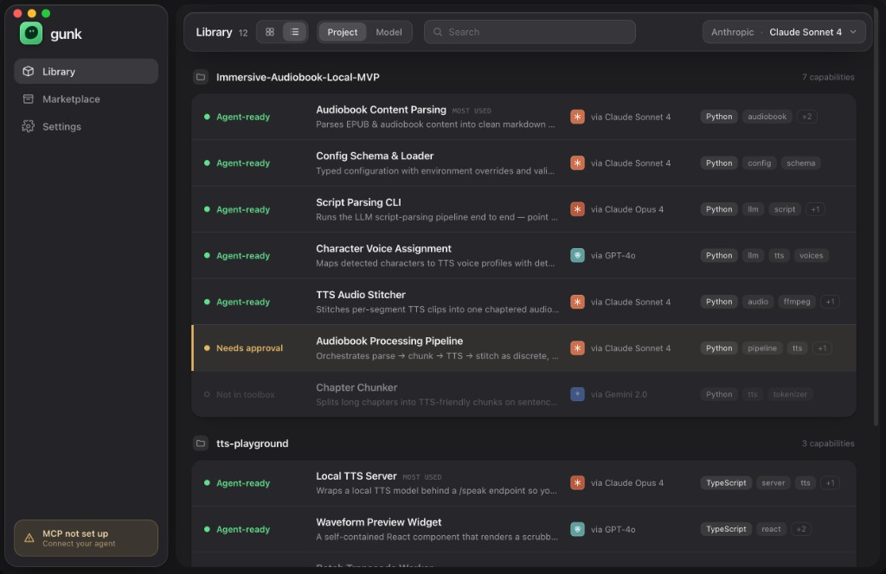
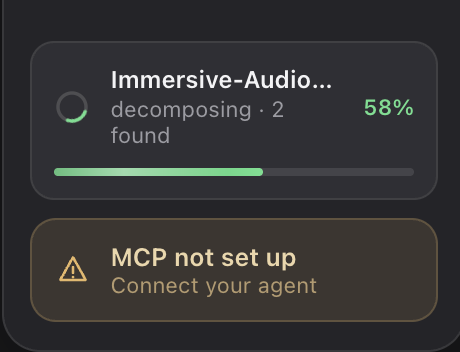
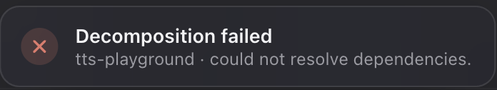

# Library v2 — list view + global processing animation (CP-D)

Date: 2026-06-14 · Designed in Claude Design · Status: **CP-D APPROVED.**
This unblocks the visual work in **T-9.3** (grid/list toggle) and **T-9.4**
(single-folder queue + global animated state).

> **Source of truth.** The interactive mockup is in the repo:
> [`library-v2-library.html`](library-v2-library.html) (standalone Claude
> Design export). All geometry, type, and material values below are read
> directly from that file's CSS — when this doc and the HTML disagree, **the
> HTML wins.** This iteration **builds on** [toolbox-v2](toolbox-v2.md): the
> grid, cell anatomy, palette, and `:root` tokens are unchanged and carried
> verbatim (`--bg #161618`, `--surface #27272b`, `--green #5fe08c`, …). Only
> the two net-new looks below are introduced. The revision instruction that
> produced it: [library-v2-instruction.md](library-v2-instruction.md).

## Verdict in one line

The Library gains a **denser list view** (flat usage-sorted rows, hero
demoted to a faint "most used" text marker) and a **single quiet live-run
indicator** — a sidebar run panel that owns queue depth, reconciles the three
pre-existing processing signals into one, and resolves into the existing
run-end toast — all with zero layout shift.

---

## 1 · List view

The same grouped Library data as the grid, denser. The `Project | Model`
grouping, search, ordering, and per-row verdict/provenance/tags carry over
unchanged; **only the layout differs** — behavior is not forked.

### What's locked

- **Hero is flattened in list (LOCKED CONSTRAINT).** The grid's 2×-wide hero
  cell does **not** exist in the list. Rows are usage-sorted, so the most-used
  module is simply the **first row of its group**, carrying only a faint
  uppercase **`MOST USED`** text marker beside its name — **never** extra
  height, color, or background. This is the answer to the open T-9.1 hero
  question; T-9.3 implements exactly this.
- **One group = one solid card.** Each group renders as a single
  `--surface` card (radius 15), rows hairline-divided (`--line` top borders),
  uniform height. Same graphite surface as the grid; scrolls beneath the
  floating glass toolbar.
- **Row anatomy (left → right), one verdict per row:**
  1. **Verdict** — fixed 142pt column: status dot + label
     (`Agent-ready` green / `Needs approval` amber / `Not in toolbox` dimmed).
  2. **Name + purpose** — name 14.5/600 (ellipsized), the `MOST USED` lead
     marker inline on the group's first row; purpose 12.5 muted, **one line**,
     ellipsized.
  3. **Provenance** — `pmark` 20×20 provider mark (radius 5) + `via <model>`.
  4. **Tags** — system-font pills, show what fits, overflow as `+N`.
- **State treatments scan at a wall of ~12 rows:**
  - **Needs approval** = an inset **3pt amber left rail** + a persistent faint
    amber wash (`rgba(231,183,101,0.06)`, hover `0.11`) so the lone row pops.
  - **Not in toolbox** = whole row at `opacity 0.46` (hover restores to 1).
  - **Selection** = `--surface-hi` fill + inset 1.5pt green ring (the same
    green-ring vocabulary as the grid; arrival highlight reuses it).
- **The grid/list toggle** is an **icon-pair segmented control** in the
  Library appbar, immediately right of the `12` count chip and left of the
  `Project | Model` segmented control. Default is **grid**; the choice
  persists (Settings-defaults, no schema — per T-9.3).

### Watch-item for implementation (T-9.3)

- The `MOST USED` lead marker uses the **mono** face (9.5px uppercase,
  `--faint`). That bends toolbox-v2's "mono only for paths/code" rule for a
  single micro-label. It is approved as a deliberate exception; if it reads as
  a violation in-app, fall back to a system small-caps treatment — do not
  promote it into color or weight.

---

## 2 · Global processing animation

There is exactly **one** live-run indicator: a **sidebar run panel** (`.proc`)
that appears above the MCP chip only while a folder decomposes, and a faint
**green live dot** on the Library nav row as its quiet echo. This **reconciles
the three signals** the shell had (the T-8.7 transient processing element, the
pulsing Library-row dot, and the run-end toast) into one system — it does not
add a fourth.

### What's locked

- **Zero layout shift (D15).** The run panel sits above the MCP chip; a flex
  spacer absorbs its height so **nothing else moves** when it appears or
  disappears. It is glass-on-glass inside the already-glass sidebar — **never
  on a content card.**
- **Quiet feedback, not the headline.** A small determinate **ring** + a
  determinate **linear bar**; green reads the positive `N found` progress.
  Panel copy: title = source name, sub = **`decomposing · N found`**,
  trailing = **`NN%`**.
- **Queue depth is first-class (drives T-9.4).** With more than one folder
  queued, the panel shows **`N waiting`** and **`next: <source>`**. There is
  **no "N sources running at once"** — processing is strictly one-at-a-time;
  extra drops enqueue in drop order. (Resolves the T-9.1 concurrency edge
  case: the old `processingStatus` "N sources" branch dies.)
- **The live dot is an echo, not a second indicator.** `navrow .livedot`
  pulses (`livepulse`, 1.9s) on the Library row **only** while running and
  stops the instant the run ends.
- **The toast is the terminal frame.** The run panel **resolves into the
  existing run-end toast** with the truthful outcome — never a competing
  completion surface, and `N added` stays a store diff (engine `N found`
  telemetry never becomes the completion claim, per T-8.7).
  - **Success** — green check · **`Decomposed <source>`** ·
    `N added · M needs review`.

    
  - **Failure** — red × · **`Decomposition failed`** ·
    `<source> · <reason>`.

    
- **Reduced motion** is handled: ring becomes a static 3/4 arc (reads
  "working"), the fill shimmer is dropped, and the live dot holds steady
  (presence without pulse). T-9.4 must preserve this `prefers-reduced-motion`
  fallback.

---

## New constraints for implementation

1. **T-9.3** ships the list exactly as locked above: flattened hero → `MOST
   USED` text marker on the usage-sorted first row, the icon-pair toggle in
   the stated appbar slot, and shared search/grouping/scope/selection/arrival
   behavior across both modes. Fits the 960pt minimum window beside the 232pt
   sidebar.
2. **T-9.4** implements the one run panel with queue depth (`N waiting` /
   `next:`), the nav-row live-dot echo, zero-layout-shift via the flex spacer,
   the toast hand-off, and the reduced-motion fallback. The provider mark in
   the list row uses the same slot the T-9.2 logo drops into without relayout
   (provider set = OpenAI / Anthropic / Ollama + neutral; Gemini excluded —
   see the instruction doc).

## Provenance

- Revision instruction (T-9.1 step 1):
  [library-v2-instruction.md](library-v2-instruction.md).
- Mockup source of truth: [library-v2-library.html](library-v2-library.html).
- Builds on: [toolbox-v2.md](toolbox-v2.md) (locked grid/cell/palette).
