# Settings v2 — the spend & trust panel (CP-L)

Date: 2026-06-17 · Designed in Claude Design · Status: **CP-L APPROVED** (all
sections + states returned). This unblocks the visual work in **T-11.4+**.

> **Source of truth.** The interactive HTML export is not in the repo yet;
> when it lands it becomes the source of truth (**HTML wins** over this prose
> and the PNGs, same rule as toolbox-v2 / library-v2 / module-run-v2). For now
> the locked capture is the screenshot set below. This iteration **builds on**
> [toolbox-v2](toolbox-v2.md) and the v1 product definition in
> [06-settings.md](../feature-report/06-settings.md). Task home:
> [phase-11-settings-v2.md](../../tasks/phase-11-settings-v2.md) (T-11.1, CP-L).

> **⚠ Palette is NOT final.** The export uses Claude Design's default dark
> teal/green chrome, **not** the gunk graphite + toolbox-v2 tokens. Read this
> for **IA, layout, copy, and component anatomy only** — colors, surfaces, and
> material are re-skinned to the locked toolbox-v2 vocabulary at build time
> (`--bg #161618`, `--surface #27272b`, `--green #5fe08c`, glass on the
> controls layer only). Do not lift any color value from these mockups.

## Verdict in one line

Settings v2 is a **left-rail sectioned page** — **Provider & keys · Local
model · Spend · Processing · Pipeline health** — that replaces the v1 single
left-floating 520pt `Form`, turning a debug panel into a place that answers
"which keys/models am I running?", "what has this *estimated* to cost?", and
"what does that one slider actually do?" — with **every dollar figure labelled
*estimated* and never stored**.

---

## 0 · Information architecture (locked)

A persistent **left section rail** under a `SETTINGS` label + a left-aligned
detail pane. Sections in order: **Provider & keys**, **Local model**,
**Spend**, **Processing**, **Pipeline health** (the last carries an amber dot
when something needs setup). The app sidebar's `MCP not set up · Connect your
agent →` chip is unchanged; the rail footer carries the quiet
**`Keys stored in your Keychain`** reassurance.

### What's locked (IA)

- **Sectioned rail, not one scrolling form** (resolves decision #5). The
  detail pane is left-aligned with generous width (fixes the v1 "520pt floats
  left" dead space — 06-settings problem #4).
- **Pipeline health is its own section**, remains the only full MCP-setup
  guidance in the app, and is the **deep-link target** for every "MCP not set
  up" affordance (06-settings problem #5).

---

## 1 · Provider & keys

> Header: **"Bring your own key. gunk talks to hosted models on your behalf —
> keys live in your system Keychain, never in gunk's database."**

### What's locked

- **Active provider for new decompositions** — segmented pills (`Anthropic` /
  `OpenAI` / `Google`) with the consequence line *"Decompositions will run on
  Anthropic `claude-sonnet-4`."*
- **Per-provider remembered model (resolves decision #4).** *"Each provider
  keeps its own model, so switching here never overwrites what you typed."*
  Kills the v1 clobber (06-settings problem #6). Switching the active provider
  shows a success banner that states the new active + that the old model was
  untouched:

  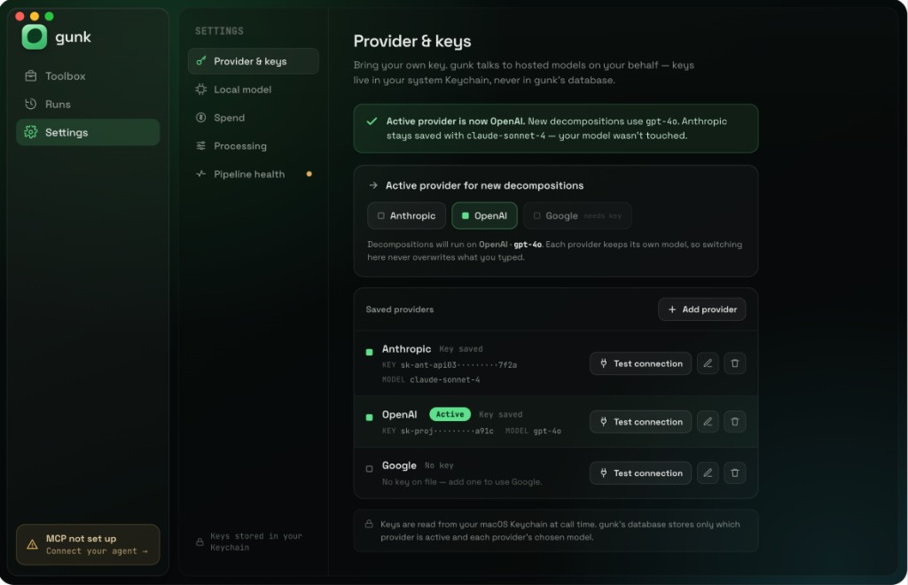
- **Saved-providers list** — one row per provider: status square + **`Active`**
  green pill on the active one; **`Key saved`** / **`No key`**; masked **`KEY`**
  + **`MODEL`** (mono); row actions **Test connection**, **edit** (pencil),
  **remove** (trash); **`+ Add provider`** top-right.
- **Inline edit** — the pencil expands an `API key` secure field
  (**`paste to replace`**), a **`Model for <provider>`** field (*"Remembered
  per provider — switching the active provider won't change this."*), and
  **`Cancel` / `Save key`**, with *"Saved to your system Keychain, never to
  gunk's database."*

  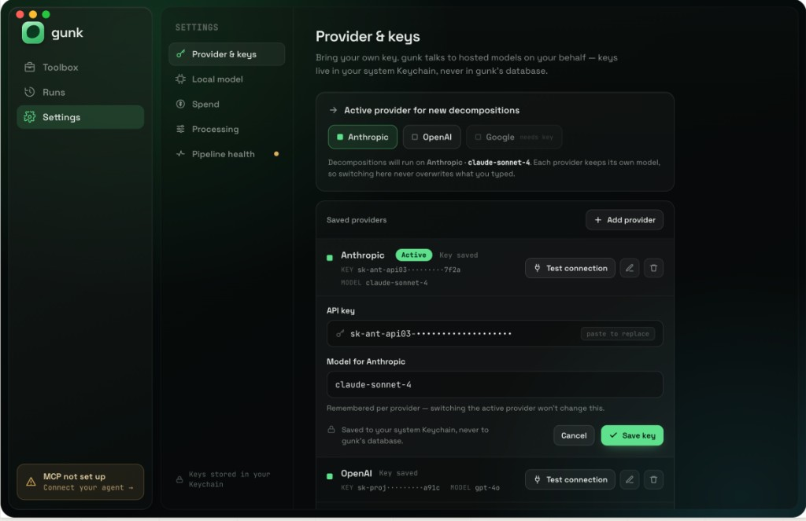
- **Test connection — success** is an inline per-row chip
  (**`✓ Connected · 420ms`**):

  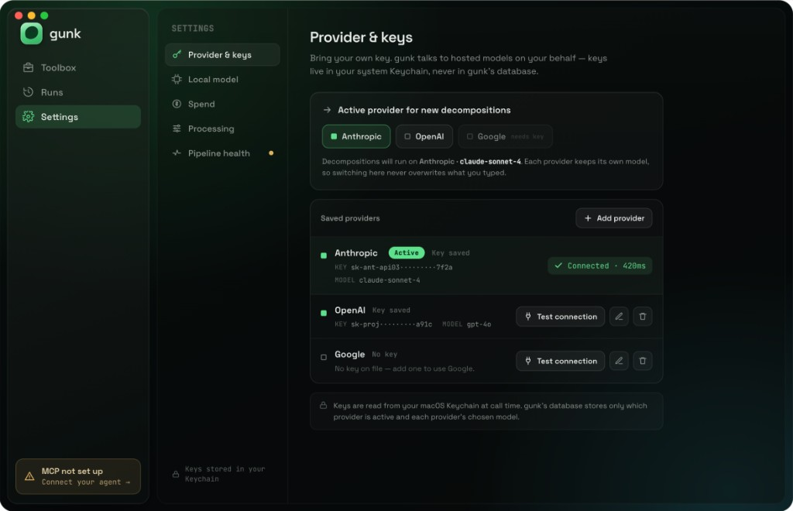
- **Test connection — failure** keeps the typed key, shows a banner + an inline
  row chip (**`✕ 401 · invalid key`**), *"The saved key didn't authenticate.
  Edit the key and test again; nothing else changed."*:

  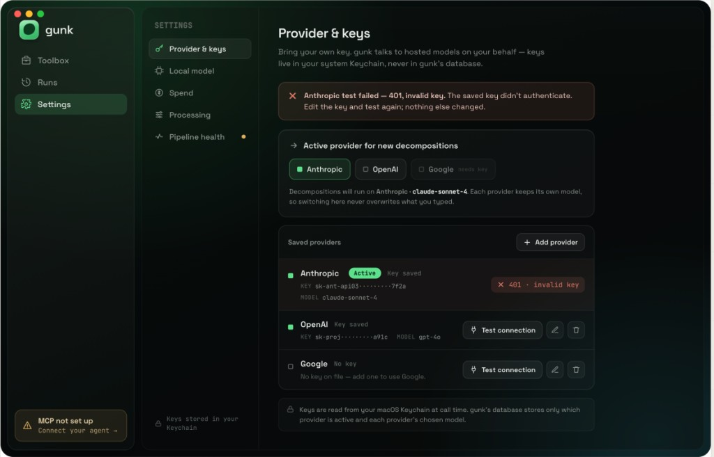
- **The trust footer (load-bearing copy).** *"Keys are read from your macOS
  Keychain at call time. gunk's database stores only which provider is active
  and each provider's chosen model."* — **keys never touch SQLite**; only
  `active provider` + `per-provider model` persist (settings-level, **no
  schema change**).

### Google (Gemini) as a provider (decision #8) — RESOLVED: not this phase

The mockups show **Google** as a hosted provider, but **decision #8 is now
settled: the live provider set is OpenAI / Anthropic / Ollama only** (Mark,
2026-06-17 — "just Ollama, OpenAI and Anthropic for now"). gunk ships no
`GoogleClient` this phase, consistent with Phase 9's Gemini exclusion. **Build
note:** the Provider & keys hosted pills are **Anthropic / OpenAI** (two), with
Ollama configured in the Local model section; **omit the Google row** from the
build (no disabled "coming soon" stub — don't ship an unselectable provider).
Google returns only when a real `GoogleClient` is added in a future phase.

---

## 2 · Local model (Ollama)

> Header: **"Run decompositions on a model you host with Ollama. No hosted
> call, no key, nothing leaves your machine."** A **`runs locally · no key`**
> badge sits on the card.

### What's locked

- **Host / base URL** field (default `localhost:11434`) — *"Point this
  elsewhere if you run it on another host or port."* — and a **Model** field
  (*"Any model you've pulled in Ollama. gunk lists what's loaded when it can
  reach the host."*).
- **A reachability check, explicitly distinct from a hosted Test connection:**
  *"A reachability check is different from a hosted Test connection — there's
  no account or key to authenticate, gunk just confirms the local server
  answers."* Four states:
  - **Not checked yet** + `Check reachability`:

    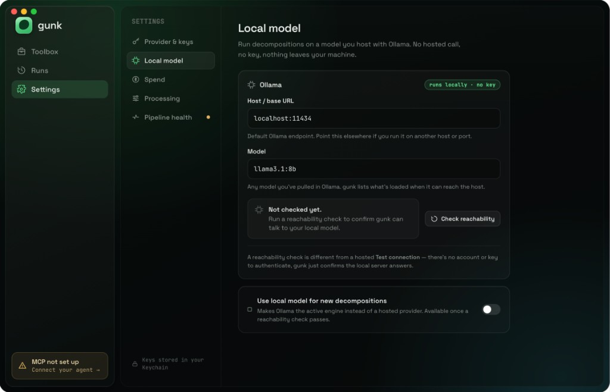
  - **Checking** (*"Checking localhost:11434… Asking Ollama for its loaded
    models."*):

    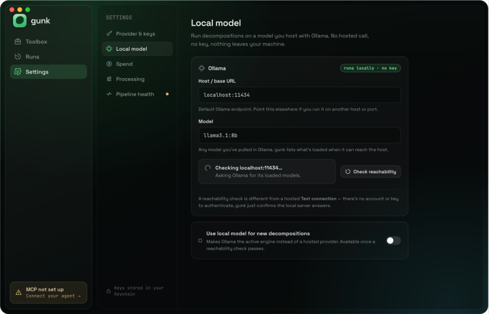
  - **Reachable** (*"Ollama reachable. `llama3.1:8b` is loaded and answered in
    180 ms."* — green):

    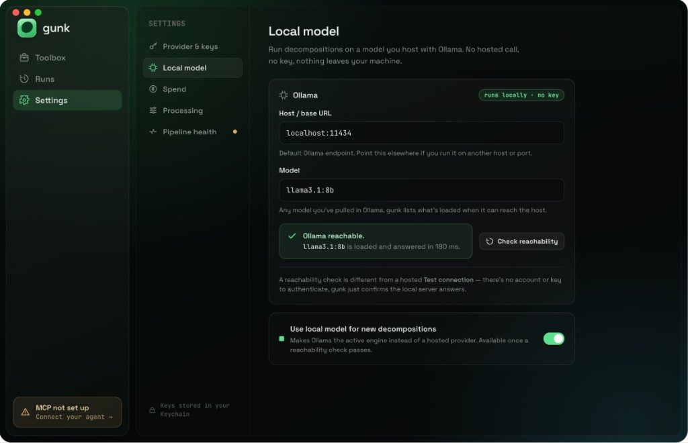
  - **Unreachable** (*"Can't reach localhost:11434. No response. Is Ollama
    running? Start it with `ollama serve`, then check again."* — red, but a
    setup nudge, not a failure verdict):

    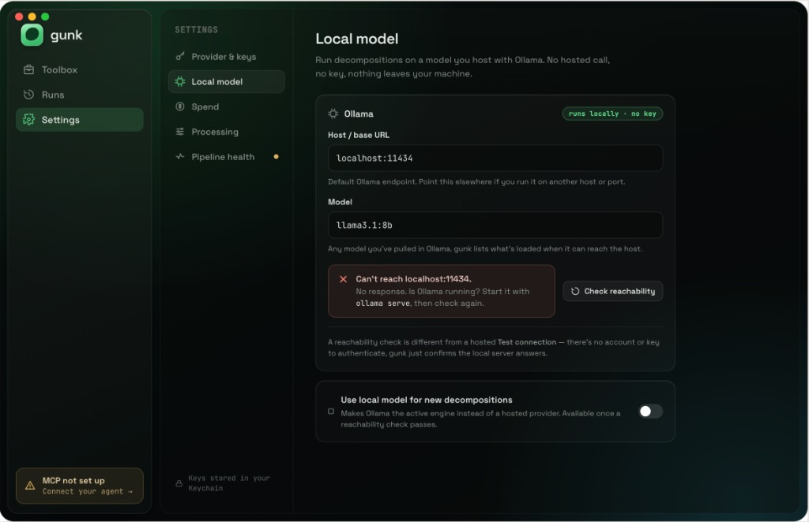
- **`Use local model for new decompositions`** toggle — *"Makes Ollama the
  active engine instead of a hosted provider. Available once a reachability
  check passes."* This is how the local model becomes the **active engine**
  (it shares the active-engine concept with Provider & keys: active engine =
  one hosted provider **or** Ollama).

---

## 3 · Spend (the meter)

> Header: **"What decompositions have cost you, estimated from real token
> usage."**

### What's locked

- **Grouped by key & model** with a **`Since first run`** window control
  (resolves decision #3: by key/model, windowed). Each row: model name +
  provider, **real token counts** (`2.41M in · 384K out`, mono), and an
  **`EST $x.xx`** estimated USD. A column header carries the version stamp
  **`Prices as of Jun 3 2026 · v1`**.
- **Estimated total** row (**`EST $13.17`**, green) — *"since first run · Mar
  2026"*.
- **The honesty footer (resolves decisions #1 + #2):** *"Reflects
  decomposition **survey + refine** calls only — not anything your agent runs
  later. Cost is computed from real token counts; the dollar figure is never
  stored."* The price-table **version + as-of date** is the staleness signal;
  the UI **never blocks** on it.

  
- **Unknown-price model** → token counts shown, USD as **`—`** (never `$0`,
  never a guess). It is **excluded from the total** (*"excludes 1 model with no
  price on file"*) and explained in an amber note: *"One model isn't in the
  price table (a custom fine-tune). Its tokens are exact, but gunk shows `—`
  instead of guessing a dollar figure — it never invents a price or shows
  $0."*

  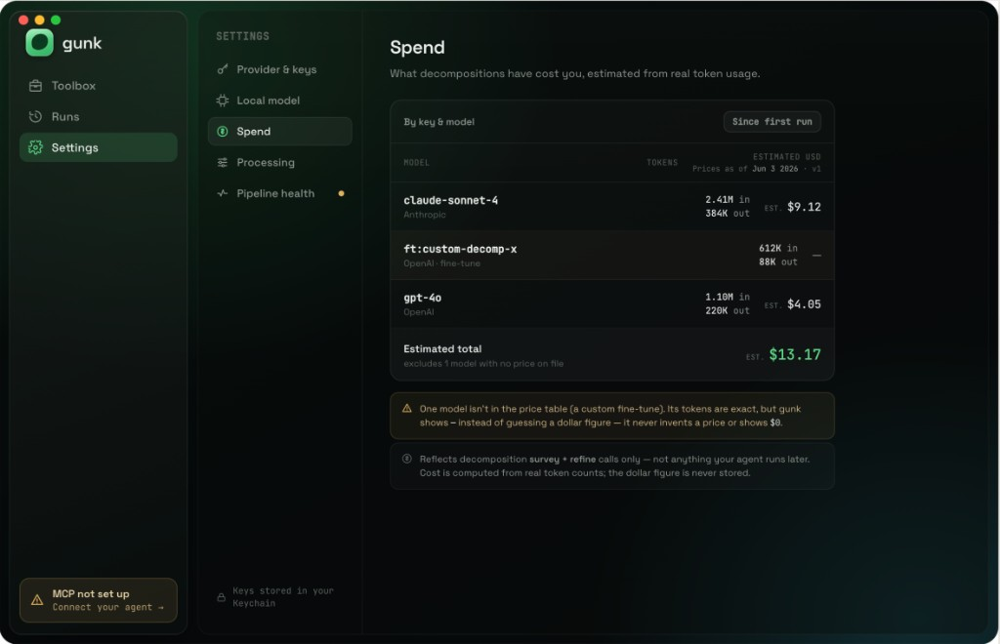
- **Empty state** — *"No spend yet · Run a decomposition and the tokens it uses
  will show up here, grouped by key and model — with an estimated cost beside
  each."* Never a fabricated zero-dollar dashboard.

  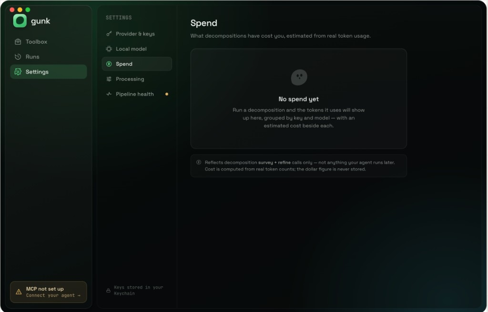
- **No charts, no time series.** A bounded list + total only.

---

## 4 · Processing (threshold + cost cap)

> Header: **"How extracted capabilities move into your agent's toolbox — and
> how you keep spend in check."**

### What's locked

- **Auto-accept threshold (resolves decision #6, fixes D14).** A big live
  value (**`85%`**) + helper: *"Modules at or above this **auto-accept** into
  your toolbox; below it they go to **Approval** for you to review."* + a
  **`What is Approval? →`** link. The slider is labelled **`APPROVAL`** ↔
  **`AUTO-ACCEPT`** with `50%`/`100%` ends and *"more reaches you"* /
  *"more auto-accepts"* hints — no more bare number.

  
  - Dragging shows the value in a bubble on the thumb:

    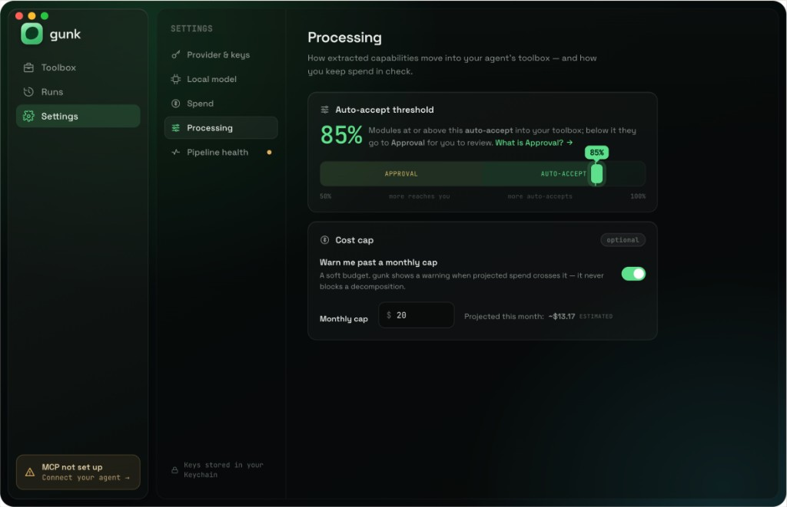
- **Cost cap (`optional`) (resolves decision #7 → warn-only).** *"Warn me past
  a monthly cap — A soft budget. gunk shows a warning when projected spend
  crosses it — **it never blocks a decomposition**."* A **`Monthly cap $`**
  field + **`Projected this month: ~$13.17 ESTIMATED`**. The cap is checked
  against an *estimate* and is always overridable (never a hard block).

---

## 5 · Pipeline health

> Header: **"Everything that has to be true for your agent to call your
> toolbox. This is the one place with the full MCP setup guidance."**

### What's locked

- **Five status rows**, each with a state icon + a value + a `Ready` /
  `Optional` / `needs setup` label:
  1. **Decomposition provider** — `Ready` (*"Anthropic key saved ·
     `claude-sonnet-4` set as active."*).
  2. **Local model (Ollama)** — `Optional` (*"Not configured — hosted provider
     is in use."*).
  3. **MCP server** — amber warning + a **`Set up MCP`** button (*"Your
     capabilities are verified but nothing is exposing them to an agent
     yet."*).
  4. **Approval queue** — `2 waiting` (*"2 capabilities awaiting your review
     below the auto-accept threshold."*).
  5. **Sandbox runtime** — `Ready` (*"Extraction & build checks run in an
     isolated Python 3.11 sandbox."* — the Phase 10 ADR-0016 sandbox).

  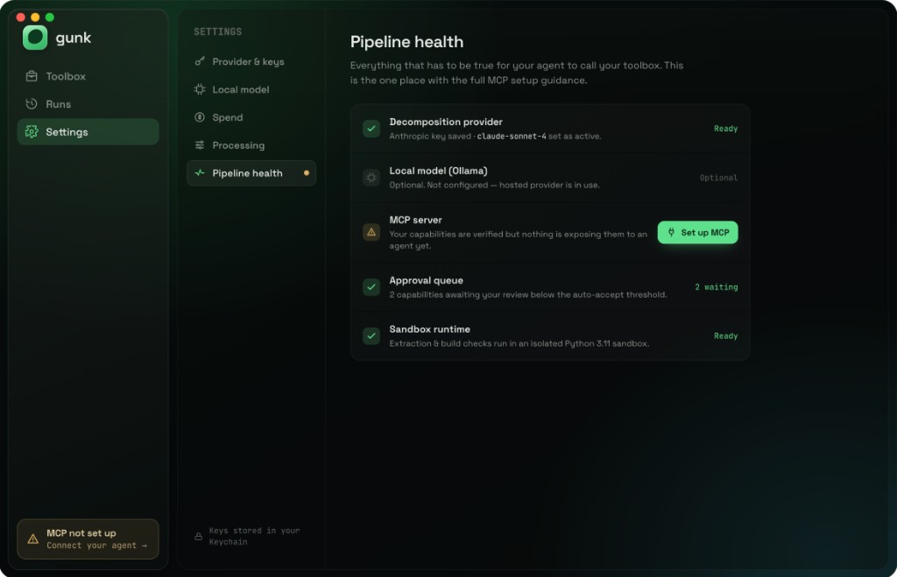
- **Deep-link arrival** — arriving from the shell's "MCP not set up" chip (or
  the Modules screen) shows a banner *"Arrived from 'MCP not set up' — the
  relevant row is highlighted below."*, scrolls to + **highlights** the MCP
  row (`jumped here from the status strip`), and expands the full **"Connect
  your agent over MCP"** guidance with the `claude_desktop_config.json`
  snippet. *"This is the only place in gunk with the full MCP setup."*

  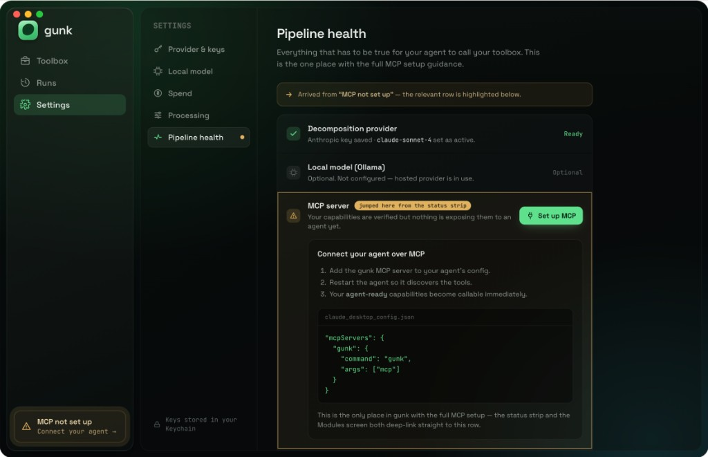

---

## Decisions resolved by this iteration

| # | Decision | Resolution |
| --- | --- | --- |
| #1 | estimation honesty | Cost computed from real tokens, **never stored**; every figure `EST`; copy locked in the Spend footer. |
| #2 | price sourcing / staleness | A **`Prices as of <date> · v<n>`** stamp is the staleness signal; the UI **never blocks** on it. |
| #3 | spend grouping | **By key & model**, with a **`Since first run`** window. No charts. |
| #4 | active-provider model | One active engine + **coexisting saved keys** + a **per-provider remembered model** (switching never overwrites). |
| #5 | Settings IA | **Sectioned left rail** (Provider & keys · Local model · Spend · Processing · Pipeline health). |
| #6 | threshold copy + Approval link | Labelled `APPROVAL ↔ AUTO-ACCEPT` slider + live %, helper copy, `What is Approval? →`. |
| #7 | cost-cap behaviour | **Warn-only**, estimate-based, **never blocks** a decomposition; off by default. |
| #8 | Google/Gemini provider | **RESOLVED — not this phase.** Live set = OpenAI / Anthropic / Ollama only (Mark, 2026-06-17). No `GoogleClient`; **omit the Google row** from the build. |

## New constraints for implementation

1. **Re-skin to toolbox-v2** at build (graphite surfaces, glass on the
   controls layer only, mono for paths/code/numbers-as-data, accent green only
   on earned state). The mockup palette is disposable.
2. **No schema change.** Active provider + per-provider model + Ollama
   host/model + threshold + cost cap are all settings-level (`@AppStorage`).
   Keys stay in Keychain. Spend reads existing `llm_runs` columns. (Phase
   re-freeze held.)
3. **Estimation honesty is non-negotiable:** `EST` everywhere, unknown →
   `—` (never `$0`), unknown rows excluded from the total, version stamp
   shown, `cost_usd` stays `NULL`.
4. **Google/Gemini (#8) is out this phase** — live set is OpenAI / Anthropic /
   Ollama; **omit the Google row**, ship no `GoogleClient`.

## Provenance

- Task / process: [phase-11-settings-v2.md](../../tasks/phase-11-settings-v2.md)
  (T-11.1, CP-L).
- Captures: Provider & keys
  ([resting](settings-v2-provider-keys.png) ·
  [switch](settings-v2-provider-keys-switch-active.png) ·
  [edit](settings-v2-provider-keys-edit-key.png) ·
  [test ok](settings-v2-provider-keys-test-ok.png) ·
  [test fail](settings-v2-provider-keys-test-failed.png)),
  Local model ([unchecked](settings-v2-local-model-unchecked.png) ·
  [checking](settings-v2-local-model-checking.png) ·
  [reachable](settings-v2-local-model-reachable.png) ·
  [unreachable](settings-v2-local-model-unreachable.png)),
  Spend ([populated](settings-v2-spend.png) ·
  [unknown price](settings-v2-spend-unknown-price.png) ·
  [empty](settings-v2-spend-empty.png)),
  Processing ([resting](settings-v2-processing.png) ·
  [dragging](settings-v2-processing-dragging.png)),
  Pipeline health ([resting](settings-v2-pipeline-health.png) ·
  [deep-link](settings-v2-pipeline-health-deeplink.png)).
- Builds on: [toolbox-v2.md](toolbox-v2.md),
  [06-settings.md](../feature-report/06-settings.md).
