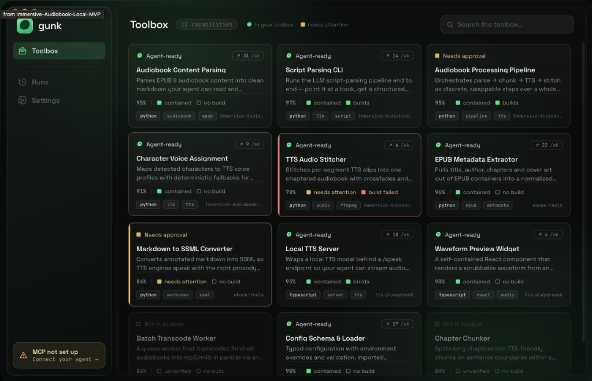

# Toolbox exploration v1 — "robotic futuristic" (rejected styling, approved IA)

Date: 2026-06-11 · Designed in Claude Design · Status: **information
architecture approved; visual styling rejected**

## Verdict in one line

The *content* of this design is exactly right and is now locked; the
*styling voice* is wrong — it reads as a sci-fi ops console ("robotic
futuristic") instead of a native Mac app, and the next iteration restyles
without touching the information architecture.

## What this iteration got right (locked — do not regress)

This is the first design that answers the
[library-view-prompt](../feature-report/library-view-prompt.md) brief
correctly:

- **Purpose line on every cell** — each module reads as a capability
  ("Stitches per-segment TTS clips into one chaptered audiobook…"), not a
  folder name.
- **Distinct trust states** — Agent-ready / Needs approval / Not in toolbox
  as the headline state, with confidence %, containment, and build status
  present per cell.
- **Agent-ready as the primary axis** — including dimmed "Not in toolbox"
  cells for unextracted modules.
- **Usage telemetry** (`↗ 31 /wk`) — present and flagged future-data.
- **Provenance** — source repo on the cell ("from
  Immersive-Audiobook-Local-MVP" on hover/corner).
- **Tags + language chips**, search, count chip ("12 capabilities"), and a
  legend in the header.
- **App-level IA** — the shell *pattern* (left sidebar, wordmark, and the
  MCP not-set-up chip pinned at the sidebar bottom) is locked. Note: the
  *section set* shown here (Toolbox / Runs / Settings) was superseded by
  the Phase 8 "Decisions locked in" — the sidebar is now **Library /
  Marketplace / Settings**, with Runs demoted to an inspector.
- **The colored top-edge treatment on "needs attention" cards** — the right
  instinct for scan-distance trust signaling; keep this.

## Why it reads "robotic futuristic" (the five problems to fix)

1. **Monospace everywhere.** Tags, source names, usage stats, and
   percentages are all set in mono. Mono type is the machine voice — it
   belongs on file paths and code only. Module names and purposes belong in
   SF Pro with real size and weight, so cards read like products, not log
   lines.
2. **Green-on-black terminal palette.** The accent green tints everything —
   backgrounds, borders, chips — so the accent has become the theme
   (Matrix/HUD). Surfaces should be neutral dark grays; green appears only
   where it means something (agent-ready, positive moments), which restores
   its meaning.
3. **Telemetry rows on every cell.** `95% ■ contained ■ no build` is four
   sensor readouts per card. Grid distance needs the *verdict*, not the
   pipeline: one summary state per cell (the colored edge), with the full
   confidence/containment/build breakdown in the detail view where the
   trust decision actually happens.
4. **HUD glyphs.** Tiny status squares, checkbox icons, bracketed
   `↗ N /wk` capsules are instrumentation iconography. Usage can be quiet
   text ("31 uses this week"); "Not in toolbox" can be a dimmed state with
   no glyph.
5. **Tight, square geometry.** Small radii, thin borders, dense rows.
   macOS Tahoe wants large concentric corner radii, generous interior
   padding, and separation by elevation/spacing rather than strokes.

## The reframe for the next iteration

Each cell is currently an **instrument panel**; it should be a **briefing
card** — a calm sentence about what the capability does, one clear verdict
about whether it's trusted, everything else whispered. The audience is a
human deciding trust, not an operator monitoring systems.

Also carry the platform rule from the Tahoe HIG: **Liquid Glass belongs on
the floating controls layer only** (filter/search bar, sidebar) — content
cells sit on standard solid materials and scroll beneath the glass. Glass
on every card is both off-HIG and part of why the view feels muddy.

## Revision instruction (give this to Claude Design verbatim)

> Keep the **library cell content and grid IA** of this design exactly
> as-is — every piece of information per cell, every trust state, the grid
> layout, the search/filter bar. The **shell sections** now follow the
> Phase 8 "Decisions locked in": the sidebar reads **Library / Marketplace
> / Settings** (not Toolbox / Runs / Settings); Runs is no longer a tab;
> the MCP chip stays pinned at the sidebar bottom as the only persistent
> global status element. Restyle everything to native macOS Tahoe with
> these hard constraints:
> 1. Mono type only for file paths and code. Names and purposes in the
>    system font with real hierarchy (name prominent, purpose regular).
> 2. Neutral dark gray surfaces. Accent green only on agent-ready/positive
>    signals; amber only on needs-attention. No green-tinted backgrounds,
>    borders, or chips.
> 3. One trust verdict per cell (keep the colored top-edge treatment);
>    move the confidence/containment/build readout row into the detail
>    view.
> 4. No HUD glyphs: no status squares, no checkboxes, no bracketed stat
>    capsules. Usage as quiet text.
> 5. Large concentric corner radii, generous padding, separation by
>    spacing and elevation, not borders. Glass material only on the
>    floating controls layer — sidebar, the search/filter bar, the window
>    toolbar, and overlays (the full-window drop target and
>    completion/failure toasts); content cards sit on solid surfaces and
>    scroll beneath the glass.
> 6. Also style the new shell chrome Phase 8 introduces, so CP-A approves a
>    target for the tasks that depend on it: the **model switcher** in the
>    toolbar (`provider · model` label), the decomposed status elements (a
>    processing element + the MCP chip, plus a transient completion/failure
>    toast), and the **full-window drop overlay** (dimmed scrim + centered
>    glass card, drag-over and ready-to-drop states). All of these float on
>    the controls layer; the underlying layout never moves during a drag.
