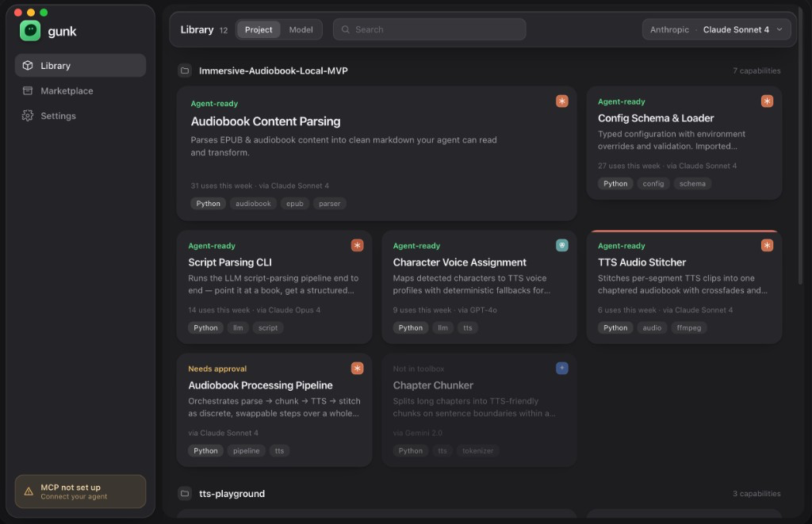

# Toolbox exploration v2 — native-Tahoe Library restyle

Date: 2026-06-11 · Designed in Claude Design · Status: **CP-A cleared for the
structural fold — palette direction approved; full visual restyle (T-8.3b)
deferred. Exact design tokens now pinned from the source mockup.**

> CP-A was cleared verbally to unblock T-8.3's structural work (sources fold
> into the Library). T-8.3 shipped the source/intake functionality on the
> existing design system. The full v2 visual restyle is scoped as **T-8.3b**.
>
> **Source of truth.** The interactive mockup is now in the repo:
> [`toolbox-v2-library.html`](toolbox-v2-library.html) (a standalone Claude
> Design export). The palette, geometry, type scale, and material values below
> are **read directly from that file's `:root` and CSS** — they are exact, not
> JPEG approximations. When this doc and the HTML disagree, **the HTML wins.**
> (The card data and provider-badge colors are rendered by the bundled JS and
> are *illustrative*; the provider-accent palette below remains a proposal.)
>
> Two corrections the HTML forces on the earlier screenshot reading:
> 1. **The accent green is unchanged (`#5fe08c`).** The de-green is **surfaces
>    only** — there is no quieter "forest" accent. Green stays exactly the
>    current `BrandColors.accent`.
> 2. **There is no provider-colored or selection top-edge.** Card top-edges are
>    drawn **only** for needs-attention (amber) and failed (red); **selection is
>    a 2px green ring** (`box-shadow`). This resolves the old open question about
>    `TTS Audio Stitcher`'s coral edge — it was the amber/selection treatment,
>    not a provenance edge.

## Verdict in one line

The native-Tahoe restyle of [toolbox-v1](toolbox-v1.md): same locked IA and
cell content, but neutral graphite surfaces (the green-tinted "ooze" near-black
is gone — **the accent green itself is unchanged**), system type for everything
but paths/code, and a new **grouped library** layout where each category leads
with a large "most-used" hero cell.

## The window at a glance

A standard macOS window, dark appearance, two regions:

- **Left sidebar** (~190pt, glass/controls layer, slightly *lighter* than the
  content): wordmark at top, three nav items, MCP chip pinned at the bottom.
- **Right content area** (solid surface, the darkest plane): a pinned header
  control bar, then a vertically scrolling list of **groups**, each group a
  source/category with its own grid of module cells.

### Sidebar (top → bottom)

1. **Wordmark** — green "ooze" app-icon tile + `gunk` in white.
2. **Library** — box/cube glyph; **currently selected** (filled rounded-rect
   highlight, lighter than the sidebar).
3. **Marketplace** — storefront glyph.
4. **Settings** — gearshape glyph.
5. **MCP chip** (pinned bottom) — amber warning triangle, **"MCP not set up"**
   on line 1, **"Connect your agent"** on line 2, in a subtly amber-tinted
   rounded card. This is the warning state of the persistent MCP status element
   (T-8.7 / T-8.10).

### Header control bar (the pinned controls layer, left → right)

1. **`Library` title** + a count chip **`12`** (total capabilities in the
   library).
2. **Grouping segmented control: `Project` | `Model`.** `Project` is selected.
   This toggles how the whole library is grouped — by **source repo/project**
   (shown) or by the **model that extracted each module**. *(New IA element,
   not previously in the task list — see "New scope flags".)*
3. **Search field** — magnifier glyph + `Search` placeholder, glass.
4. **Model picker** (trailing) — `Anthropic · Claude Sonnet 4` with a
   disclosure chevron. This is the shell-chrome model switcher from **T-8.8**,
   shown here as `provider · model`.

## The grouped grid (the core of the new layout)

Content is a stack of **groups**. Each group has:

- A **group header**: a folder/box glyph + the category name
  (`Immersive-Audiobook-Local-MVP`, then `tts-playground` below) on the left,
  and a right-aligned per-group count (`7 capabilities`, `3 capabilities`).
- A **grid of module cells** beneath it.

### The "hero" cell rule (confirmed by you)

Within each category, the module with **the most uses** is promoted to a
**large hero cell** — roughly **2 columns wide and taller** — pinned top-left.
Every other module is a **standard 1-column cell**. The rest of the grid is a
**3-column** layout. In the screenshot's first group:

- **Hero (2×, top-left): `Audiobook Content Parsing` — 31 uses** (the max in
  this group). Full, untruncated purpose; all four tags visible.
- Top-right standard cell: `Config Schema & Loader` — 27 uses.
- Row 2 standards: `Script Parsing CLI` (14), `Character Voice Assignment` (9),
  `TTS Audio Stitcher` (6).
- Row 3 standards: `Audiobook Processing Pipeline` (needs approval),
  `Chapter Chunker` (not in toolbox).

So the hero is purely a **usage-rank** treatment, recomputed **per category**
(and therefore per grouping mode — switching to `Model` re-buckets and
re-elects a hero for each model).

### Cell anatomy

**Standard cell** (top → bottom):

- **State label** (top-left): `Agent-ready` (green) / `Needs approval` (amber)
  / `Not in toolbox` (dimmed gray). One verdict per cell — the v1 telemetry row
  is gone.
- **Provider mark badge** (top-right): a small rounded-square glyph, **color-
  keyed to the model provider** that extracted the module:
  - **Anthropic / Claude** → coral-orange (~`#D26D43`)
  - **OpenAI / GPT-4o** → teal (~`#639FA9`)
  - **Google / Gemini** → indigo-blue (~`#33508A`)
- **Title** — system semibold, near-white.
- **Purpose** — system regular, ~2 lines, truncated with `…` on standard cells.
- **Meta line** — `N uses this week · via <Model>`, muted. *Note:* the
  `Needs approval` and `Not in toolbox` cells **omit the uses count** and show
  only `via <Model>`.
- **Tags** — pill chips (`Python` `audiobook` `epub` `parser`), system font in
  rounded gray pills (not mono).

**Hero cell:** identical anatomy, larger title, full purpose, more tags, more
interior padding.

**`Not in toolbox` cell (`Chapter Chunker`):** the entire cell is **dimmed**
(reduced opacity, muted text), no green — the quiet state for unextracted
modules, exactly as v1 specified.

### Per-cell states present in the shot (use as the screenshot matrix)

| Module | State | Provider badge | Uses | Notes |
| --- | --- | --- | --- | --- |
| Audiobook Content Parsing | Agent-ready | coral (Claude) | 31 | **hero** |
| Config Schema & Loader | Agent-ready | coral (Claude) | 27 | standard |
| Script Parsing CLI | Agent-ready | coral (Claude Opus) | 14 | standard |
| Character Voice Assignment | Agent-ready | teal (GPT-4o) | 9 | standard |
| TTS Audio Stitcher | Agent-ready | coral (Claude) | 6 | **coral top-edge accent — see open question** |
| Audiobook Processing Pipeline | Needs approval | coral (Claude) | — | amber state label |
| Chapter Chunker | Not in toolbox | blue (Gemini) | — | fully dimmed |

## What changed from v1 (the restyle)

1. **Surfaces are neutral graphite, not green-tinted ooze.** v1/current tokens
   use a green-black (`#0B0D0C` bg). v2 reads as a lighter, near-neutral
   graphite with a faint cool/purple cast. Elevation still reads
   content-darkest → sidebar → cards-lightest, just brighter overall.
2. **Accent green is unchanged** (`#5fe08c`, exactly the current token). The
   only color move is de-greening the *surfaces*; the accent is not re-tuned.
   Still green-on-meaning-only.
3. **Type is system everywhere except paths/code** — names, purposes, meta,
   tags all in SF Pro with real hierarchy. Mono retained only for path/code.
4. **One verdict per cell** — the confidence/containment/build readout row is
   gone from the grid (moves to detail, per the brief).
5. **Provider provenance is now a colored corner badge** rather than mono text
   — a quiet, scannable provenance signal.
6. **New grouped layout with a usage-ranked hero cell per category.**

## Exact tokens (read from `toolbox-v2-library.html` `:root`)

These are the literal CSS custom properties from the mockup — not samples. They
are the target for the `BrandColors` **dark** retune in T-8.3b.

| Mockup token | Hex / value | Role | Current dark token → direction |
| --- | --- | --- | --- |
| `--bg` | `#161618` | window / deepest plane | `backgroundPrimary` `#0B0D0C` → **lighter, de-greened** |
| `--bg-2` | `#1d1d20` | content area behind the cards | (the scrolling surface) |
| `--surface` | `#27272b` | solid content cards | `backgroundElevated` `#121613` → **lighter, de-greened** |
| `--surface-hi` | `#303036` | card hover | new hover step |
| `--text` | `#f3f3f5` | primary text | near-white |
| `--muted` | `#9b9ba2` | secondary text (purpose, counts) | |
| `--faint` | `#6c6c74` | tertiary / placeholder / meta | |
| `--line` | `rgba(255,255,255,0.07)` | hairline separators | lean on elevation, strokes barely there |
| `--green` | `#5fe08c` | agent-ready / positive **only** | `accent` `#5FE08C` → **unchanged** |
| `--green-d` | `#36b566` | deeper green (gradient/press) | |
| `--amber` | `#e7b765` | needs-attention **only** | `warning` `#E0C25F` → slightly warmer |
| `--red` | `#e5786a` | failed **only** | `danger` → roughly holds |
| `--glass-tint` | `rgba(48,48,54,0.55)` | the floating controls layer | over `backdrop-blur(42px) saturate(1.7)`, border `rgba(255,255,255,0.09)` |

Note there is **no dedicated "dimmed cell" or "tag pill" surface token**: the
*Not in toolbox* state is just the standard card at `opacity: 0.5` (hover → 1),
and tag chips are `rgba(255,255,255,0.06)` (language chip `0.09`) on the card —
both derived, not new tokens.

### Provider-accent palette (proposal — **not pinned by the mockup**)

The corner badges are colored by the bundled JS, so the HTML does not expose
their hex. Treat these as a starting proposal (fixed *art* colors, like the
brand-mark colors, with a `providerAccent(for:) -> Color` resolver and a neutral
fallback). `[HOLD FOR ME]` to confirm/replace before they land.

| Provider | Proposed |
| --- | --- |
| Anthropic / Claude | ~`#D26D43` (coral-orange) |
| OpenAI / GPT | ~`#639FA9` (teal) |
| Google / Gemini | ~`#33508A` (indigo-blue) |
| Ollama / unknown | neutral gray |

## Geometry, type & material (exact, from the mockup CSS)

**Type** — `--sans` is the system stack (`-apple-system`/SF Pro); `--mono` is
SF Mono, for paths/code only.

| Element | Size / weight |
| --- | --- |
| Wordmark | 20 / 600, `-0.02em` |
| Toolbar title | 16 / 600; count chip 12.5 / 500 muted |
| Group header title | 14.5 / 600; subtitle 12 muted; count 12 faint |
| Cell state label | 12 / 600 (text only, no glyph) |
| Cell name | 16 / 600, 2-line clamp; **hero (`.feat`) 19** |
| Cell purpose | 13 / regular muted, 2-line clamp; **hero 13.5, 3-line clamp** |
| Cell meta | 11.5 faint, pinned to bottom (`margin-top:auto`) |
| Chip | 11 muted; language chip brighter |

**Radii** — window `24`, sidebar & content panel `19`, toolbar `15`, cards `17`
(hero shares `17`), search/segmented/model controls `10–11`, chips `8`, provider
badge `6`, detail sheet `22`.

**Layout / grid**

- Sidebar: width `232`, margin `11`, padding `16/13/14`, glass.
- Content: solid `--bg-2`, radius `19`; the floating glass **toolbar** is
  `56` tall, inset `11`, and cards **scroll beneath it** (`.scroll` top padding
  `92`, sides `22`).
- Grid: `repeat(auto-fill, minmax(262px, 1fr))`, `gap: 14`, `grid-auto-flow:
  dense`. `--card: 262px` is the tunable cell min-width.
- **Hero (`.card.feat`)**: `grid-column: span 2; min-height: 210px`, more padding
  (`20/22/18`). Standard card `min-height: 168`, padding `17/18/16`.
- **Hero reflow**: under a `720px` content width the hero drops to `grid-column:
  auto` (single column) rather than shrinking — exactly the T-8.3b 960pt
  breakpoint guidance.

**Card surface & state**

- Card: solid `--surface`, hover lifts to `--surface-hi` with a `translateY(-2px)`
  and a deeper shadow. Selection = `box-shadow: 0 0 0 2px var(--green)` (green
  ring) — **this is also the cleanest home for T-8.3's arrival highlight.**
- Top-edge bar (`::before`, 3px, top-rounded) renders **only** for `.attn`
  (amber) and `.fail` (red). Agent-ready and *Not in toolbox* have no top edge.
- *Not in toolbox* = `.notready { opacity: 0.5 }` (hover restores to `1`).
- Provider badge `.mbadge`: top-right `19×19`, radius `6`, white glyph at ~95%
  opacity on a provider-colored fill.

### Design-system action items (for T-8.3b)

- Retune `BrandColors` **dark** surfaces to the exact tokens above
  (`backgroundPrimary` → `#161618`, the scrolling surface → `#1d1d20`,
  `backgroundElevated` → `#27272b`, a `#303036` hover step) and de-green them;
  re-derive matching light values. **Keep `accent` at `#5fe08c`.**
- Re-check `success`/`warning`/`danger` against the lighter surfaces for
  contrast (`warning` toward `#e7b765`, `danger` toward `#e5786a`).
- Add a **provider-accent palette** + `providerAccent(for:)` resolver (proposal
  above; `[HOLD FOR ME]` on the exact hex).
- Confirm `TagChip` is system font on a neutral translucent pill (no mono, no
  green tint).

## Constraints carried forward (unchanged from v1, restated for v2)

- **Glass on the floating controls layer only** — sidebar, the header control
  bar (title/segmented/search/model picker), window toolbar, overlays. Module
  cells and group content sit on **solid surfaces** and scroll beneath.
- **Mono only for paths/code.** Everything else system font.
- **Accent green only on meaningful state** (agent-ready / positive); amber
  only on needs-attention; dimmed for not-in-toolbox.
- **Large concentric radii, generous padding, separation by spacing/elevation,
  not strokes.**

## Implications for T-8.3 (sources fold into Library)

The v2 shot is the **Library grid**; it does not draw the sources panel, the
"Sources (N)" trigger, or the "Add folder" button. T-8.3 must add those onto
this header **without** disturbing the layout above:

- The **header control bar is already busy** (title+count, Project/Model
  segmented, search, model picker). Adding `Sources (N)` + `Add folder` will
  almost certainly trip the refining-loop clause — **plan to collapse the
  Library header into two rows** at the 960pt minimum rather than shrink touch
  targets. Screenshot both widths.
- The **arrival highlight moves to the module grid** (T-8.3 item 4): newly
  created cells get the 2s accent treatment. Use the **green** accent for the
  positive-arrival decay (distinct from the provider-coral badge and from the
  open-question top-edge below).
- Absent a v2-drawn sources surface, **default to a sheet** (per the task) that
  reuses `SourceRow`'s status slot; its chrome may be glass, its rows stay on
  solid surfaces.

## New scope flags (raise before building)

1. **`Project | Model` grouping toggle** is a brand-new IA control not in the
   T-8.3 task text. Decide whether it lands in T-8.3 or a follow-up; it implies
   `BrowseModel` can bucket by source **and** by extracting model, plus the
   per-category hero election.
2. **Usage-ranked hero cell** is new grid behavior (a layout/`BrowseModel`
   change). Needs a tie-break rule (e.g., when uses are equal or all zero) and
   a "no usage data yet" fallback so a fresh library still picks a sensible
   hero (or shows none).
3. **Provider corner badge** needs the provider→color mapping above plus glyphs
   and an unknown-provider fallback.

## Resolved (was an open question)

The `TTS Audio Stitcher` "coral top-edge" is **not** a real treatment — the
mockup CSS draws top-edges only for needs-attention (amber) and failed (red),
and **selection is a 2px green ring**, not a top edge. So selection and the
T-8.3 arrival highlight share the same green-ring vocabulary and do not collide
with the amber/red verdict edges. No provenance-colored edge exists.

## Beyond the Library: surfaces the mockup also specifies (later phases)

`toolbox-v2-library.html` is a full shell mockup, not just the grid. It also
pins these surfaces for the tasks that own them — use it as the visual target
when those land:

- **Detail = a centered glass sheet overlay** (`.overlay`/`.sheet`, radius `22`,
  `blur(50)`), *not* an inline pane. It holds the trust **readout** as a 3-up
  grid (confidence / containment / build), a mono code block, an agent note, a
  **`FUTURE`-flagged usage block**, and a footer with primary (green) / ghost /
  danger buttons. → **T-8.6 run inspector.** (The `FUTURE` usage flag in the
  mockup itself confirms the no-fabricated-usage rule: usage is shown as a
  flagged-future field, never a real number.)
- **Sidebar processing chip** (`.proc`, spinner + title/subtitle) and **MCP
  chip** (`.mcp`, amber, pinned bottom). → **T-8.7 status strip / T-8.10 MCP.**
- **Completion / failure toast** (`.toast`, top-center glass, ok-green /
  err-red). → **T-8.7.**
- **Full-window drop overlay** (`.drop`/`.dropcard`, dashed border that goes
  solid green on `ready` with a `— let go` affordance). → **T-8.5 drop overlay.**
- **Model switcher** (`.model` + `.model-menu`, grouped by provider, green
  check on the selected model). → **T-8.8 model switcher.**
- **`Project | Model` segmented control** (`.seg`). → grouping toggle in T-8.3b.
