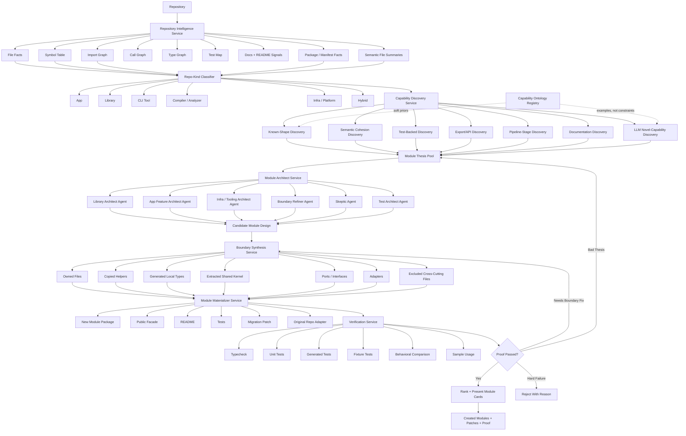
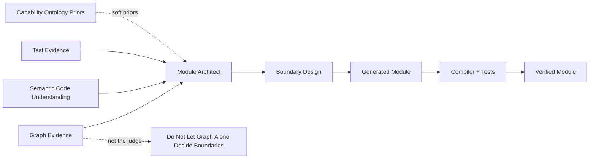
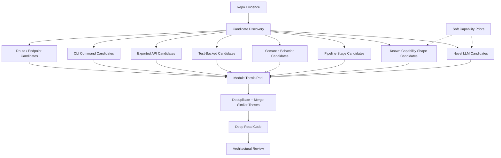
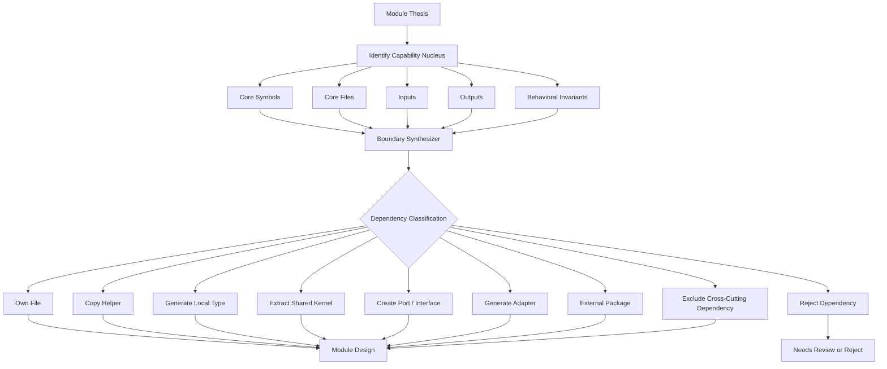
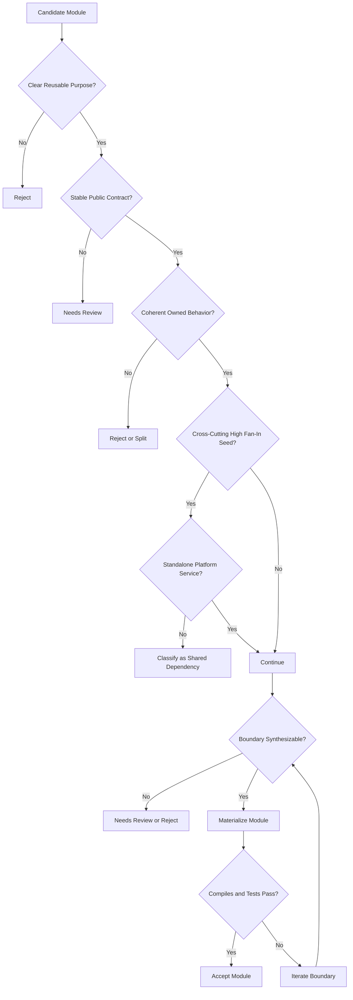
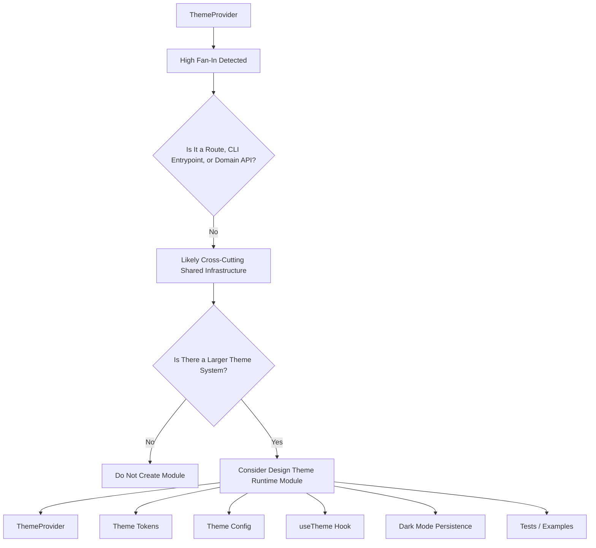
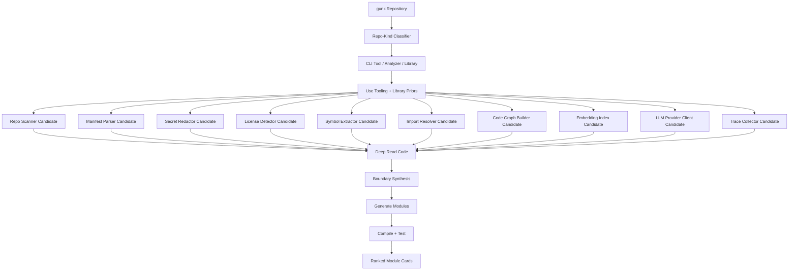
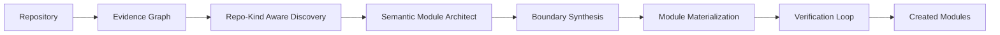

# Module Architect: build a module creator, not a graph clusterer

- **Status:** Proposed (vision / north-star architecture)
- **Date:** 2026-06-18
- **Author:** Mark Kohler
- **Decision record:** [ADR-0018](../adr/0018-module-architect.md)
- **Supersedes (when adopted):** the pipeline *shape* of
  [ADR-0012](../adr/0012-capability-centric-decomposition.md) (capability-centric
  decomposition). Retains ADR-0011's `gunk.yml`, secret-redaction, provenance,
  and license rules by reference.

---

## Why this document exists

Two observed failures motivate a redesign of the decomposition engine:

1. **gunk false negative.** Running gunk on its *own* repo produced **no
   modules**, even though it contains obviously reusable capabilities (a repo
   scanner, a dependency-manifest parser, a secret redactor, a license detector,
   a multi-language symbol extractor, an LLM provider client, …).
2. **ThemeProvider false positive.** On an older app codebase, a cross-cutting
   `ThemeProvider` was surfaced as a "module" purely because everything imports
   it.

Both stem from the same root cause: **the import graph is the architect.** The
current pipeline asks _"can I find a connected cluster that looks like an app
feature?"_ — and answers it with deterministic static analysis (routes, exported
symbols, dependency hints, strongly-connected clusters, high-fan-in bridge
files), boxing the LLM inside that frame.

### Where this lives in today's code

| Current behavior | Where | The bias it creates |
| --- | --- | --- |
| Survey rubric prefers "OAuth login, Stripe checkout…" and rejects "generic utilities / arbitrary folders" | `engine/src/decompose/survey.ts` | App-shaped capabilities only; library/tool code reads as "utilities" |
| "Surface" = routes ∨ public exports ∨ dependency lexicon hints | `ModuleQualityGate.hasSurface` in `engine/src/decompose/qualityGate.ts` | Tool/library code with no routes or recognized deps has no "surface" |
| Module boundary = graph BFS closure (depth ≤ 3, ≤ 25 files) | `engine/src/decompose/expander.ts` | Boundaries are "what's nearby," not "what belongs" |
| High inbound degree → candidate anchor / bridge | `GraphClustering.highFanInBridgeFiles` in `engine/src/analyze/graphClustering.ts` | High fan-in (usually a shared utility) gets *promoted* to a capability |
| "Self-contained or reject" | `engine/src/decompose/selfContainment.ts` + the gate | A dependency on shared types/store kills an otherwise good capability |
| `utils/`, `*helper*`, `config*`, `types.*` paths classified as trivial | `classify()` in `engine/src/decompose/qualityGate.ts` | Library primitives are rejected by path/name |

The fix is **not** to remove the graph. The graph is valuable evidence and
keeps results cheap and reproducible. The fix is to stop letting the graph do
the architectural thinking.

> **The architectural principle.** Graphs discover dependency pressure. AI
> discovers product boundaries. Verification proves extractability.

This is an explicitly **more expensive** architecture. It is the right one when
correctness matters more than cost and speed (gunk's stated stance — see
ADR-0012 "Cost stance").

---

## 1. Define a module as a product, not a folder or cluster

A module should not mean "a set of files that import each other." It should mean
a productizable capability with a contract, an extraction plan, and a proof:

```ts
type CreatedModule = {
  name: string;
  kind:
    | "app_feature"
    | "library_capability"
    | "cli_capability"
    | "integration_adapter"
    | "data_pipeline"
    | "analysis_engine"
    | "ui_component_system"
    | "platform_service"
    | "shared_kernel";
  problemStatement: string;
  publicContract: PublicContract;
  ownedFiles: FileRef[];
  sharedDependencies: SharedDependency[];
  generatedAdapters: GeneratedAdapter[];
  generatedFacade: FileRef[];
  tests: TestRef[];
  extractionPlan: ExtractionStep[];
  proof: ModuleProof;
};
```

The most important shift:

- **Today** the system asks: _"Is this already self-contained?"_
- **The new system** asks: _"Can I make this self-contained by extracting,
  wrapping, adapting, or generating a boundary?"_

That is the difference between **detection** and **creation**. A module is
allowed to require boundary work.

---

## 2. Use a multi-plane architecture

> Visual companion: see [Appendix A: Architecture diagrams](#appendix-a-architecture-diagrams)
> for the full pipeline, the "graph is evidence not judge" view, candidate
> discovery, boundary synthesis, the decision gate, and the ThemeProvider / gunk
> walkthroughs as Mermaid diagrams.

Seven layers, each with a distinct job:

```
Repository
   ↓
1. Evidence Plane
   ↓
2. Repo-Kind + Capability Ontology Plane
   ↓
3. Candidate Discovery Plane
   ↓
4. Semantic Deep-Read Plane
   ↓
5. Boundary Synthesis Plane
   ↓
6. Module Materialization Plane
   ↓
7. Verification + Ranking Plane
```

---

## 3. Evidence Plane: collect many kinds of truth

The current system is overly dependent on import-graph shape, routes, exports,
dependency hints, and environment hints. That is too narrow. Build a rich
repository fact model:

```ts
type RepoEvidence = {
  files: FileFacts[];
  symbols: SymbolFacts[];
  imports: ImportFacts[];
  exports: ExportFacts[];
  callGraph: CallGraphFacts;
  typeGraph: TypeGraphFacts;
  tests: TestFacts[];
  cliCommands: CliFacts[];
  routes: RouteFacts[];
  packageManifests: PackageFacts[];
  runtimeEntrypoints: RuntimeFacts[];
  docs: DocumentationFacts[];
  config: ConfigFacts[];
  dependencyManifests: DependencyManifestFacts[];
  namingClusters: NamingClusterFacts[];
  semanticSummaries: SemanticFileSummary[];
};
```

What matters depends on the repo:

- **App code:** routes, screens.
- **Library code:** exported symbols, classes, pure functions,
  parser/resolver/extractor/indexer/scanner names, test files, algorithmic
  cohesion, input/output types, error types, adapters, dependency boundaries.
- **CLI / tooling:** commands, pipelines, input files, output artifacts,
  analysis stages, configuration loaders, report generators, plugin points.

The evidence model must not privilege SaaS surface area.

---

## 4. Repo-Kind Plane: change the rubric before discovery

Before finding modules, classify the repo:

```ts
type RepoKind =
  | "saas_app"
  | "frontend_app"
  | "backend_service"
  | "cli_tool"
  | "library"
  | "sdk"
  | "compiler_or_analyzer"
  | "monorepo"
  | "infra_tooling"
  | "hybrid";
```

Then use **repo-kind-specific module rubrics**:

- `saas_app` → OAuth login, billing, checkout, upload flow, admin dashboard,
  notification settings, API endpoint group.
- `library` / `cli_tool` / `compiler_or_analyzer` → scanner, parser, resolver,
  extractor, detector, redactor, indexer, classifier, serializer, manifest
  parser, embedding store, trace collector, runtime adapter, provider client.

That single change fixes most of the gunk self-blindness:
`symbolExtractor.ts`, `importResolver.ts`, `licenseDetector.ts`,
`dependencyManifest.ts`, and `scanner.ts` should not be "mere utilities" just
because they are not routes or SaaS features. They are **library capabilities**.

> These repo-kind rubrics are **recall priors**, not allow-lists. They bias
> discovery toward shapes common to each repo kind; they never restrict which
> capabilities are valid. See §12 for the soft-priors model and the
> unknown-capability path.

---

## 5. Candidate Discovery Plane: use many candidate generators

Do not have one discovery mechanism. Use an ensemble:

```
Candidate Discovery
  ├─ route/endpoint candidate generator
  ├─ CLI command candidate generator
  ├─ export/API candidate generator
  ├─ test-backed capability generator
  ├─ algorithmic noun generator
  ├─ semantic file-summary generator
  ├─ dependency-adapter generator
  ├─ pipeline-stage generator
  ├─ graph-community generator
  ├─ documentation-heading generator
  └─ whole-repo LLM proposal generator
```

Each generator emits **module theses** (a candidate worth investigating, not yet
a final module):

```ts
type ModuleThesis = {
  id: string;
  name: string;
  kind: CreatedModule["kind"];
  thesis: string;
  primaryValue: string;
  likelyPublicApi: string[];
  nucleusFiles: FileRef[];
  supportingFiles: FileRef[];
  evidence: EvidenceRef[];
  risks: string[];
};
```

For gunk, candidates should include Repo Scanner, Dependency Manifest Parser,
Secret Redactor, License Detector, Tree-sitter Symbol Extractor, Import
Resolver, Code Graph Builder, Embedding Index, LLM Provider Client, Trace
Viewer, Runnability Classifier — **even with no routes, env keys, or SaaS
dependency hints.**

---

## 6. Semantic Deep-Read Plane: let AI read code, not just maps

Today, Pass 1 (survey) sees only the structural repo map, never code. For each
candidate thesis the LLM should instead receive: nucleus files, direct imports,
direct importers, tests, symbol summaries, top-level types, important call
sites, related docs, naming-similar neighbors, and semantically-similar
neighbors.

Then ask architectural questions: What capability exists here? Who would reuse
it? What is its public contract? Which files are essential / incidental /
shared? Which imports should become ports/adapters? Which types should be
copied, extracted, or wrapped? What tests prove it works? What should it be
named?

Because cost doesn't matter, do **not** do one LLM pass. Use specialist agents
and merge their findings:

- Library Architect Agent
- App Feature Architect Agent
- Infra/Tooling Architect Agent
- Skeptic Agent
- Boundary Refiner Agent
- Test Architect Agent
- Packaging Agent

Example dialogue:

- **Library Architect:** `analyze/symbolExtractor.ts` is a reusable
  multi-language symbol-extraction capability.
- **Skeptic:** It is coupled to `models.ts`, `analysisRegex.ts`, and
  `standardLibraries.ts`; it needs a shared-kernel extraction or local type
  adapter.
- **Boundary Refiner:** Extract it as `@gunk/symbol-extractor`, copy
  `analysisRegex.ts` and `standardLibraries.ts`, generate local `SymbolRecord`
  and `LanguageId` types, expose a stable façade.

That is module creation.

---

## 7. Boundary Synthesis Plane: replace BFS with semantic slicing

A graph BFS answers _"what is nearby?"_. Boundary synthesis must answer
_"what belongs?"_. Those are different questions. Use a weighted
module-boundary solver:

```ts
type BoundaryInput = {
  thesis: ModuleThesis;
  fileFacts: FileFacts[];
  symbolFacts: SymbolFacts[];
  importGraph: ImportGraph;
  callGraph: CallGraph;
  typeGraph: TypeGraph;
  semanticSimilarity: SemanticSimilarityGraph;
  tests: TestFacts[];
  repoKind: RepoKind;
};

type BoundaryPlan = {
  ownedFiles: FileRef[];
  copiedFiles: FileRef[];
  extractedSharedKernelFiles: FileRef[];
  generatedInterfaces: GeneratedFile[];
  generatedAdapters: GeneratedFile[];
  excludedFiles: ExcludedFile[];
  originalRepoPatch: PatchPlan;
  newModulePatch: PatchPlan;
  risks: BoundaryRisk[];
};
```

**Optimize for:** high semantic cohesion, clear public API, minimal accidental
imports, low cross-cutting fan-in, testability, small stable contract, few
framework assumptions, few app-specific references.

**Penalize:** high inbound fan-in, config-only files, global providers,
theme/context/root app files, shared models with no domain-specific ownership,
files imported by many unrelated candidates, files with many unrelated
responsibilities.

**Do not auto-reject:** utility-looking files; scanner/parser/resolver/extractor
files; shared type imports; internal analysis code; non-route code; library
primitives.

---

## 8. Treat high fan-in as suspicious, not attractive

A high-fan-in file should almost never be a module **seed**. High fan-in usually
means a shared provider, theme provider, config, global context, logger, model
definitions, utility, framework adapter, or shared constants. Those can be
*part* of a module, but they are usually not *the* module.

Change the rule from `high fan-in → possible capability hub` to
`high fan-in → likely shared dependency or platform service`:

```ts
function classifyHighFanInFile(file: FileFacts): HighFanInRole {
  if (file.isRoute || file.isCliEntrypoint) {
    return "possible_entrypoint";
  }
  if (file.exportsDomainSpecificApi && file.hasCohesiveTests) {
    return "possible_platform_service";
  }
  if (
    file.name.includes("Provider") ||
    file.name.includes("Context") ||
    file.name.includes("Theme") ||
    file.name.includes("Config") ||
    file.path.includes("shared") ||
    file.path.includes("common")
  ) {
    return "shared_infrastructure";
  }
  return "suspicious_cross_cutting_file";
}

if (file.inboundDegree > threshold && classifyHighFanInFile(file) !== "possible_entrypoint") {
  doNotSeedModule(file);
  allowAsSharedDependency(file);
}
```

This directly fixes the ThemeProvider false positive. A `ThemeProvider` can
still belong to a *design-system / theme-runtime* module — but only if the
thesis is actually about theming (tokens, theme config, provider, hooks, tests,
external usage). It must not become a module merely because everything imports
it.

This inverts today's `GraphClustering.highFanInBridgeFiles`
(`engine/src/analyze/graphClustering.ts`), which currently treats high inbound
degree as a positive signal.

---

## 9. Replace "self-contained or reject" with extraction strategies

The current self-containment check (`engine/src/decompose/selfContainment.ts`)
is too binary. A good candidate may depend on shared types, shared stores,
common errors, logging, tracing, or config — that should not kill it. Classify
every dangling import:

```ts
type DependencyResolution =
  | { kind: "own"; file: FileRef }
  | { kind: "copy_into_module"; file: FileRef }
  | { kind: "extract_shared_kernel"; file: FileRef }
  | { kind: "generate_local_type"; symbol: SymbolRef }
  | { kind: "replace_with_interface"; symbol: SymbolRef }
  | { kind: "adapter_port"; dependency: DependencyRef }
  | { kind: "external_package"; packageName: string }
  | { kind: "reject"; reason: string };
```

Examples:

- `symbolExtractor.ts` imports `models.ts` → don't pull all of `models.ts`;
  extract only `SymbolInfo`, `LanguageId`, `FileAnalysisInput` into local module
  types.
- `embeddingIndex.ts` imports `store/index.ts` → create a `VectorStorePort`,
  generate an adapter for the existing store, the module owns the embedding
  logic, the original repo keeps the adapter implementation.

That is the difference between finding clusters and creating modules.

---

## 10. The central primitive is a "capability nucleus"

A module begins with a semantic nucleus, not a graph closure:

```ts
type CapabilityNucleus = {
  coreSymbols: SymbolRef[];
  coreFiles: FileRef[];
  capabilityVerb: string;
  capabilityObject: string;
  inputs: TypeRef[];
  outputs: TypeRef[];
  invariants: string[];
};
```

Examples (gunk): scan repository, parse dependency manifest, redact secrets,
detect license, extract symbols, resolve imports, build code graph, index
embeddings, call LLM provider, trace execution, classify runnability.

Given the nucleus, ask: What minimum code makes this capability real? What is
implementation detail? What is shared infrastructure? What is accidental
coupling? What boundary would a user want? This naturally finds library/tool
modules.

---

## 11. Use semantic verbs and objects as capability anchors

Current anchors are app-biased. Add anchors based on semantic action names.

**Strong module verbs:** scan, parse, resolve, extract, detect, redact, index,
embed, classify, rank, cluster, decompose, trace, render, serialize, normalize,
validate, generate, compile, execute, hydrate, ingest, search.

**Strong module objects:** repository, manifest, license, secret, symbol,
import, graph, embedding, trace, module, dependency, file, project, AST, schema,
route, document, event, command, query.

A file or cluster containing `extractSymbols`, `resolveImports`,
`parseManifest`, `redactSecrets`, or `buildCodeGraph` should be considered
highly module-worthy **even with zero routes**.

> These verb/object lists are **positive priors that raise a candidate's score**
> (the `namingPriorScore` term in §12), not a required vocabulary. A capability
> whose naming matches none of them is still valid if it has reuse value, a
> coherent implementation, and a synthesizable boundary.

---

## 12. Capability ontology: soft priors, not hard gates

> **This is the single most important guardrail in the whole design.** The
> capability shapes below — scanner, parser, resolver, extractor, detector,
> redactor, indexer, classifier, serializer, manifest parser, embedding store,
> trace collector, runtime adapter, provider client — are **soft capability
> priors**, never constraints. They mean *"in library/tooling/analyzer repos
> these are common capability shapes, so bias discovery toward noticing them"* —
> **not** *"only these things count as modules."*

A module ontology gives the system *language* for capabilities so it does not
view everything through one SaaS lens. It must never become a prison.

### The wrong design (do not do this)

```ts
if (!nameMatchesKnownCapabilityKind(file)) {
  reject();
}
```

That recreates today's problem in a new form. The current engine is biased
toward SaaS shapes (routes, checkout, login, upload, API groups). Replacing that
with a hardcoded list of *tooling* shapes just creates a **different** blind
spot — you would start missing things like: scheduler, planner, normalizer,
matcher, ranker, linter, transpiler, migrator, validator, simulator,
orchestrator, policy engine, cache layer, query engine, workflow engine, diff
engine, report generator. So the ontology is **not** a hard gate.

### Capability shape = a scoring prior, with a boundary recipe

```ts
type CapabilityShape = {
  id: string;
  labels: string[];
  repoKinds: RepoKind[];
  positiveSignals: Signal[];
  negativeSignals: Signal[];
  commonPublicApis: string[];
  boundaryRecipe: BoundaryRecipe;
  examples: string[];
};

const SymbolExtractorShape: CapabilityShape = {
  id: "symbol_extractor",
  labels: ["extractor", "symbol extractor", "AST extractor"],
  repoKinds: ["library", "cli_tool", "compiler_or_analyzer"],
  positiveSignals: [
    { kind: "symbol_name", pattern: /extract.*symbol/i },
    { kind: "dependency", package: "tree-sitter" },
    { kind: "input_output", input: "source file", output: "symbols" },
    { kind: "test_name", pattern: /symbol|extract/i },
  ],
  negativeSignals: [
    { kind: "high_fan_in_cross_cutting" },
    { kind: "config_only" },
  ],
  commonPublicApis: ["extractSymbols(file, options)", "detectLanguage(path, contents)"],
  boundaryRecipe: "library_capability",
  examples: ["tree-sitter symbol extractor", "language symbol analyzer"],
};
```

This shape helps the system *notice* symbol extraction. It does not declare
other shapes invalid.

### The ontology contributes to the score; it does not dominate it

Instead of `if (candidate.kind not in knownKinds) reject;`, use an additive
score where the ontology is just two of many terms:

```
score(candidate) =
    semanticCohesionScore
  + publicContractScore
  + reuseValueScore
  + repoKindPriorScore     // ← ontology
  + testEvidenceScore
  + namingPriorScore       // ← ontology
  + exportSurfaceScore
  - crossCuttingPenalty
  - accidentalCouplingPenalty
```

```ts
function scoreCapability(candidate: ModuleCandidate): ModuleScore {
  return {
    capabilityValue: scoreCapabilityValue(candidate),
    publicApiClarity: scorePublicApi(candidate),
    cohesion: scoreSemanticCohesion(candidate),
    repoKindFit: scoreRepoKindFit(candidate),
    ontologyPrior: scoreOntologyPrior(candidate),
    extractability: scoreExtractability(candidate),
    falsePositiveRisk: scoreFalsePositiveRisk(candidate),
  };
}

// Decide on architecture, not on a noun match:
if (score.capabilityValue < 0.6) reject();
else if (score.falsePositiveRisk > 0.8) reject();
else if (score.publicApiClarity < 0.5) needsReview();
else accept();
```

(See §16 for the full score vector and §17 for the gate.)

### The list lives in a registry, not in logic

```ts
interface CapabilityOntology {
  shapes: CapabilityShape[];
  repoKindProfiles: RepoKindProfile[];
  boundaryRecipes: BoundaryRecipe[];
}

const TOOLING_CAPABILITY_PRIORS = [
  "scanner", "parser", "resolver", "extractor", "detector", "redactor",
  "indexer", "classifier", "serializer", "manifest_parser", "embedding_store",
  "trace_collector", "runtime_adapter", "provider_client",
];
```

A match adds **evidence with a strength**, it does not flip an `allowed` flag:

```ts
// Good — the registry gives the system language:
candidate.evidence.push({ type: "ontology_match", strength: 0.22, matchedShape: "extractor" });

// Bad — the registry becomes a prison:
candidate.allowed = matchedKnownShape;
```

### Unknown-capability discovery is required

The system must have a path for candidates that match **no** known shape — an
`UnknownButCohesiveCapabilityGenerator` that looks for: strong semantic
cohesion, clear input/output behavior, behavior-specific tests, repeated domain
nouns, a clear exported API, pipeline stages, isolated algorithms, stable types.
The LLM then assigns a *new* shape, and the ontology **evolves** (after review):

```json
{
  "name": "Policy Normalizer",
  "kind": "library_capability",
  "ontologyStatus": "new_shape",
  "proposedShape": "normalizer",
  "reason": "Converts multiple policy formats into one canonical representation."
}
```

### The prompt must say "examples, not exhaustive"

Without this wording the LLM overfits to the examples:

> The following are **common** capability shapes for this repo kind: scanner,
> parser, resolver, extractor, detector, redactor, indexer, classifier,
> serializer, manifest parser, embedding store, trace collector, runtime
> adapter, provider client. **These are examples, not constraints.** You may
> propose other capabilities if the code has: a clear reusable purpose, a stable
> public contract, coherent owned implementation, identifiable inputs and
> outputs, and a plausible extraction boundary.

### Three levels of capability recognition

This taxonomy prevents rejecting useful modules just because the name was not
prelisted:

```ts
type CapabilityRecognition =
  | { kind: "known_shape"; shapeId: string; confidence: number }
  | { kind: "known_family"; familyId: string; proposedSpecificShape: string; confidence: number }
  | { kind: "novel_shape"; proposedShape: string; explanation: string; confidence: number };
```

```ts
{ kind: "known_shape", shapeId: "secret_redactor", confidence: 0.94 }
{ kind: "known_family", familyId: "analysis_engine", proposedSpecificShape: "dependency risk scorer", confidence: 0.82 }
{ kind: "novel_shape", proposedShape: "runnability explainer",
  explanation: "Predicts whether a module can execute in a sandbox and explains why.", confidence: 0.76 }
```

The coarse **families** (`CreatedModule.kind` in §1) are a small, stable set with
a `novel_shape` escape hatch; the specific **shapes** are open and evolving.

### What may be hardcoded — and what may not

The module *types* must not be hardcoded. The *architectural principles* may be.

**Safe to hardcode (architectural invariants):**
- A module needs a clear purpose.
- A module needs a plausible public contract.
- A module should own cohesive implementation.
- A module should not merely be a random folder.
- A high-fan-in cross-cutting file is suspicious as a **seed** (§8).
- A boundary can be created with adapters, ports, copied helpers, or extracted
  types (§9).
- A candidate can be app-, library-, CLI-, infra-shaped, or novel.

**Unsafe to hardcode (the current failure):**
- Only routes count.
- Only exported APIs count.
- Only known capability nouns count.
- Utility-looking files cannot be modules.
- Internal tools cannot be modules.
- High fan-in means capability hub.
- No self-containment today means no module.

### The core rule

> A module is valid if it has **durable reuse value, a coherent implementation,
> and a synthesizable boundary** — not if it matches one of our known nouns.

### Discovery has multiple lanes; all feed one architectural review

```ts
type ModuleCandidate = {
  name: string;
  proposedKind: ModuleKind;
  recognition: CapabilityRecognition;
  evidence: EvidenceRef[];
  nucleus: CapabilityNucleus;
  publicContractHypothesis: PublicContract;
  boundaryHypothesis: BoundaryPlan;
  scores: ModuleScores;
};
```

- **Known-shape discovery** — finds scanner/parser/resolver/etc. (ontology recall).
- **Semantic discovery** — finds cohesive behavior even without known labels.
- **Test-backed discovery** — finds modules implied by tests.
- **Export-backed discovery** — finds modules implied by public API.
- **Pipeline discovery** — finds stages in workflows.
- **LLM novel discovery** — finds concepts the static system missed.

All candidates flow into the same architectural review (§6–§9, §15–§17). This is
how you avoid replacing one biased detector with another biased detector.

---

## 13. Use module creation recipes

Each module type needs a different extraction strategy.

- **App feature:** entrypoint route/screen/API; own feature-specific components,
  server handlers, and state; shared UI/system deps stay external; generate an
  app-shell adapter.
- **Library capability:** start from exported symbols and tests; identify minimal
  I/O types; copy pure helper files; replace app-specific imports with local
  interfaces; generate a public façade; generate examples + README.
- **CLI capability:** start from the command handler; separate command parsing
  from capability logic; extract the capability core; generate the CLI adapter
  as an optional wrapper.
- **Analysis engine:** start from a pipeline stage; own algorithms and domain
  types; separate persistence from computation; replace the repo store with a
  port; generate an in-memory adapter; generate golden tests.
- **Integration adapter:** own the provider-specific client; define a
  provider-neutral interface if useful; keep credentials/config outside the
  module; generate a mock transport; test request/response mapping.

For gunk, the best modules are mostly `library_capability` or `analysis_engine`,
not `app_feature`.

---

## 14. Materialize modules, don't only report them

Output real artifacts. For each approved module:

```
/packages/repo-scanner
  src/
    index.ts
    scanner.ts
    ignoreRules.ts
    types.ts
  tests/
    scanner.test.ts
    ignoreRules.test.ts
  package.json
  README.md
```

…plus a compatibility patch in the original repo:

```ts
// old location
export { scanRepository } from "@gunk/repo-scanner";
```

```ts
import { createEmbeddingIndex } from "@gunk/embedding-index";
import { GunkVectorStoreAdapter } from "./store/GunkVectorStoreAdapter";
```

The system should produce: new module source, public API, tests, adapter,
migration patch, README, confidence score, and remaining risks — not just
"this could be a module."

---

## 15. Use compiler/test loops as architectural truth

Since cost and speed don't matter, verify aggressively. For each candidate:
create a scratch extraction, install deps, compile, run relevant existing tests,
generate + run missing tests, typecheck, lint, run sample usage, and compare
behavior against the original.

```ts
type ModuleProof = {
  typecheckPassed: boolean;
  testsPassed: boolean;
  generatedTestsPassed: boolean;
  sampleUsagePassed: boolean;
  behavioralComparisonPassed: boolean;
  unresolvedImports: UnresolvedImport[];
  publicApiReview: string;
};
```

This lets you accept modules that **required generated boundaries**, not only
ones that were already clean. (Today's best-effort build check lives in
`engine/src/extract/buildVerify.ts` and is never gate-enforcing; here,
verification becomes central.)

---

## 16. Rank extractability and usefulness separately

The current system conflates "easy to extract" with "real capability." Score
them independently:

```ts
type ModuleScore = {
  capabilityValue: number;
  extractability: number;
  cohesion: number;
  publicApiClarity: number;
  couplingRisk: number;
  testability: number;
  reusePotential: number;
  falsePositiveRisk: number;
};
```

- `secretRedactor.ts` → capabilityValue: high, extractability: high, cohesion:
  high.
- `symbolExtractor.ts` → capabilityValue: very high, extractability: medium,
  cohesion: high, couplingRisk: medium.
- `ThemeProvider.tsx` → capabilityValue: low/medium, extractability: high,
  cohesion: low (unless paired with a real theme system), falsePositiveRisk:
  high.

This prevents easy-but-unimportant files from beating valuable-but-coupled
modules.

---

## 17. The new gate is "can be productized," not "already clean"

```ts
function shouldCreateModule(candidate: ModuleThesis, boundary: BoundaryPlan, proof: ModuleProof): Decision {
  if (!candidate.primaryValue) {
    return reject("No clear reusable capability.");
  }
  if (!candidate.publicContractIsStable) {
    return reject("No stable public contract.");
  }
  if (candidate.isCrossCuttingInfrastructure && !candidate.hasStandaloneServiceSemantics) {
    return reject("Cross-cutting dependency, not a module.");
  }
  if (proof.unresolvedImports.length > 0 && !boundary.hasResolutionForAllImports) {
    return needsApproval("Useful capability, but unresolved boundary risk.");
  }
  if (!proof.typecheckPassed) {
    return needsApproval("Module likely valid, but generated extraction does not compile yet.");
  }
  return accept();
}
```

This replaces the current gate's `no surface → reject`, `dangling import →
reject`, `utility path → reject`, `high fan-in → nominate`
(`engine/src/decompose/qualityGate.ts`).

---

## 18. Proposed end-to-end flow

1. Ingest repo
2. Build rich evidence graph
3. Classify repo kind
4. Generate candidate module theses from many generators
5. Deep-read each candidate with specialist LLM agents
6. Merge duplicate candidates
7. Identify capability nucleus
8. Synthesize module boundary
9. Classify every dependency (owned / shared / copied / adapted / generated /
   external / rejected)
10. Generate public API
11. Generate module package
12. Generate adapters back into the original repo
13. Compile and test in a scratch workspace
14. Iterate boundary until proof passes or risks are explicit
15. Rank modules by value and feasibility
16. Present module cards and patches

The important part: **the LLM creates the boundary, it does not merely judge a
boundary produced by BFS.**

---

## 19. Expected output on gunk

| # | Module | Kind | Owned files | Boundary strategy |
| --- | --- | --- | --- | --- |
| 1 | Repo Scanner | `library_capability` | `ingest/scanner.ts`, `ingest/ignoreRules.ts` | copy local types; expose scanner options; keep repo-specific persistence outside |
| 2 | Dependency Manifest Parser | `library_capability` | `analyze/dependencyManifest.ts` | local manifest types; no store dependency |
| 3 | Secret Redactor | `library_capability` | `extract/secretRedactor.ts` | pure module; fixture tests |
| 4 | License Detector | `library_capability` | `extract/licenseDetector.ts` | local result types; fixtures for known licenses |
| 5 | Symbol Extractor | `analysis_engine` | `analyze/symbolExtractor.ts`, `analyze/analysisRegex.ts`, `analyze/standardLibraries.ts` | extract local symbol model; tree-sitter as external dep; replace repo model imports with local types; generate language adapter interfaces |
| 6 | Import Resolver | `analysis_engine` | `analyze/importResolver.ts` | local file-graph types; resolver options; adapters for manifest lookup |
| 7 | Code Graph Builder | `analysis_engine` | `analyze/codeGraph.ts` (+ import resolver as dep/sibling) | local graph model; no persistence dependency |
| 8 | LLM Provider Client | `integration_adapter` | `llm/client.ts` (+ maybe `llm/embeddings.ts`) | provider-neutral interface; provider-specific adapters; tracing as optional port |
| 9 | Embedding Index | `analysis_engine` | `search/embeddingIndex.ts` | `VectorStorePort`; in-memory store; adapter for existing `store/index.ts` |
| 10 | Trace System | `platform_service` | `trace/*` | extract trace event model; adapters for file/stdout sinks |

Proposed public APIs:

```ts
scanRepository(root, options): AsyncIterable<ScannedFile>;
createIgnoreMatcher(patterns): IgnoreMatcher;
parseDependencyManifest(filePath, contents): DependencyManifest;
redactSecrets(text, options): RedactionResult;
detectLicense(files): LicenseDetectionResult;
extractSymbols(file, options): SymbolExtractionResult;
detectLanguage(path, contents): LanguageId;
resolveImports(file, projectContext): ResolvedImport[];
```

This is the output the current system cannot produce reliably because it waits
for app-shaped surface area.

---

## 20. Expected behavior on ThemeProvider

```
Candidate: ThemeProvider
High fan-in: yes
Semantic role: shared UI infrastructure
Standalone capability: weak unless paired with theme tokens/config/hooks
Public API: narrow provider wrapper
Imported by many unrelated features: yes
Decision: do not seed module
Classification: shared dependency or part of a larger design-system module
```

- **Accepted module (if warranted):** `Design Theme Runtime` — ThemeProvider +
  theme tokens + `useTheme` hook + theme config + dark/light persistence +
  tests/examples.
- **Rejected module:** `ThemeProvider` alone — a cross-cutting app-shell
  provider, not a standalone capability.

---

## 21. Responsibilities split

- **Graph:** What depends on what? What is central? What is isolated? What would
  break if moved?
- **LLM:** What capability exists? What should the public contract be? What is
  accidental coupling? What should be owned / wrapped / copied / adapted?
- **Compiler/tests:** Did the created module actually work?

Right now the graph does too much of the architectural thinking.

---

## 22. Recommended system design (five cooperating services)

```ts
interface RepositoryIntelligenceService {
  analyze(repoPath: string): Promise<RepoEvidence>;
}

interface CapabilityDiscoveryService {
  discover(evidence: RepoEvidence): Promise<ModuleThesis[]>;
}

interface ModuleArchitectService {
  designModule(thesis: ModuleThesis, evidence: RepoEvidence): Promise<ModuleDesign>;
}

interface ModuleMaterializerService {
  materialize(design: ModuleDesign, repo: RepoWorkspace): Promise<MaterializedModule>;
}

interface VerificationService {
  verify(module: MaterializedModule): Promise<ModuleProof>;
}
```

- **A. Repository Intelligence** → file summaries, symbol tables, import/call/type
  graphs, test map, entrypoint map, package map, semantic embeddings, repo kind.
- **B. Capability Discovery** → candidate theses via static, semantic, full-repo
  LLM, test-backed, export-backed, and pipeline-stage generators.
- **C. Module Architect** → public contract, owned files, non-owned dependencies,
  boundary risks, adapter strategy, module name + kind.
- **D. Module Materializer** → new package, generated façade + adapters, README,
  tests, migration patch.
- **E. Verification** → typecheck, unit tests, generated tests, fixture tests,
  sample imports, behavioral comparison. Results feed a final ranker.

---

## 23. Replace the current prompts with role-specific prompts

The survey prompt (`engine/src/decompose/survey.ts`) should no longer say, in
effect, _"prefer SaaS features, reject utilities."_ It should say:

> Identify reusable capabilities appropriate to this repo kind. A reusable
> capability may be an app feature, parser, scanner, resolver, detector,
> adapter, indexer, provider client, pipeline stage, runtime service, or shared
> kernel. Do not reject library/tool capabilities merely because they are
> internal utilities. Judge whether they have a clear contract and reuse value.

The refine prompt (`engine/src/decompose/refiner.ts`) should no longer say
_"return null if this is not a real module."_ It should say:

> Either reject, accept, or propose a boundary transformation that would make
> this a real module.

The boundary prompt should explicitly allow: add sibling files, remove bridge
files, copy small helpers, extract local types, generate ports, generate
adapters, split a candidate into multiple modules, merge a candidate with a
sibling, and **downgrade high-fan-in files to shared dependencies.** That last
part is crucial.

---

## 24. Mental model: module extraction as refactoring synthesis

You are not building a detector. You are building an **automated refactoring
architect.** The output is not "here are clusters." The output is: here are
productized modules I can create, here is their API, here is their boundary,
here is the migration plan, here is the proof they compile and work.

---

## 25. The architecture in one sentence

> Build an AI-led Module Architect that starts from semantic capability theses,
> uses the graph as evidence, synthesizes boundaries with adapters/shared-kernel
> extraction, materializes real packages, and verifies them with compiler/test
> loops.

This directly fixes both observed failures:

- **gunk false negative** → fixed by repo-kind-aware library/tool capability
  discovery and code deep-reading.
- **ThemeProvider false positive** → fixed by high-fan-in seed suppression and
  cross-cutting dependency classification.

The graph stays valuable. It stops being the architect.

---

## Appendix A: Architecture diagrams

These diagrams are the visual companion to the spec above. They are the
authoritative picture of the data flow; the prose sections (§1–§25) are the
detail.

### A.1 Full pipeline (end to end)

The complete flow from repository to created modules + patches + proof. Note the
feedback edges out of the verification gate: a failed proof can loop back to
boundary synthesis, back to the thesis pool, or reject — verification is part of
the accept decision (§15, §17), not a post-step.



### A.2 The graph is evidence, not the judge (§21)

The single most important visual point: the graph is one evidence source among
several feeding the Module Architect. It must not decide boundaries alone.



### A.3 How candidates are created (§5, §12)

Many discovery lanes feed one thesis pool. The capability ontology supplies
*soft priors* to the known-shape and novel lanes — it raises recall for
library/tooling/analyzer repos and is never a hardcoded constraint.



Examples living in **Soft Capability Priors**: scanner, parser, resolver,
extractor, detector, redactor, indexer, classifier, serializer, manifest parser,
embedding store, trace collector, runtime adapter, provider client. They are not
hardcoded constraints — they only increase recall for
library/tooling/analyzer repos (see §12).

### A.4 Boundary synthesis — the replacement for pure BFS (§7, §9, §10)

Start from a capability nucleus, then classify *every* dependency into a
resolution strategy, rather than hoping a BFS closure happens to be right.



- **Old:** start at seed file → BFS imports → hope the closure is good.
- **New:** start at capability nucleus → classify every dependency → synthesize
  the module boundary.

### A.5 Decision gate — architectural, not noun-matching (§17)

The hard gates are architectural (purpose, contract, coherent behavior,
synthesizable boundary, verification proof). Capability nouns like scanner /
parser / resolver **do not** appear as gates.



### A.6 What happens to ThemeProvider (§20)

`ThemeProvider` alone is rejected or classified as shared infrastructure; a
larger *Design Theme Runtime* module may still be valid if a real theme system
exists.



### A.7 What happens to gunk-style tooling code (§19)

gunk is treated as a repo full of tooling capabilities, not as a failed SaaS
app.



### A.8 One-line architecture



---

## Relationship to existing docs

- Current engine reference: [`engine/docs/ARCHITECTURE.md`](../../engine/docs/ARCHITECTURE.md).
- Current pipeline decision: [ADR-0012](../adr/0012-capability-centric-decomposition.md)
  (this design supersedes its pipeline *shape* when adopted).
- Manifest / safety / provenance rules retained by reference:
  [ADR-0011](../adr/0011-ai-decomposition-pipeline.md).
- Multi-language coverage + verification: [ADR-0014](../adr/0014-multilang-coverage-and-verification.md).
- Directional decision: [ADR-0018](../adr/0018-module-architect.md).
