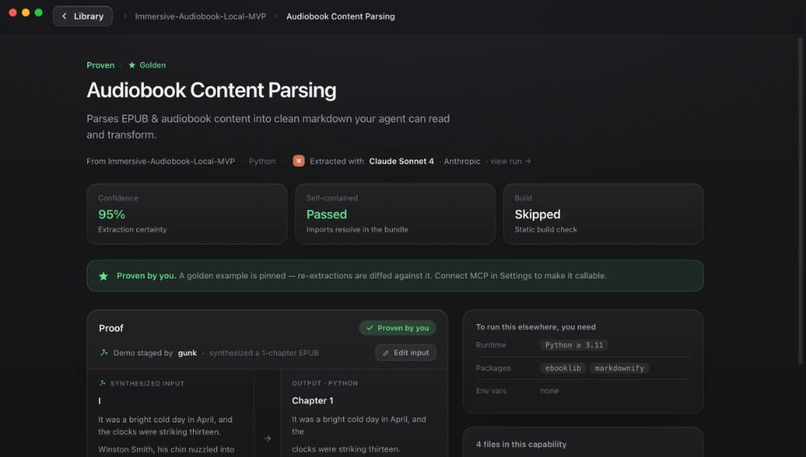
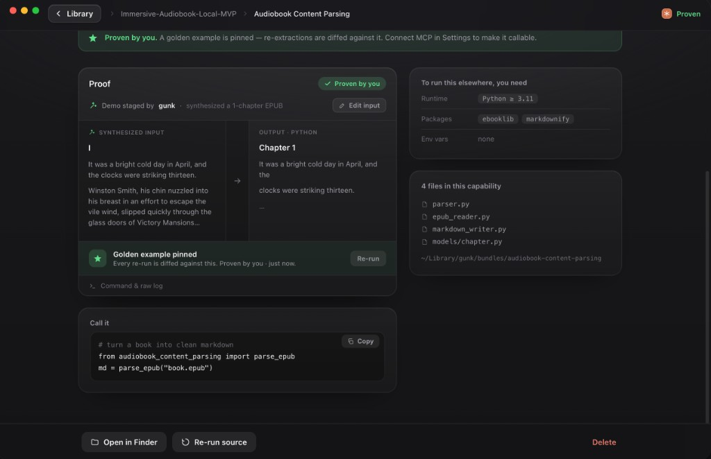
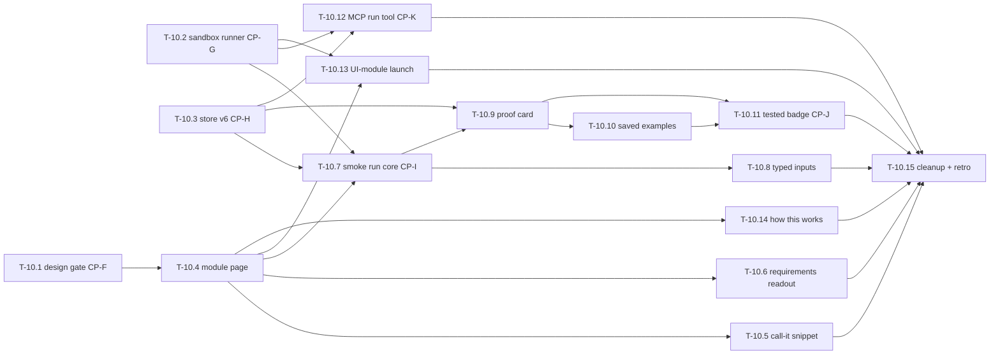

# Phase 10 — Run & test modules (the proof loop)

This phase builds **the developer's door** into a module — and, for the
first time, **the agent's door beyond read-only**. MCP let the agent *read*
a module (Phases 2–8); this phase lets a module **demonstrate that it
works**, to two audiences: the **developer** (who runs it, judges the
output, and pins a golden example) and the **AI system** (which can run and
test a module over MCP before it dares use it). Two questions drive every
item: *"does it actually do the thing?"* (proof, not claims) and *"can I
take it somewhere?"* (portability).

Clicking a module stops opening an inline pane and instead navigates to a
**full module page** (breadcrumb `‹ Library › <source> › <module>`) whose
spine is *proof*: the trust readout, a before/after **Proof card**, a real
**sandbox-bounded terminal** with developer and example inputs, an
accumulating **testing metric** (the Tested badge — *one passing example
never reads "Proven"*), and an MCP run/test tool so the agent earns the
same evidence the human does.

Roadmap: [docs/roadmap.md → Phase 10](../roadmap.md). Product definition:
[smoke-run-prompt.md](../design/feature-report/smoke-run-prompt.md) (stage
1), [module-io-prompt.md](../design/feature-report/module-io-prompt.md)
(stage 2), and the direction-setting exploration
[module-run-v1.md](../design/explorations/module-run-v1.md) (stage 3 —
**when its design HTML lands, the HTML wins** over the prose and the PNGs,
same rule as toolbox-v2). Phase 8/9 outcomes this phase builds on:
[docs/retros/phase-8.md](../retros/phase-8.md),
[docs/retros/phase-9.md](../retros/phase-9.md) (write the latter if it does
not exist yet).

The two reference screens that exist today (resting "Proven" state only —
**every other state is unbuilt and ungated**, which is what T-10.1 fixes):

## How to read this document

Written to be executed by an AI agent **with a human ("me") in the loop**.
Each task has the same shape:

- **Task execution (agent prompt):** the literal instruction block.
- **Refining loop:** iterate-until-good cycle.
- **Human-in-the-loop (me):** what I review or provide. The agent **must
  stop at every `[HOLD FOR ME]` gate.**
- **Acceptance:** objective done criteria.

### Working agreement for the agent

1. One task at a time, in order, unless I say otherwise.
2. After any visible change: `swift build`, run the app (`make app` when
   packaging matters), capture a screenshot of the affected surface, paste
   it in your summary. After any engine/mcp change: `bun test` in that
   package.
3. Never proceed past `[HOLD FOR ME]` without my explicit approval.
4. Keep each task PR-sized and reversible.
5. **Scope expands this phase — deliberately.** Phases 8–9 froze
   `engine/`, `mcp/`, and `Store/Schema.swift`. Phase 10 **must** touch all
   three because the whole point is *execution*: a sandbox runner, a new
   MCP run/test tool, and store state for receipts. Those are unlocked
   here, but each risky one ships **behind an ADR and tests** (the sandbox
   model = a new ADR; the MCP run tool = a new ADR or an ADR-0001 amendment;
   the schema change = a forward migration with backfill tests). No other
   relitigating of frozen Phase 8/9 decisions.
6. `swift test` and the relevant `bun test` stay green after every task.
7. Use the frozen design system (`Design/` tokens + components) and the
   **toolbox-v2** styling constraints: glass material on the floating
   controls layer only (breadcrumb bar, toolbars, overlays), solid graphite
   surfaces for content; mono **only** for paths/code/terminal output;
   accent green **only** on earned, meaningful state (agent-ready, a passed
   run, a Proven tier); amber = needs the human; red = failed. Do not
   re-tune the palette — toolbox-v2 is locked.
8. **Safety is a feature, not a footnote.** Anything that executes
   extracted code (T-10.2, T-10.7+, T-10.12, T-10.13) carries the
   first-run consent treatment and respects the sandbox contract from
   T-10.2. Never silently run code, never silently write into the user's
   filesystem outside the sandbox run directory.

## Decisions locked in (do not relitigate)

- **The module surface becomes a full page, not a sheet.** module-run-v1
  reverses toolbox-v2's "detail = centered glass sheet" and T-8.4's interim
  inline pane: clicking a module **navigates** (breadcrumb back, not
  dismiss). Nothing pre-builds the glass-sheet detail container.
- **Receipt-first, terminal-demoted.** The primary evidence is the
  before/after **Proof card**, rendered *as the artifact* (markdown
  rendered, JSON pretty, audio playable, image shown, text plain). The raw
  command + stdout/stderr **demote to a `>_ Command & raw log` disclosure.**
- **The developer is the judge.** A run gets a developer verdict
  (**"That's right" / "That's wrong"**). A "right" verdict **pins a golden
  example**; future runs and source re-extractions diff against it. "Wrong"
  is a first-class amber state (*Needs you*), warmer than "needs approval".
- **The agent is the second runner.** An MCP tool lets the AI system run a
  module's entrypoint in the same sandbox and get the same receipt back, so
  an agent can verify before it uses. This is the user's explicit Phase 10
  ask ("the AI needs to test these modules as well").
- **"Proven is earned, not declared."** One pinned golden example must
  **not** read as "Proven." The claim scales with an accumulating metric
  (count of examples + pass state) — the **Tested badge leveling rule**.
  What earns each tier is an open product decision settled in T-10.1.
- **A real terminal, sandbox-bounded.** The expert path is a working
  terminal (developer inputs + one-click example inputs); the guided path
  is a typed input surface. They coexist. The boundary is **sandbox
  guarantees** (fs scope, network, timeouts), stated in the UI, not waved
  at. First-run consent applies to both.
- **UI modules launch the browser.** If a module's output *is* UI, running
  it launches the user's external browser at the served surface. In-app
  preview is explicitly **out**.
- **Two surfaces, never merged.** *Extraction runs* (`view run →`, the
  T-8.6 `RunInspectorView`) answer "what did gunk do to make this." *Smoke
  runs* answer "what does the module do." They link but never share a
  screen.
- **No fabricated usage numbers.** Smoke-run receipts are the first
  *honest* usage signal; they feed the Library `heroRank` `// FUTURE: rank
  by uses/week` seam. Until that seam is wired, ranking stays on its
  documented fallback.
- **Explicitly out:** dependency-graph visualizations, run-history charts,
  in-app code editing, metrics dashboards, a "test suite" UI, REPL of
  arbitrary shell beyond the sandbox-bounded terminal.

## Hard data facts (verified against the codebase — do not fight these)

1. **Nothing executes a module today.** There is no smoke run, no "Call it"
   runner, no sandbox. The only code execution that exists is an *optional*
   build-verify compile check (`engine/src/extract/buildVerify.ts`,
   `spawnSync` of `tsc`/`dart analyze`/etc. in a throwaway `mkdtempSync`
   temp dir) — and the app spawns the engine **without** `--verify-build`
   by default, so most stores have an empty build receipt. T-10.2 builds
   the real runner; do not assume one exists.
2. **The "terminal receipt in the store" is actually trace JSON, not a DB
   column.** The build verify `command` + `log` live in
   `~/.gunk/runs/<runId>/trace.json` (`trace.verification.build[]`), read
   by `BrowseModel.indexBuildVerification` keyed by normalized `bundlePath`,
   surfaced in `ModuleDetailView`'s "Build verification" section. It is the
   *pattern* to imitate (a captured command + log rendered in the UI), but
   smoke-run receipts need **durable per-module storage**, not ephemeral
   trace JSON — that is T-10.3.
3. **Schema is at v5; `gunks` already has `provider` + `model`** (Phase 9
   T-9.2). Adding smoke-run/example/tested state is a **v6** migration
   (app-only — `mcp/src/schema/migrate.ts` `LATEST_VERSION = 4` early-
   returns on higher stores, and every MCP read uses an explicit column
   list, so new columns/tables are invisible to it). The store lives at
   `~/.gunk/store.db`; bundles at `~/.gunk/modules/<gunk_id>/` (**not**
   `~/Library/gunk/bundles/`).
4. **Entrypoints carry symbols.** `RunTrace.Module.surface: [{path, symbol?}]`
   → `BrowseEntrypoint(path:symbol:)` with `label` = `"path · symbol"`
   (`BrowseModel.indexTraces`, fallback `manifestEntrypoints` parsing
   `gunk.yml`). Engine origin: refiner LLM `entrypoints: [{path, symbol}]`
   → `Module.surface`. This feeds the "Call it" snippet (T-10.5) and the
   terminal pre-fill (T-10.7).
5. **Requirements data exists but is not surfaced.** Module detail shows
   shared-dependency *paths* (`RunTrace.Module.sharedDeps`). The engine has
   a real `DependencyManifestParser`
   (`engine/src/analyze/dependencyManifest.ts`: package.json, pubspec,
   requirements.txt, pyproject, go.mod, cargo, Gradle, Maven) but it runs
   only at the pipeline "fingerprints" stage and is **not** persisted per
   module — and `ManifestWriter` writes **empty `deps` stubs** into
   `gunk.yml`. T-10.6 closes this gap.
6. **Module detail is an inline pane, and there is no page navigation.**
   `ModuleDetailView` (private in `BrowseView.swift`) renders in an `HStack`
   right pane when `selectedGunkId` is set; comments mark it "interim" until
   this exact exploration. `AppShellView` uses a `NavigationStack` with only
   `.navigationTitle("gunk")` — **no breadcrumb, no full-page push.** T-10.4
   builds it. Sheets exist for `RunInspectorView`, `MCPSetupView`, and the
   sources panel.
7. **The extraction-run inspector already exists and is correct.**
   `RunInspectorView.swift` (sheet; `RunInspectorContext` = `.all` /
   `.source` / `.mostRecentFailure`), reading `RunTraceStore.recentTraces()`
   from `~/.gunk/runs/<id>/trace.json`; `RunTrace.provider`/`.model` are
   top-level. The module-page `view run →` line is its module-detail entry
   point — reuse it, do not rebuild it.
8. **MCP has exactly four read tools and no run tool.**
   `mcp/src/server/registerTools.ts` wires `list_gunks`, `list_sources`,
   `search_gunks`, `get_gunk`. They open the store via `bun:sqlite`
   (`openDefaultStore()` → `~/.gunk/store.db`) with explicit column lists,
   query, and `db.close()`. T-10.12 adds the first **write/execute** tool —
   the largest change to the MCP contract since Phase 2, hence its own ADR.
9. **The app spawns subprocesses via `Process()`**
   (`SourceProcessingRunner` → `ProcessEngineLauncher`, `EngineLauncher.swift`;
   binary resolved by `EngineBinary.resolve()` → `GUNK_ENGINE_BIN` /
   bundled `gunk-engine` / `bun run` dev). The MCP binary installs to
   `~/.local/bin/gunk-mcp` (`MCPBinary.ensureInstalled`). The sandbox
   runner (T-10.2) follows these spawn/resolve patterns but adds the
   sandbox wrapper they lack.
10. **No Tested/Proven/golden state anywhere in product code.**
    `ModuleCellState` is `.agentReady` / `.needsApproval` / `.notInToolbox`.
    "smoke", "tested", "golden", "proof" appear only in docs. All of it is
    net-new here.
11. **Design system is ready.** `Design/BrandColors.swift`
    (`accent`, `warning`, `danger`, `success`, `providerAccent(for:)`),
    `BrandMotion`, `BrandMetrics`, `ProviderBadge` all exist and are the
    only styling vocabulary to use.

## Checkpoint map

| Gate | What I review | Blocks |
| --- | --- | --- |
| CP-F | Design gate: full module page + **all** smoke-run states + the seven open-question decisions (incl. the leveling rule and sandbox-promise copy) | all visual work (T-10.4+) |
| CP-G | The **sandbox/execution contract** (ADR + what the sandbox promises) — security-sensitive | T-10.7+, T-10.12, T-10.13 |
| CP-H | The **store migration** (v6: receipts, examples, test counts) — schema + backfill | T-10.7, T-10.9, T-10.10, T-10.11 |
| CP-I | The first real smoke run **end-to-end** on my real store (consent → run → receipt) | T-10.8+ |
| CP-J | The **Tested leveling rule** as implemented (tiers, what earns each) | phase exit |
| CP-K | The **MCP run/test tool** exercised by a real agent against my Cursor | phase exit |

---

## T-10.1 — Design gate: the full module page, every run state, the open questions (CP-F)

**Owner:** me (Claude Design) + agent (documentation)
**Checkpoint:** CP-F

### Goal
Get an approved, complete visual + product target before any module-page
work ships. The two existing PNGs show **only** the resting "Proven" state;
this gate produces the missing states and settles the product decisions the
exploration left open. (Phase 8/9 lesson: an approved exploration needs an
explicit doc + decisions, or structural work builds on the wrong look.)

### Files
- `docs/design/explorations/` (the Claude Design **HTML export**
  `module-run-v1*.html` — *source of truth when it lands* — plus new
  state screenshots)
- `docs/design/explorations/module-run-v1.md` (updated: resolve its
  "Open questions" section into decisions, add the new screenshots)

### Task execution (agent prompt)

> 1. Write the revision instruction for Claude Design covering the states
>    the PNGs do **not** show, each as its own screen:
>    - **Smoke run states:** never-tried, **first-run consent** (states the
>      command + working directory + sandbox promise without reading like a
>      scary system dialog), running/streaming terminal, passed (earned
>      green), failed (red), resting receipt.
>    - **Typed input surface** (stage 2): prefilled-demo, developer-swapped,
>      invalid input, missing-requirement, file-drop-well.
>    - **The effort spectrum in one composition:** Try it → swap input →
>      *save as example*, without three competing CTAs.
>    - **Saved examples:** the module's named-case list, re-run, diff vs
>      golden.
>    - **"How this works"** disclosure: closed (one quiet affordance) and
>      open (analysis layout inside the page).
>    - **Tested badge** on the Library cell at each tier — *must not break
>      the one-trust-verdict-per-cell rule* (it is provenance/metric, not a
>      second trust verdict).
>    - **UI-module** running state (the "launching browser" moment).
>    - **Needs-you** on the cell and on the page (warmer than needs-approval).
> 2. Put the seven open questions from `module-run-v1.md` §"Open questions"
>    in front of me as explicit product decisions and record my answers in
>    the updated doc (do not invent them):
>    - the **leveling rule** (what evidence earns each Tested tier; the
>      lowest *honest* label for "one synthesized example passed");
>    - the **sandbox promise** (exactly what the terminal may/may not touch,
>      and the consent + terminal-badge copy);
>    - terminal vs typed inputs (one composition or two tabs; what the
>      terminal pre-fills);
>    - golden-diff semantics per artifact type (text / structural JSON /
>      audio);
>    - the re-extraction-breaks-golden resolution flow (where the developer
>      sees and fixes it);
>    - breadcrumb navigation mechanics (does the grid keep scroll/selection
>      on back; sidebar-badge deep-link → scoped grid → page → back);
>    - where "How this works" lives on the page.
> 3. Hand the instruction to me; I run the iteration in Claude Design and
>    return the HTML export + screenshots.
> 4. When I return an approved iteration, save the assets into
>    `docs/design/explorations/`, fold the answers into
>    `module-run-v1.md` (verdict line, what is locked, what changed, new
>    constraints), and cross-link it from the roadmap Phase 10 item.

### Human-in-the-loop (me)
- `[HOLD FOR ME]` CP-F: I produce and approve the full set of states and
  answer all seven open questions. No visual/page work (T-10.4+) starts
  before this clears. (T-10.2 and T-10.3 — the sandbox and the store — may
  start now; they are foundation, not visual.)

### Acceptance
- An approved exploration (HTML export + screenshots) covering every
  smoke-run state, the typed-input surface, saved examples, "How this
  works", the Tested tiers, the UI-module state, and Needs-you exists;
  `module-run-v1.md`'s open questions are all resolved into recorded
  decisions; cross-linked from the roadmap.

---

## T-10.2 — Sandbox & execution runner foundation (CP-G)

**Owner:** agent
**Checkpoint:** CP-G

### Goal
A reusable, **sandbox-bounded** capability to execute a module's entrypoint
against its extracted bundle and capture a structured result (exit status,
stdout, stderr, duration, output artifacts) — with **stated guarantees**
about filesystem scope, network, and timeouts. No UI; this is the engine
the developer's "Try it" (T-10.7) and the agent's MCP tool (T-10.12) both
call. This is the riskiest, highest-leverage piece, so it lands first and
behind a security review.

### Why an ADR
The sandbox model is a hard-to-reverse, security-sensitive decision (what
isolation primitive, what the promise to the user is). It gets its own ADR.

### Files
- `docs/adr/00NN-sandbox-execution-model.md` (new — next free ADR number)
- The runner. **Decide the home in the ADR and state why:** either
  - app-side Swift (`app/Sources/GunkApp/Run/SmokeRunner.swift` +
    `RunSandbox.swift`, spawning via `Process()` like
    `EngineLauncher.swift`, wrapped in `sandbox-exec`/an App-Sandbox-
    compatible profile), or
  - an engine subcommand (`engine/src/run/*` + a `gunk-engine run` CLI
    verb) invoked the way decomposition already invokes the engine.
  Recommend app-side Swift unless the ADR finds a reason it must be the
  engine (the runner needs the macOS sandbox primitives, which the Swift
  app reaches more directly).
- Tests alongside whichever home is chosen
  (`app/Tests/GunkAppTests/SmokeRunnerTests.swift` or
  `engine/test/run.test.ts`).

### Task execution (agent prompt)

> 1. **Write the ADR first** and stop for me: choose the isolation
>    primitive and state the concrete promise — working directory pinned to
>    a throwaway copy of the bundle (never the user's source), network
>    **off** by default, a hard timeout (propose a default, e.g. 30s),
>    output written only inside the run directory, env vars passed
>    explicitly (sensitive ones never echoed). Reference how
>    `buildVerify.ts` already does a throwaway `mkdtempSync` copy as the
>    nearest existing pattern, and how `EngineLauncher`/`MCPBinary` resolve
>    binaries and inherit env — your sandbox tightens these, it does not
>    copy them wholesale.
> 2. Define the result type: `{ command, exitCode, stdout, stderr,
>    durationMs, timedOut, outputArtifacts: [path], startedAt }`. Streaming
>    must be supported (incremental stdout/stderr for the live terminal in
>    T-10.7) **and** a buffered one-shot mode (for the MCP tool in T-10.12).
> 3. Resolve the entrypoint command from the stored entrypoints + language
>    (Hard data fact 4): e.g. Python `python <entry>`, Node
>    `node <entry>` / the symbol import form. Where the command can't be
>    derived confidently, return a typed "cannot determine how to run"
>    result rather than guessing — the UI shows that honestly.
> 4. Enforce the sandbox: copy the bundle to a run dir under
>    `~/.gunk/runs/smoke/<gunkId>/<timestamp>/`, run there, deny network,
>    apply the timeout, and tear down on completion (keep the captured
>    output, drop the temp copy unless an artifact must persist).
> 5. **No store writes here** — this task returns the result object;
>    persistence is T-10.3/T-10.7. **No UI here.**
> 6. Tests against fixtures (no real user data): a passing entrypoint
>    returns exit 0 + captured stdout; a failing one returns non-zero +
>    stderr; a hanging one trips the timeout and reports `timedOut`; a
>    network attempt is blocked; output stays inside the run dir; an
>    un-runnable module returns the typed "cannot determine" result.
> 7. `swift build` + `swift test` (and/or `bun test`). **Run the
>    security-review subagent on the diff** and address findings before the
>    gate.

### Refining loop
- If `sandbox-exec` proves too brittle under the macOS App Sandbox /
  notarization path (it is deprecated), document the fallback in the ADR
  (a constrained `Process` with no network entitlement + scoped working
  dir + timeout) rather than shipping an unbounded `Process` — an
  unbounded runner is not acceptable.
- If streaming and buffered modes diverge, share one core and layer the two
  consumption shapes on top; do not fork the executor.

### Human-in-the-loop (me)
- `[HOLD FOR ME]` CP-G: I approve the ADR (the sandbox promise) and the
  security-review outcome before anything calls this runner.

### Acceptance
- A tested, sandbox-bounded runner returns a structured streaming/buffered
  result, enforces fs scope + no-network + timeout, and refuses to guess
  un-runnable commands; the model is captured in an accepted ADR; security
  review is clean. No UI, no store writes. Build + tests green.

---

## T-10.3 — Store: smoke-run receipts, examples, test counts (v6 migration) (CP-H)

**Owner:** agent
**Checkpoint:** CP-H

### Goal
Durable per-module storage for everything the proof loop produces: run
receipts, golden/saved examples, and the per-module test metric the Tested
badge reads — surviving trace pruning, unlike today's build receipt (Hard
data fact 2).

### Why an ADR-adjacent write-up
Following T-9.2's pattern, write the representation decision into the task's
summary (and the migration comment) before coding. No separate ADR unless a
sub-decision proves hard to reverse.

### Files
- `app/Sources/GunkApp/Store/Schema.swift` (**v6** migration — the one
  sanctioned schema change this phase)
- `app/Sources/GunkApp/Store/Models.swift` (new record types)
- `app/Sources/GunkApp/Store/Store.swift` (read/write)
- `app/Tests/GunkAppTests/StoreTests.swift`

### Task execution (agent prompt)

> 1. Design and write up the shape before coding. Proposed tables (refine
>    against the CP-F decisions, but stay additive + nullable):
>    - `smoke_runs`: `id`, `gunk_id`, `input_ref` (which example/input),
>      `command`, `exit_code`, `passed` (nullable until a verdict),
>      `duration_ms`, `output_artifact_path` (nullable), `log` (captured
>      stdout/stderr), `created_at`. (The receipt.)
>    - `module_examples`: `id`, `gunk_id`, `name`, `input` (or input ref),
>      `is_golden` (bool), `verdict` (`right`/`wrong`/null), `created_at`.
>      (Saved/golden examples — the developer's fixture library.)
>    - Optionally `entrypoint_signatures` if input signatures need
>      persistence beyond what the trace/`gunk.yml` already give (decide
>      from CP-F; prefer deriving over storing if the trace suffices).
>    - The **Tested tier** is a *derived* value (count of passing examples,
>      distinct inputs, recency — per the T-10.1 leveling rule), computed in
>      the model layer, **not** a stored denormalized tier unless the
>      leveling rule proves expensive to compute (T-10.11 owns the rule;
>      this task just stores the inputs it needs).
> 2. Add the forward migration to `Schema.swift` (`version = 6`; new tables;
>    no destructive change). Old stores open unchanged.
> 3. **mcp divergence note (flag for CP-H):** v6 is app-only;
>    `mcp/src/schema/migrate.ts` `LATEST_VERSION = 4` early-returns and uses
>    explicit column lists, so it never trips on v6. T-10.12 (the MCP run
>    tool) will read/write these tables explicitly when it lands — note that
>    dependency here, do not pre-build it.
> 4. Store API: insert a receipt, read a module's most-recent receipt + its
>    history (capped — receipts, not a dashboard), insert/list examples,
>    mark an example golden, attach a verdict to a run.
> 5. Tests: an old store opens and upgrades to v6; a receipt round-trips; an
>    example round-trips; marking golden is exclusive per module (or per the
>    CP-F decision); no test touches the real store path.

### Refining loop
- If `output_artifact_path` rows could leak large blobs, store the **path**
  to the artifact in the run dir, never the bytes; prune with the run dir.
- Keep receipt history bounded (e.g. last N) so this never becomes a
  history table feeding a chart — that is explicitly out.

### Human-in-the-loop (me)
- `[HOLD FOR ME]` CP-H: I review the migration on a **copy of my real
  store** — it must open clean, and the new tables must be empty + correct
  on an upgraded store.

### Acceptance
- A v6 forward migration adds receipt/example storage; old stores open
  unchanged; the Store API round-trips receipts and examples with tests; no
  fabricated or denormalized data the leveling rule should derive. Build +
  tests green.

---

## T-10.4 — Full module page + breadcrumb navigation (replaces the inline pane)

**Owner:** agent
**Checkpoint:** none (structural; implements the CP-F page shell)

### Goal
Clicking a module **navigates** to a full page with a breadcrumb
(`‹ Library › <source> › <module>`), replacing the interim inline
`ModuleDetailView` pane. Every existing detail capability moves onto the
page; the proof/run features (T-10.5+) then land on it.

### Files
- `app/Sources/GunkApp/Views/AppShellView.swift` (navigation model:
  push/pop a module-page route; breadcrumb in the controls layer)
- `app/Sources/GunkApp/Views/BrowseView.swift` (selecting a module
  navigates instead of opening the inline pane; grid reclaims full width)
- `app/Sources/GunkApp/Views/ModulePageView.swift` (new — the page; lifts
  the trust readout, files, bundle path, approve/reject, and the
  `view run →` line out of `ModuleDetailView`)

### Task execution (agent prompt)

> 1. Add a module-page route to the shell navigation (extend the existing
>    `NavigationStack` — Hard data fact 6 — with a typed `module(gunkId)`
>    destination). The breadcrumb bar reads as the glass controls layer:
>    `‹ Library` back, then `<source> › <module>`; when scrolled it gains a
>    compact trailing state chip (the trust verdict), per the second PNG.
> 2. Build `ModulePageView` from the module-run-v1 top section: state line
>    (verdict `· ★ Golden` when applicable), title + purpose, provenance
>    line `From <source> · <language> ·` provider badge `Extracted with
>    <model> · <provider> · view run →` (the `view run →` opens
>    `RunInspectorView(.source(sourceId))` — Hard data fact 7, reuse it),
>    and the 3-up trust readout (Confidence / Self-contained / Build).
> 3. **Move, don't duplicate:** lift the trust readout, files list, bundle
>    path + Open-in-Finder, and the approve/reject review block (T-8.4) out
>    of the inline `ModuleDetailView` and into the page. Approve/reject
>    confirmations and animations carry over unchanged.
> 4. Selecting a module from grid **or** list (T-9.3) navigates to the page;
>    with nothing selected the grid owns full width (no resting pane). On
>    back, the grid keeps scroll + selection per the CP-F decision.
> 5. Footer actions row: Open in Finder / Re-run source / **Delete**
>    (destructive, right-aligned, confirmed).
> 6. Delete the inline `ModuleDetailView` pane path once nothing references
>    it (`rg` first). `swift build`, `swift test`, screenshots: the page top
>    matching `module-run-v1-page.png`, the scrolled breadcrumb chip, and
>    back-navigation preserving grid state, at 960pt and default width.

### Refining loop
- If breadcrumb back loses grid scroll/selection, fix the navigation state
  retention rather than re-fetching the grid (per the CP-F decision).
- Keep the page content on solid graphite; only the breadcrumb bar is glass.

### Human-in-the-loop (me)
- I navigate Library → module → back across several modules and confirm the
  page replaces the pane cleanly and grid state survives.

### Acceptance
- Clicking a module opens a full breadcrumb page carrying every former
  detail capability; the inline pane is gone; the `view run →` line opens
  the extraction-run inspector; back preserves grid state; fits at 960pt.
  Build + tests green.

---

## T-10.5 — Copyable invocation snippet ("Call it")

**Owner:** agent
**Checkpoint:** none (smallest feature first)

### Goal
A generated, one-glance "how do I use this" snippet on the module page,
copyable in one click — built from the stored entrypoints + symbols.

### Files
- `app/Sources/GunkApp/Views/ModulePageView.swift` ("Call it" section)
- `app/Sources/GunkApp/Models/BrowseModel.swift` (snippet generation from
  `BrowseEntrypoint` — read-only/derive; no schema)

### Task execution (agent prompt)

> 1. Generate a short (≈2-line) example call per the dominant entrypoint +
>    symbol and language (Hard data fact 4): e.g. Python `from
>    audiobook_content_parsing import parse_epub` / `md =
>    parse_epub("book.epub")`, with a leading `# <purpose>` comment. Where
>    no symbol exists, fall back to the path-based import. Keep the
>    generator pure and tested.
> 2. Render it in a mono block (mono is allowed here — it is code) with a
>    **Copy** button, matching the "Call it" panel in
>    `module-run-v1-proof.png`.
> 3. `swift build`, `swift test`, screenshot the snippet + a copied state.

### Refining loop
- If a module exposes several entrypoints, show the primary one with a quiet
  way to switch — do not dump a wall of snippets.

### Human-in-the-loop (me)
- I copy a snippet and confirm it reads as a real, runnable call.

### Acceptance
- A correct, copyable snippet generated from entrypoints+symbols renders on
  the page; generator is pure + tested. Build + tests green.

---

## T-10.6 — Requirements readout ("To run this elsewhere, you need")

**Owner:** agent
**Checkpoint:** none (absorbs the old Phase 9 dependencies panel)

### Goal
Reshape shared-dependency *paths* into a portability readout: **runtime**
(e.g. `Python ≥ 3.11`), **packages** (e.g. `ebooklib`, `markdownify`),
**env vars** — the right-rail panel in the PNGs.

### Files
- `app/Sources/GunkApp/Views/ModulePageView.swift` (requirements panel)
- `app/Sources/GunkApp/Models/BrowseModel.swift` (requirements derivation)
- Possibly `engine/src/extract/manifestWriter.ts` +
  `engine/src/analyze/dependencyManifest.ts` (persist parsed deps into
  `gunk.yml` so the app reads real packages, not empty stubs — Hard data
  fact 5)

### Task execution (agent prompt)

> 1. Decide the data source and report it: the engine *can* parse real
>    deps (`DependencyManifestParser`) but does **not** persist them per
>    module — `gunk.yml` `deps` is empty stubs today. Either (a) surface
>    real requirements by **persisting** the parsed runtime/packages/env
>    into the bundle manifest at extraction (small engine change, allowed
>    this phase, behind tests), or (b) parse the bundle's own manifest
>    files app-side at view time. Recommend (a) — the data is already parsed
>    upstream; persisting it is faithful and avoids re-parsing. State your
>    choice.
> 2. Render the three-row readout (runtime / packages / env vars) on solid
>    surface, packages as neutral chips (Hard data fact 11), `none` when
>    empty — never invent requirements. Mono only for the version
>    constraint token if shown as code.
> 3. If (a): add the persistence behind engine tests; keep it additive to
>    `gunk.yml` so older bundles without it fall back gracefully (show what
>    is known, omit what is not).
> 4. `swift build` + `swift test` (+ `bun test` if engine touched),
>    screenshot the readout populated and the empty/`none` state.

### Refining loop
- If a language's manifest can't yield a clean runtime/packages split, show
  what is parseable and omit the rest rather than guessing a version.

### Human-in-the-loop (me)
- I check the readout against a real module's actual manifest and confirm it
  is honest (no invented packages/versions).

### Acceptance
- The module page shows a runtime/packages/env-vars readout derived from
  real manifest data (persisted at extraction or parsed from the bundle),
  honest about unknowns; the old "shared-dependency paths" list is replaced.
  Build + tests green.

---

## T-10.7 — Smoke run ("Try it"): consent → run → streaming terminal → receipt (CP-I)

**Owner:** agent
**Checkpoint:** CP-I

### Goal
The developer's door. One **Try it** on the module page executes the
entrypoint via the T-10.2 sandbox runner, streams stdout/stderr into a mono
terminal block, and persists a receipt (T-10.3). All states from CP-F:
never-tried, **first-run consent**, running/streaming, passed (earned
green), failed (red), resting receipt. This is the demoted-disclosure
evidence (`>_ Command & raw log`); the Proof card (T-10.9) is the headline.

### Files
- `app/Sources/GunkApp/Views/ModulePageView.swift` (Try it + terminal block
  + receipt states)
- `app/Sources/GunkApp/Run/SmokeRunner.swift` (consumed; built in T-10.2)
- `app/Sources/GunkApp/Models/BrowseModel.swift` (run orchestration, receipt
  read/write via Store)
- `app/Tests/GunkAppTests/BrowseModelTests.swift`

### Task execution (agent prompt)

> 1. **First-run consent** (per CP-F copy): before the first run of a
>    module, show the consent treatment stating the command, the working
>    directory, and the sandbox promise (from the T-10.2 ADR). Record
>    consent per module so subsequent runs don't re-ask.
> 2. Wire **Try it** to `SmokeRunner` in **streaming** mode: render
>    incremental stdout/stderr into a mono terminal block (mono allowed —
>    terminal output), with a running spinner/elapsed indicator. No layout
>    shift when it appears (D15).
> 3. On completion, persist the receipt (T-10.3) and resolve to: **passed**
>    (exit 0 — the receipt line takes earned accent green: "Last tried:
>    passed · 1.8s"), **failed** (non-zero/timeout — red, with the stderr in
>    the disclosure), or **un-runnable** (the typed "cannot determine"
>    result rendered honestly, not as a failure).
> 4. The terminal + raw command are the **demoted disclosure**
>    (`>_ Command & raw log`), collapsed by default per the receipt-first
>    rule. The resting state on re-visit shows the last receipt, not a live
>    terminal.
> 5. Keep the two-surfaces rule: this is the *smoke run*; do not merge it
>    with the `view run →` extraction inspector.
> 6. `swift build`, `swift test`, screenshots of every state (never-tried,
>    consent, running, passed, failed, resting receipt) staged via the
>    runner's test seams / `GUNK_DEBUG_*` hooks where live execution is
>    impractical to screenshot deterministically.

### Refining loop
- If streaming output floods the block, virtualize/scroll it; never let it
  grow the page or steal focus.
- If a passed run's green competes with the trust readout's green, the
  receipt's green is fine (it is earned meaning) but keep one *headline*
  verdict — the Proof card (T-10.9) owns the headline once it lands.

### Human-in-the-loop (me)
- `[HOLD FOR ME]` CP-I: I run a **real** module on my machine end-to-end —
  consent once, watch it stream, see the receipt persist and survive an app
  relaunch.

### Acceptance
- Try it runs the entrypoint in the sandbox with first-run consent, streams
  output, persists a receipt that survives relaunch, and renders all CP-F
  states with the terminal demoted to a disclosure; never-merged with the
  extraction inspector. Build + tests green.

---

## T-10.8 — Typed input surface (the developer brings their own input)

**Owner:** agent
**Checkpoint:** none (implements CP-F's typed-input + effort-spectrum design)

### Goal
The empowerment move: a developer feeds the module **their** data. Compact
native controls derived from the entrypoint's input signature — file drop
well, text field, dropdown — **prefilled with the staged demo input**,
every value swappable. The run button always works untouched (the T-10.7
zero-touch floor is preserved).

### Files
- `app/Sources/GunkApp/Views/ModulePageView.swift` (the input surface +
  the effort spectrum: Try it → swap input → save as example)
- `app/Sources/GunkApp/Models/BrowseModel.swift` (input signature →
  controls; pass the chosen input to `SmokeRunner`)

### Task execution (agent prompt)

> 1. Derive the input controls from the entrypoint signature (symbols/params
>    + the CP-F decision on signatures): file-of-type, string, number,
>    choice, env var. Prefill with the AI-staged demo input; every value is
>    swappable in one gesture (not a form-filling session).
> 2. The file drop well accepts the typed file; invalid input and
>    missing-requirement states read as **quiet guidance** ("this entrypoint
>    takes a `.epub`"), not system warnings (CP-F).
> 3. The **effort spectrum** in one composition (no three competing CTAs):
>    zero-touch Try it → swap an input → **save as example** (persists the
>    developer's input + verdict as a named case — T-10.10 owns the saved-
>    example list; this task wires the "save" action and stores it via
>    T-10.3).
> 4. Inputs respect the sandbox boundary (file-size caps, no network, env
>    vars marked sensitive never echoed into receipts — from the T-10.2
>    contract).
> 5. `swift build`, `swift test`, screenshots: prefilled demo, developer-
>    swapped, invalid input, missing requirement, file-drop-well.

### Refining loop
- If a multi-input entrypoint crowds the page, follow the CP-F composition;
  do not invent a new layout. If signatures are unreliable for a module,
  fall back to the terminal path (T-10.7) and say so quietly.

### Human-in-the-loop (me)
- I swap in my own input on a real module and confirm it runs my data, not
  the demo's.

### Acceptance
- The page renders signature-derived input controls prefilled with the demo
  input, all swappable; invalid/missing states are quiet guidance; the
  effort spectrum reads as one composition; inputs respect the sandbox
  boundary. Build + tests green.

---

## T-10.9 — Proof card: synthesized before/after demo + developer verdict + golden example

**Owner:** agent
**Checkpoint:** none (the heart of the page; depends on CP-I)

### Goal
The headline evidence: a **Proof card** showing a synthesized **input →
output** rendered *as the artifact* (not a log), with the developer's
verdict (**That's right / That's wrong**) and golden-example pinning +
diffing. This is what makes a module *demonstrate* instead of *assert*.

### Files
- `app/Sources/GunkApp/Views/ModulePageView.swift` (Proof card + artifact
  renderers + verdict + golden state)
- `app/Sources/GunkApp/Models/BrowseModel.swift` (golden diff; verdict →
  Store)
- Synthesized-demo generation: `engine/src/run/demo.ts` (new) **or** an
  app-side LLM call — decide and report (the engine already owns LLM access
  at extraction; generating a representative demo input there and persisting
  it is the faithful place, but it is an engine change — behind tests)

### Task execution (agent prompt)

> 1. **Synthesized demo input.** Generate a small, representative input for
>    the module (the "1-chapter EPUB" in the PNG) so Try-it has something to
>    prove against with zero developer effort. Decide where it is generated
>    (engine at extraction, cached; or app-side on first open) and persist
>    it (T-10.3 / bundle run dir). Mark it clearly as `Demo staged by gunk`.
> 2. **Artifact rendering** per output kind (CP-F + module-io-prompt §1):
>    markdown rendered (not source), JSON pretty-printed, audio as a
>    playable clip, image as an image, plain text plain. Side-by-side
>    `Synthesized input → Output` like `module-run-v1-proof.png`.
> 3. **Developer verdict:** **That's right** pins the run as the module's
>    **golden example** (stored, T-10.3); **That's wrong** sets the amber
>    **Needs you** state (feeds review — judging behavior, not AI self-
>    assessment). The footer reads `★ Golden example pinned — every re-run
>    is diffed against this`.
> 4. **Golden diff:** subsequent runs (and source re-extractions) diff their
>    output against the golden per the CP-F per-artifact semantics (text
>    diff / structural JSON / audio tolerance). "Still matches your golden
>    output" is the quality statement; a break surfaces per the CP-F
>    re-extraction-resolution decision.
> 5. The `>_ Command & raw log` disclosure from T-10.7 lives **under** the
>    card (footnote, not headline).
> 6. `swift build`, `swift test` (+ `bun test` if engine touched),
>    screenshots: the proof card matching the PNGs, each artifact-kind
>    renderer, the right/wrong verdict, the pinned-golden resting state, and
>    a golden-diff match vs break.

### Refining loop
- If an output kind has no clean renderer yet, fall back to plain text in
  the card (never raw log as the headline) and leave a documented seam.
- If synthesized-demo generation is slow, cache it once and reuse; opening
  the card must feel instant, not like summoning a model.

### Human-in-the-loop (me)
- I judge a real run, pin a golden, re-run, and confirm the diff statement
  is truthful; I confirm "right" feels like *I* earned the verdict.

### Acceptance
- The Proof card renders a synthesized before/after as the artifact, takes a
  developer verdict that pins a golden example, and diffs future runs
  against it per artifact type; the terminal stays a footnote. Build +
  tests green.

---

## T-10.10 — Saved examples (the developer's fixture library)

**Owner:** agent
**Checkpoint:** none

### Goal
Every developer action persists as an asset: a developer's input + verdict
becomes a **named, re-runnable example** pinned to the module. The module
lists its saved cases, re-runs them, and diffs each against golden.

### Files
- `app/Sources/GunkApp/Views/ModulePageView.swift` (saved-examples list +
  re-run + per-example diff state)
- `app/Sources/GunkApp/Models/BrowseModel.swift` (examples read/write via
  Store T-10.3)
- `app/Tests/GunkAppTests/BrowseModelTests.swift`

### Task execution (agent prompt)

> 1. Render the module's saved examples (from T-10.3): name, last verdict,
>    last-run status, a re-run action. The golden example is marked.
> 2. Re-running an example uses `SmokeRunner` with that example's stored
>    input and diffs against golden (T-10.9), updating the receipt.
> 3. Keep it **receipts, not a dashboard** — a bounded list of named cases,
>    no charts, no run-history graph (explicitly out).
> 4. `swift build`, `swift test`, screenshots: the examples list, a re-run,
>    a matching example, and a broken (Needs-you) example.

### Refining loop
- If the list grows long, cap/scroll it per the CP-F "how many before
  clutter" decision; do not turn it into a management console.

### Human-in-the-loop (me)
- I save two examples, re-run both, and confirm they persist and diff
  correctly.

### Acceptance
- Saved examples list, re-run, and diff against golden; bounded and
  receipt-like (no dashboard); round-trip tested. Build + tests green.

---

## T-10.11 — Tested badge + leveling rule (CP-J)

**Owner:** agent
**Checkpoint:** CP-J

### Goal
The honest metric: a **Tested badge** whose tier scales with how much the
module was actually tested (count of examples, pass state, distinct inputs,
recency — per the CP-F leveling rule). **One passing example never reads
"Proven."** It expresses on the Library cell *without* breaking the
one-trust-verdict-per-cell rule, and on the module page's state line. It is
also the first **honest** usage signal for the Library `heroRank`
`// FUTURE` seam (still never fabricate usage numbers).

### Files
- `app/Sources/GunkApp/Models/BrowseModel.swift` (the `testedTier`
  comparator/derivation — the leveling rule; the `heroRank` seam update)
- `app/Sources/GunkApp/Views/ModuleCell.swift` (cell expression of the
  tier — provenance/metric, not a second trust verdict)
- `app/Sources/GunkApp/Views/ModulePageView.swift` (state line tier)
- `app/Tests/GunkAppTests/BrowseModelTests.swift`

### Task execution (agent prompt)

> 1. Implement the leveling rule from CP-F as a **pure, tested**
>    derivation over T-10.3 data (examples + pass state + recency). Define
>    the tiers and the **lowest honest label** for "one synthesized example
>    passed" (per CP-F — it is *not* "Proven"). Isolate it behind one
>    `testedTier` function with a comment pointing at the CP-F decision.
> 2. Express the tier on `ModuleCell` quietly — it must not compete with the
>    `.agentReady`/`.needsApproval`/`.notInToolbox` trust verdict (Hard data
>    fact 10). It is a metric/provenance mark, like the provider badge.
> 3. Express the tier on the module page state line (`Proven · ★ Golden`
>    only at the tier the rule actually earns).
> 4. **Honest usage seam:** wire smoke-run receipts as the input the
>    `heroRank` `// FUTURE: rank by uses/week` seam was waiting for *only if
>    CP-F says so*; otherwise leave the seam and note that receipts are now
>    available to it. Never fabricate counts.
> 5. `swift build`, `swift test`, screenshots: each tier on the cell and the
>    page; the lowest tier proving "one example passed" reads honestly.

### Refining loop
- If the tier visually competes with the trust verdict on the cell, shrink
  it / move it to the metric slot rather than escalating it; the trust
  verdict wins the cell.

### Human-in-the-loop (me)
- `[HOLD FOR ME]` CP-J: I confirm the tiers and labels match my CP-F
  decision and that a single passing example never claims "Proven."

### Acceptance
- A pure, tested leveling rule drives a Tested tier shown on cell + page
  without breaking the one-trust-verdict rule; one passing example reads
  honestly (not "Proven"); usage seam handled without fabrication. Build +
  tests green.

---

## T-10.12 — MCP run/test tool: the agent tests modules too (CP-K)

**Owner:** agent
**Checkpoint:** CP-K

### Goal
The user's explicit ask: **the AI system tests modules as well.** Add the
first MCP **execute** tool so an agent can run a module's entrypoint in the
same T-10.2 sandbox and get the receipt back — verifying a module *works*
before it uses it, and (optionally) writing the receipt to the same store
the developer's runs use, so human and agent evidence accumulate together.

### Why an ADR
This is the largest change to the MCP contract since Phase 2 (the first
non-read tool). ADR-0001 frames MCP as the user-visible contract; an
execute tool needs an ADR (or an ADR-0001 amendment) covering the safety
posture (consent model for agent-initiated execution, sandbox reuse, what
the tool returns).

### Files
- `docs/adr/00NN-mcp-run-tool.md` (new — next free ADR number)
- `mcp/src/tools/run_gunk.ts` (new — `RUN_GUNK_TOOL` + handler, following
  the `get_gunk.ts` pattern)
- `mcp/src/server/registerTools.ts` (register the new tool)
- The runner: if T-10.2 chose **app-side Swift**, the MCP tool needs a
  callable path to it — decide and document (shell out to a `gunk-engine
  run` verb, or move the sandbox core into the engine so both the app and
  MCP call it). **State the chosen architecture in the ADR.**
- `mcp/test/run_gunk.test.ts` (new)

### Task execution (agent prompt)

> 1. **Write the ADR first** and stop for me. Resolve where the runner
>    lives so both the app (T-10.2) and MCP can call it without duplicating
>    the sandbox — recommend a single engine-level `run` core both invoke,
>    even if T-10.2 wrapped it app-side first (reconcile, do not fork the
>    sandbox). Cover: agent-execution consent posture (does the agent's run
>    require the human's prior first-run consent for that module?), what the
>    tool returns (pass/fail + captured output + duration, **not** a live
>    stream), and timeouts.
> 2. Define `run_gunk` (name per ADR): input `{ gunkId, input? }`, output a
>    structured receipt `{ passed, exitCode, durationMs, output, command }`.
>    It opens the store the existing way (`openDefaultStore()`, explicit
>    column lists — Hard data fact 8), resolves the bundle + entrypoint, and
>    invokes the shared sandbox runner in **buffered** mode (T-10.2).
> 3. Respect the sandbox contract exactly (no network, scoped fs, timeout).
>    Honor the consent decision from the ADR — an agent must not be a way to
>    bypass the human first-run consent if the ADR says consent is required.
> 4. Optionally persist the receipt to the v6 `smoke_runs` table (tagged as
>    agent-initiated) so human + agent evidence share the leveling rule —
>    only if the ADR approves MCP writes; otherwise return-only this phase.
> 5. Tests against fixtures: a passing module returns a passing receipt; a
>    failing one returns a failing receipt; an un-runnable one returns the
>    typed "cannot determine" result; the sandbox boundary holds; the store
>    read uses explicit columns. No test touches the real store.
> 6. `bun test` (mcp). **Run the security-review subagent** on the diff
>    (agent-initiated code execution is the highest-risk surface in the
>    phase) and address findings.

### Refining loop
- If reconciling the runner home (app vs engine) is large, prefer moving
  the sandbox core into the engine in this task and having the app's
  `SmokeRunner` (T-10.2) call it too — one sandbox, two callers — over
  shipping two sandboxes.

### Human-in-the-loop (me)
- `[HOLD FOR ME]` CP-K: I wire the tool into my real Cursor and confirm an
  agent can call `run_gunk`, gets an honest pass/fail receipt, and **cannot**
  exceed the sandbox or skip required consent.

### Acceptance
- A tested MCP `run_gunk` tool executes a module in the shared sandbox and
  returns an honest receipt; the safety posture is captured in an accepted
  ADR; one sandbox serves both app and MCP; security review is clean.
  `bun test` green.

---

## T-10.13 — UI-module runner: detect UI modules, launch the browser

**Owner:** agent
**Checkpoint:** none

### Goal
If a module's output *is* UI, running it **launches the user's external
browser** at the module's served surface. In-app preview is explicitly out.

### Files
- `app/Sources/GunkApp/Views/ModulePageView.swift` (the UI-module run
  affordance + the "launching browser" state from CP-F)
- `app/Sources/GunkApp/Run/SmokeRunner.swift` (a served-surface run mode, or
  detection + `NSWorkspace.open(url)` after the server is up)
- `app/Sources/GunkApp/Models/BrowseModel.swift` (UI-module detection flag)

### Task execution (agent prompt)

> 1. Detect UI modules from existing signals (language/framework/entrypoint
>    heuristics — report what you key on; do not invent store state beyond a
>    derived flag, or persist a `isUIModule` flag via T-10.3 if a derived
>    flag is unreliable).
> 2. For a UI module, the run affordance starts the served surface in the
>    sandbox (respecting the T-10.2 contract — a UI server needs a port;
>    state how the sandbox handles local-port-but-no-external-network) and,
>    when it is up, opens the user's default browser at the URL
>    (`NSWorkspace.shared.open`). Show the "launching browser" state from
>    CP-F; do not embed a web view.
> 3. The receipt for a UI run records that it launched (and the URL),
>    distinct from a pass/fail data run.
> 4. `swift build`, `swift test`, screenshot the UI-module affordance + the
>    launching state.

### Refining loop
- If detection is noisy, prefer a quiet "Open in browser" action on
  plausible UI modules over a wrong automatic classification; never
  auto-launch without the consent gate.

### Human-in-the-loop (me)
- I run a real UI module and confirm it opens in my browser, not in-app.

### Acceptance
- UI modules are detected and run by launching the external browser at the
  served surface (no in-app preview); the launch state and receipt are
  honest; consent respected. Build + tests green.

---

## T-10.14 — "How this works" on-demand analysis

**Owner:** agent
**Checkpoint:** none

### Goal
A quiet, single disclosure on the module page that opens an AI-written
analysis of the module's design (data flow in → transform → out, key
functions, what it touches, its limits). Rule: **"if they want to see it" —
never in their face**; generated once at extraction and cached so opening
feels instant.

### Files
- `app/Sources/GunkApp/Views/ModulePageView.swift` (the disclosure, closed
  + open)
- `engine/src/analyze/*` + persistence (generate + cache the analysis at
  extraction) **or** app-side cached generation — decide and report
- `app/Sources/GunkApp/Store/...` (cache the analysis text — reuse T-10.3 if
  a column/table fits, additive)

### Task execution (agent prompt)

> 1. Generate the analysis text once (engine at extraction is the faithful
>    place — it already has LLM access and the bundle; persist + cache it).
>    The input signature (T-10.8) is the short form; this disclosure is the
>    long form.
> 2. Render it behind **one** quiet affordance ("How this works"), opening
>    inside the page (not a modal, not a chatbot). Mono only for the code
>    references inside it.
> 3. Opening must be instant (read the cache; never block on a live model
>    call at view time).
> 4. `swift build`, `swift test` (+ `bun test` if engine touched),
>    screenshots: closed (one affordance) and open (analysis layout).

### Refining loop
- If the cached analysis is missing on older modules, show a quiet "not
  analyzed yet" with a way to generate on demand — do not auto-summon a
  model on every page open.

### Human-in-the-loop (me)
- I open "How this works" on a real module and confirm it is instant,
  accurate-enough, and stays out of the way until asked.

### Acceptance
- A single quiet disclosure opens a cached AI analysis inside the page,
  instant on open, generated once at extraction; never in the user's face.
  Build + tests green.

---

## T-10.15 — Cleanup, regression pass, retro

**Owner:** agent
**Checkpoint:** phase exit

### Task execution (agent prompt)

> 1. Delete dead code this phase orphaned (the inline `ModuleDetailView`
>    pane path if T-10.4 fully replaced it, any superseded scaffolding).
>    `rg` for references first.
> 2. Full pass at 960×600 and default window size: the module page and every
>    run state (consent, streaming, passed, failed, resting receipt, typed
>    inputs, proof card per artifact kind, saved examples, Tested tiers,
>    UI-module launch, "How this works"), plus back-navigation grid state —
>    no layout shifts, no clipped controls.
> 3. Confirm the toolbox-v2 constraints still hold (graphite surfaces, mono
>    only for paths/code/terminal, accent green only on earned meaning,
>    glass on the controls layer only) and the two-surfaces rule (smoke run
>    ≠ extraction inspector) is intact.
> 4. Confirm the ADRs (sandbox, MCP run tool) are Accepted and linked from
>    the roadmap; confirm `mcp/` still ignores the v6 store cleanly.
> 5. Check off completed Phase 10 items in `docs/roadmap.md`.
> 6. Write `docs/retros/phase-10.md`: what shipped, what slipped, what we
>    learned, what we're cutting.

### Acceptance
- No dead code, ADRs accepted + linked, roadmap current, retro written,
  build + all package tests green.

---

## Task order and dependencies

**T-10.2 (sandbox) and T-10.3 (store) are foundation and start
immediately** — before CP-F clears (they have no visual surface). They are
also the riskiest pieces (code execution + a schema change), so front-load
them like the engine work was front-loaded in Phases 3–5. **CP-F gates all
page/visual work (T-10.4+).** T-10.5 and T-10.6 are small and independent
once the page (T-10.4) exists. The proof loop is a chain:
T-10.7 → T-10.8/T-10.9 → T-10.10 → T-10.11. **T-10.12 (the agent's door)**
needs only the sandbox + store and can run in parallel with the developer-
facing chain. T-10.13 and T-10.14 are independent page features. T-10.15
closes the phase.

Two ADRs are produced in-phase: the **sandbox/execution model** (T-10.2,
CP-G) and the **MCP run tool** (T-10.12, CP-K). Both are security-sensitive
and ship behind the security-review subagent.
