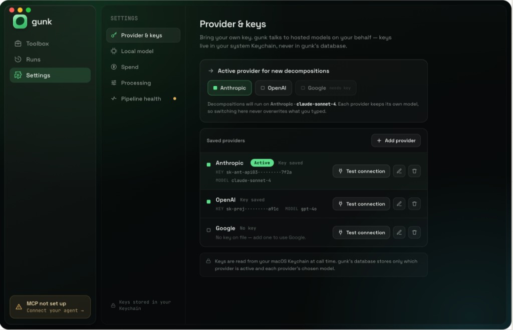
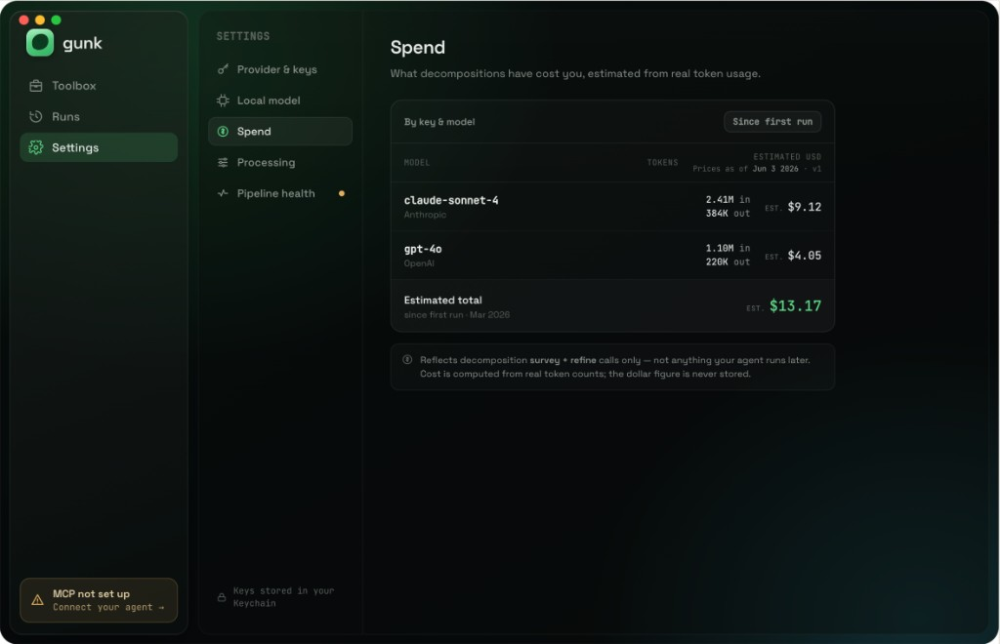
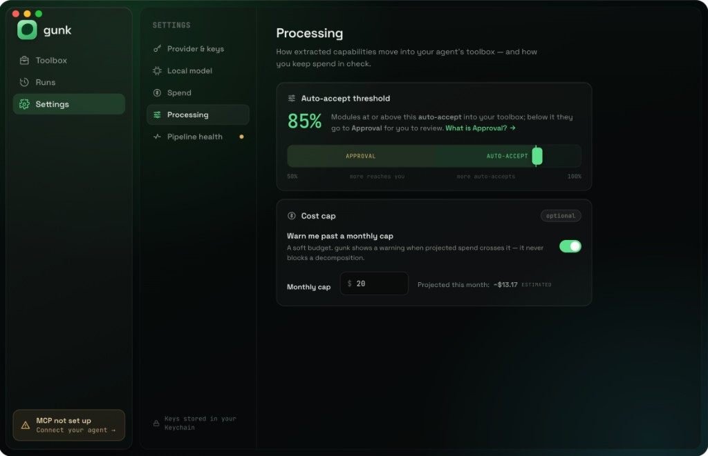
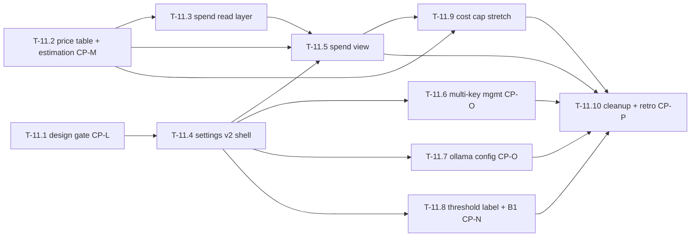

# Phase 11 — Settings v2 (the spend & trust panel)

This phase turns the app's **most complete but least loved** page into the
place you go to answer three honest questions: *"what has this actually
cost me?"*, *"which keys and models am I running?"*, and *"what is that one
slider really doing?"* Today Settings is a single 520pt grouped `Form` with
debug-grade presentation (raw paths, an **unlabeled** slider that silently
decides what lands in Approval, one provider at a time). Phase 11 gives it a
**spend view** (tokens you really spent → an *estimated* dollar figure),
**multi-provider key management**, a **local-model (Ollama) configuration
UX**, and — finally — a **labeled confidence threshold** whose value the rest
of the app actually obeys.

The load-bearing honesty constraint, called out in the roadmap and locked
below: **cost is *estimated*, never stored.** The `cost_usd` column exists
but is always `NULL`; only the token counts are real. The spend view derives
USD from a **versioned price table** and **never fabricates a figure** — an
unknown model reads `—`, not `$0`, and every dollar amount is labelled
*estimated*.

Roadmap: [docs/roadmap.md → Phase 11](../roadmap.md). Product definition (the
v1 ground truth this phase rebuilds on):
[06-settings.md](../design/feature-report/06-settings.md) — read its "Known
problems & quirks" first; this phase is the fix list for D14 (the unlabeled
slider) and B1 (the approval queue gating on a hard-coded threshold). The
design **source of truth** becomes
[`settings-v2.md`](../design/explorations/settings-v2.md) once **CP-L** lands
— **when its HTML export lands, the HTML wins** over the prose and the PNGs
(same rule as toolbox-v2 / library-v2 / module-run-v2). Phase 9/10 outcomes
this phase builds on: [docs/retros/phase-9.md](../retros/phase-9.md),
[docs/retros/phase-10.md](../retros/phase-10.md) (write the latter if it does
not exist yet).

The reference screens. **CP-L is approved** — the full Settings v2 design
(every section + state) is captured in
[`settings-v2.md`](../design/explorations/settings-v2.md). The
**sectioned left-rail IA** is locked (Provider & keys · Local model · Spend ·
Processing · Pipeline health):

**One caveat:** the export's **palette is Claude Design's default, not gunk's**
— read it for IA/layout/copy/anatomy only and **re-skin to the toolbox-v2
tokens** at build time. The v1 baseline this replaces is the grouped `Form` in
[06-settings.md](../design/feature-report/06-settings.md). All eight CP-L
decisions are resolved in `settings-v2.md` — including **#8: the live provider
set is OpenAI / Anthropic / Ollama only this phase** (no Google/Gemini, no
`GoogleClient`; the Google row is omitted from the build).

## The process (how the design gets made)

This is the same human-in-the-loop design loop every other phase used, stated
explicitly because it sets the task order:

1. **The agent writes the product-design instruction** (T-11.1) — every
   screen and state Settings v2 must cover, plus the open product decisions —
   and hands it to **me**.
2. **I run it through Claude Design** and return the **HTML export +
   screenshots**.
3. **We then write/refine the implementation plan against the approved
   design.** The implementation tasks below (T-11.2–T-11.10) are drafted in
   advance so the foundation work can start, but **T-11.4+ are provisional
   until CP-L returns** and will be revised to match the merged v2 design
   (the way Phase 10's tasks were "Revised to match the merged v2 design").
   The two foundation tasks (T-11.2 price/estimation core, T-11.3 the spend
   read layer) have **no visual surface** and may start before CP-L.

## How to read this document

Written to be executed by an AI agent **with a human ("me") in the loop**.
Each task has the same shape:

- **Task execution (agent prompt):** the literal instruction block.
- **Refining loop:** iterate-until-good cycle.
- **Human-in-the-loop (me):** what I review or provide. The agent **must
  stop at every `[HOLD FOR ME]` gate.**
- **Acceptance:** objective done criteria.

### Working agreement for the agent

1. One task at a time, in order, unless I say otherwise.
2. After any visible change: `swift build`, run the app (`make app` when
   packaging matters), capture a screenshot of the affected surface, paste
   it in your summary.
3. Never proceed past `[HOLD FOR ME]` without my explicit approval.
4. Keep each task PR-sized and reversible.
5. **Scope re-freezes after Phase 10 — deliberately.** Phase 10 unlocked
   `engine/`, `mcp/`, and `Store/Schema.swift` because it executed code.
   Phase 11 **re-freezes all three**: **no schema migration** (the
   `llm_runs` columns already exist — Hard data fact 1), **no `mcp/`
   change**, and **no `engine/` change** unless threading the Ollama
   base-URL genuinely cannot be done app-side (decide at CP-L; prefer
   app-side). This is a **presentation + read-API + price-data** phase.
6. `swift test` (and any touched `bun test`) stays green after every task.
7. Use the frozen design system (`Design/` tokens + components) and the
   **toolbox-v2** styling constraints: glass material on the floating
   controls layer only, solid graphite surfaces for content; mono **only**
   for paths/code/numbers-as-data; accent green **only** on earned,
   meaningful state; amber = needs the human; red = failed/over budget. Do
   not re-tune the palette. **How much of the v2 visual language Settings
   adopts (vs staying a system `Form`) is a CP-L decision** — 06-settings
   notes the page was deliberately "mostly not re-skinned."
8. **Never fabricate a number.** Every dollar figure is *estimated* and
   labelled so; unknown prices read `—`, never `$0`; token counts are shown
   as the real, stored values only. This is the phase's whole point.

## Decisions locked in (do not relitigate)

- **Cost is estimated, not stored.** `cost_usd` stays `NULL` forever; only
  `input_tokens` / `output_tokens` are real (Hard data fact 2). The spend
  view derives USD as `tokens × price` from a **versioned price table**,
  **stamps the price-table version it used**, and labels every figure
  *estimated*. An unknown provider/model pair shows token counts + `—` for
  USD — never a fabricated `$0` and never a guessed price.
- **No schema change this phase.** The `llm_runs` columns already exist
  (schema v0, Hard data fact 1). The price data is **in-repo, git-versioned
  static data**, not a DB table (storing prices in SQLite would invite
  storing *computed cost*, which we explicitly do not do). This phase adds a
  **read/aggregation API** over existing columns + the **estimation core** +
  **UI** — nothing migrates. (Deliberate contrast with Phase 10's sanctioned
  v6/v7.)
- **Per-provider keys stay in Keychain.** Each provider already has a
  `secretAccount` and `KeychainStore` slot (Hard data fact 7). The
  management UI is net-new; keys **never** move to SQLite. Multiple
  providers' keys coexist; exactly one provider is **active** for new
  decompositions, and the UI states which.
- **B1 is a real bug with a known root cause, and it gets fixed.** The engine
  honors the user's `llm.confidenceThreshold` via `--confidence`, but
  `BrowseModel.confidenceThreshold` is hard-coded to `0.7` so the in-app
  Approval queue + sidebar badge can diverge from what the engine actually
  did (Hard data fact 9). The fix wires the user's setting into
  `BrowseModel`. The slider also gets a **label + a link to the Approval
  concept** (D14).
- **The spend view is a readout, not a dashboard.** Tokens + estimated USD
  grouped by key/model (and optionally by source), bounded — **no spend
  charts, no time-series graphs, no run-history visualizations** (consistent
  with Phase 10's "receipts, not a dashboard").
- **Reintroducing the meter, not the old one.** A cost-meter UI existed once
  and was removed; `cost_usd` has been "inert, parity-locked storage" since
  (Hard data fact 5). Phase 11 brings back a meter as **presentation-only on
  real token data**, not the removed implementation.
- **Explicitly out:** pulling *actual billed* cost from provider usage APIs
  (OpenAI/Anthropic dashboards) to reconcile, spend charts/graphs over time,
  storing any computed cost, team/org billing, paid plans or cloud billing
  (ADR-0001), and a model catalog/auto-discovery of provider models.

## Hard data facts (verified against the codebase — do not fight these)

1. **`llm_runs` already exists with the cost columns (schema v0).**
   `Store/Schema.swift`: `llm_runs(id, source_id REFERENCES sources ON
   DELETE SET NULL, provider TEXT, model TEXT, input_tokens INTEGER,
   output_tokens INTEGER, cost_usd REAL, started_at INTEGER, finished_at
   INTEGER)`. **No migration is needed** to read or estimate spend.
2. **Tokens land — `cost_usd` never does.** The **engine** pipeline records
   runs: `engine/src/decompose/pipeline.ts` `recordRun` is wired into the
   **survey** and **refine** stages (`{ recordRun: (r) => this.recordRun(...) }`)
   and calls `recordLLMRun` with real `inputTokens`/`outputTokens` +
   `startedAt`/`finishedAt`. It **never passes `costUsd`**, and
   `engine/src/store/index.ts` writes `run.costUsd ?? null` — so `cost_usd`
   is **always NULL**. (Only survey + refine are recorded; other LLM calls
   are not — be honest about what the meter reflects.)
3. **The app's `recordLLMRun` is unused in production, and there is NO read
   API.** `Store.swift` has only `recordLLMRun` (used by tests). There is
   **no** `listLLMRuns` / `llmRunsForSource` in the app Store today — the
   `app/README.md` + `CHANGELOG.md` mention them but **the code does not have
   them** (stale docs). The spend view needs this read/aggregation layer
   **built** (T-11.3).
4. **No price table exists anywhere in gunk.** (`AICockpit/.../Cost/Pricing.swift`
   is a *different project* — do **not** import or copy it.) USD must come
   from a **new in-repo price table** (T-11.2).
5. **A cost meter existed and was removed.** `phase-4` task doc: "the
   cost-meter UI was already removed… `cost_usd` … remains: … inert,
   parity-locked storage." Phase 11 reintroduces the meter as
   presentation-only.
6. **Settings is one 520pt grouped `Form`, left-floating.** `SettingsView.swift`:
   `@AppStorage` `llm.provider` / `llm.model` / `llm.confidenceThreshold`; a
   Provider picker (OpenAI / Anthropic / Ollama); **switching provider
   overwrites the model field** with that provider's default and loads its
   key; **one active provider at a time**. Save writes the key to Keychain;
   Test connection saves-then-pings (`liveTestConnection`, max 64 tokens).
7. **Per-provider Keychain wiring exists.** `LLMProvider.secretAccount`
   (`openai-api-key` / `anthropic-api-key` / `ollama-api-key`) +
   `KeychainStore: SecretStore`. The Ollama key field is hidden (local, no
   key). Multiple providers can already *store* keys; there is just no UI to
   *manage* more than the active one.
8. **Ollama has no host/port UI.** `OllamaClient` hard-codes
   `baseURL = http://localhost:11434` (settable only via `init`, never from
   the UI); default model `llama3.2`. The config UX (host, model,
   reachability) is net-new (T-11.7).
9. **B1 root cause, precisely.** `SourceProcessingRunner` reads
   `llm.confidenceThreshold` from `UserDefaults` → passes `--confidence` to
   the engine (honored). But `BrowseModel.confidenceThreshold` defaults to
   `Extractor.defaultConfidenceThreshold` (`0.7`) and the queue filter
   `(item.gunk.confidence ?? 0) < confidenceThreshold` + the sidebar badge
   read that constant — the in-code comment literally says "the Settings
   slider is cosmetic until Phase 11." The fix injects the user's setting.
10. **The slider is unlabeled (D14).** `Slider(value:in:0...1, step:0.05)` +
    a bare `0.70` caption — **no label, no helper text, no link** to the
    Approval concept that it governs.
11. **Design system is frozen (toolbox-v2) and Settings was barely
    re-skinned.** `Design/` tokens + components (`BrandColors`, `BrandMotion`,
    `BrandMetrics`, `ProviderMark`/`ProviderIcon`) are the only styling
    vocabulary. 06-settings notes Settings is "mostly not re-skinned" — how
    far v2 changes that is a CP-L call.
12. **The live provider set is three (no Google this phase).** `LLMProvider`
    has exactly `openAI` / `anthropic` / `ollama` (Hard data fact 6); there is
    **no `GoogleClient`**, and CP-L decision #8 keeps it that way — the
    Settings-v2 mockup shows a Google row, but it is **omitted** from the build
    this phase (Mark, 2026-06-17). Do **not** add a `GoogleClient` or a Google
    Keychain slot.

## Checkpoint map

| Gate | What I review | Blocks |
| --- | --- | --- |
| CP-L | Design gate: full Settings v2 IA + the spend view + multi-key management + Ollama config + the labeled threshold, **every state**, and the estimation-honesty decisions — **CLEARED 2026-06-17** ([settings-v2.md](../design/explorations/settings-v2.md); all 8 decisions resolved — providers = OpenAI/Anthropic/Ollama, no Google) | all visual work (T-11.4+) |
| CP-M | The **versioned price table + USD estimation model** (the *estimated-not-stored* contract: sourcing, versioning, staleness, unknown-model handling) — data-honesty sensitive | T-11.5, T-11.9 |
| CP-N | The **B1 fix** verified on my real store (the slider actually drives the Approval queue + sidebar badge end-to-end) | phase exit |
| CP-O | **Multi-provider key management + Ollama config** exercised on my real machine/Keychain | phase exit |
| CP-P | The full Settings v2 walkthrough on my real store data (spend honest, nothing fabricated) | phase exit |

---

## T-11.1 — Design gate: Settings v2, every state, the estimation-honesty decisions (CP-L)

**Owner:** me (Claude Design) + agent (documentation)
**Checkpoint:** CP-L — **CLEARED 2026-06-17.**

> **Status: done.** Claude Design returned the full Settings v2 design — every
> section (Provider & keys · Local model · Spend · Processing · Pipeline
> health) and every state — recorded in
> [`settings-v2.md`](../design/explorations/settings-v2.md) with the captures
> saved alongside it. **All eight decisions are resolved there:** #1
> estimation honesty (`EST` everywhere, never stored), #2 price staleness (a
> `Prices as of <date> · v<n>` stamp, never blocks), #3 spend grouping (by key
> & model, `Since first run` window), #4 per-provider remembered model
> (switching never overwrites), #5 sectioned-rail IA, #6 the labelled
> `APPROVAL ↔ AUTO-ACCEPT` threshold + `What is Approval?` link, #7 the
> **warn-only** soft cost cap, and **#8: the live provider set is OpenAI /
> Anthropic / Ollama only** (Mark, 2026-06-17 — "just Ollama, OpenAI and
> Anthropic for now") — no Google/Gemini, no `GoogleClient`, the Google row is
> **omitted** from the build. **Caveat:** the export's palette is Claude
> Design's default — re-skin to toolbox-v2 at build, lift no color. T-11.4+ are
> reconciled to this design below.

### Goal
Get an approved, complete visual + product target before any Settings-page
work ships. The v1 is a debug-grade `Form`; this gate produces the v2 IA and
settles the product decisions that the implementation tasks below depend on
(notably the estimation-honesty rules and where spend lives in the IA).
(Phase 8/9/10 lesson: an approved exploration needs an explicit doc +
recorded decisions, or structural work builds on the wrong look.)

### Files
- `docs/design/explorations/settings-v2-instruction.md` (new — the
  driving instruction for Claude Design)
- `docs/design/explorations/settings-v2.md` (new — the approved exploration:
  verdict line, what is locked, decisions; created when I return the export)
- `docs/design/explorations/` (the Claude Design **HTML export** —
  *source of truth when it lands* — plus state screenshots)

### Task execution (agent prompt)

> 1. Write the design instruction for Claude Design. It must cover **every
>    screen and state**, each as its own screen, built on the toolbox-v2
>    vocabulary (state explicitly how much Settings adopts the v2 visual
>    language vs staying a system `Form` — 06-settings called it "mostly not
>    re-skinned"; ask the designer to make that call and show it):
>    - **The overall IA.** Does Settings v2 stay one scrolling form, or
>      split into sections/tabs (Provider & keys · Local model · Spend ·
>      Processing)? It must remain the **deep-link target** for every health
>      affordance in the app (the MCP-row jump from the shell/chip/Modules —
>      06-settings problem #5), so a deep-link-to-section affordance is in
>      scope.
>    - **The spend view ("what you've spent").** Per **key/model**: real
>      token totals (input/output) + an **estimated** USD figure; the
>      "estimated" labelling treatment and the price-table-version stamp
>      ("Prices as of … · v1"); the **unknown-model** state (`—`, never
>      `$0`); an **empty state** (no runs yet); and the honest scope note
>      ("reflects decomposition survey + refine calls only"). **No charts.**
>    - **Multi-provider key management.** The list of providers, each with
>      key present/missing, add/edit/remove, **Test connection** per
>      provider, and a clear **"active provider for new decompositions"**
>      selector — fixing the v1 quirk where switching provider silently
>      overwrites the model field (06-settings problem #6). Keychain-not-SQLite
>      reassurance copy.
>    - **Local model (Ollama) configuration.** Host/base-URL field (default
>      `localhost:11434`), model field, a **reachability** check distinct
>      from a hosted "Test connection", and the "runs locally · no key"
>      treatment.
>    - **The confidence threshold, labelled (D14 fix).** A real label, helper
>      copy that says *what it does* ("modules at/above this auto-accept;
>      below it they go to **Approval**"), the live value, and a link to the
>      Approval concept. Show the resting + dragging states.
>    - **Cost cap (stretch).** The optional budget-cap control and its
>      **over-budget warning** state (amber, honest that it gates on an
>      *estimate*) — design it even though the build is a stretch (T-11.9).
>    - **Pipeline health (the Status section).** The five existing rows
>      reskinned to v2 — still the only full MCP-setup guidance in the app —
>      and the **MCP-row highlight/scroll-to** when arrived at via deep link.
> 2. Put the open product decisions in front of me as explicit choices and
>    record my answers in `settings-v2.md` (do not invent them):
>    - **#1 estimation honesty:** confirm cost is *estimated, never stored*;
>      the exact "estimated" copy; how the price-table version is surfaced;
>      unknown-model handling (`—`).
>    - **#2 price-table sourcing & staleness:** where the numbers come from,
>      how a stale table is signalled, and whether the UI ever blocks on
>      staleness (recommend: never block; just label the as-of date).
>    - **#3 spend grouping:** by key/model only, or also by source/folder?
>      Bounded how (top-N, "since" window)?
>    - **#4 active-provider model:** one active provider with coexisting saved
>      keys (recommended) vs per-provider remembered models; what happens to a
>      custom model name when you switch.
>    - **#5 Settings IA:** one form vs sections/tabs; where spend lives;
>      how the MCP deep-link target behaves.
>    - **#6 threshold copy + Approval link:** the exact label/helper and where
>      the link goes.
>    - **#7 cost-cap behaviour (stretch):** warn-only vs soft-block new
>      decompositions; honest estimate framing.
>    - **#8 Google/Gemini provider — RESOLVED (not this phase).** The Provider
>      & keys mockup shows **Google**, but the live set is **OpenAI / Anthropic
>      / Ollama only** (Mark, 2026-06-17). No `GoogleClient`; **omit the Google
>      row** from the build (no "coming soon" stub). Google returns when a real
>      client is added in a future phase.
> 3. Hand the instruction to me; I run the iteration in Claude Design and
>    return the HTML export + screenshots.
> 4. When I return an approved iteration, save the assets into
>    `docs/design/explorations/`, write `settings-v2.md` (verdict line, what
>    is locked, what changed, new constraints), cross-link it from the
>    roadmap Phase 11 item, and **revise T-11.4–T-11.10 below to match** the
>    approved design where they conflict.

### Refining loop
- Iterate the instruction with me until the export covers **every** state
  above with no gaps; an approved-looking export that is missing the
  empty/unknown/over-budget states is **not** done.

### Human-in-the-loop (me)
- `[HOLD FOR ME]` CP-L: I produce and approve the full set of states and
  answer all eight decisions (the first iteration already resolved #4 and #5
  and raised #8). No visual/page work (T-11.4+) starts before this clears.
  (T-11.2 and T-11.3 — the price/estimation core and the spend read layer —
  may start now; they have no visual surface.)

### Acceptance
- An approved exploration (HTML export + screenshots) covering the IA, the
  spend view (incl. estimated/unknown/empty states + version stamp),
  multi-key management, Ollama config, the labelled threshold, the cost-cap
  stretch, and the reskinned Status section exists; all eight decisions are
  recorded in `settings-v2.md`; cross-linked from the roadmap; T-11.4+
  reconciled to it.

---

## T-11.2 — Versioned price table + USD estimation core (CP-M)

**Owner:** agent
**Checkpoint:** CP-M

### Goal
A pure, tested capability to turn **real stored token counts** into an
**estimated** USD figure, from a **versioned, in-repo price table** — with
the honesty rules baked in (never fabricate, unknown → `—`, stamp the
version). No UI, no store writes, no schema change. This is the foundation
both the spend view (T-11.5) and the cost cap (T-11.9) call; it lands first
because the *estimated-not-stored* contract is the phase's load-bearing
decision.

### Why an ADR-adjacent write-up
Following the T-9.2 / T-10.3 pattern, write the representation decision into
the task's summary (and a comment / a small `PRICES` note next to the data)
before coding: where prices come from, how the table is versioned, how
staleness is signalled, and the unknown-model rule. **Promote to a full ADR
only if the price-sourcing/staleness policy proves hard to reverse at CP-M.**

### Files
- `app/Sources/GunkApp/Cost/PriceTable.swift` (new — the versioned static
  price data: per `provider`+`model`, `inputPricePerMTok` /
  `outputPricePerMTok`, an `effectiveDate`, a `priceTableVersion`, and a
  `source` URL string for provenance)
- `app/Sources/GunkApp/Cost/CostEstimate.swift` (new — the pure estimation
  function + the result type that carries `isEstimated`, the version stamp,
  and an `unknownPrice` flag)
- `app/Tests/GunkAppTests/CostEstimateTests.swift` (new)

### Task execution (agent prompt)

> 1. **Write up the representation first** and stop for me at CP-M: the price
>    table is **in-repo static data**, not a DB table (storing prices invites
>    storing computed cost, which we do not do). State the sourcing (the
>    provider pricing pages, captured by hand with a date), the version field,
>    and the staleness signal (an `effectiveDate` the UI surfaces — never a
>    hard block).
> 2. Define `PriceTable`: a versioned lookup keyed by normalized
>    `(provider, model)` → `{ inputPricePerMTok, outputPricePerMTok }`, plus
>    table-level `priceTableVersion` + `effectiveDate`. Seed it with the
>    providers/models gunk actually uses (Hard data fact 6 defaults:
>    `gpt-4.1-mini`, `claude-sonnet-4-*`, `llama3.2`) and the common siblings;
>    Ollama/local models price to **`$0` *but flagged local*** (free to run,
>    not "unknown").
> 3. Define the pure estimator: `estimate(inputTokens:outputTokens:provider:model:)`
>    → `CostEstimate { usd: Double?, isEstimated: true, priceTableVersion,
>    unknownPrice: Bool }`. **Rules:** a missing price → `usd = nil`
>    (`unknownPrice = true`) so the UI renders `—`, **never** `0`; a known
>    price → `tokens / 1_000_000 × price`, summed input+output; **always**
>    `isEstimated = true`. No rounding that invents precision.
> 4. **No store writes, no reading `cost_usd`** (it is and stays NULL — Hard
>    data fact 2). This task is pure compute over values handed to it.
> 5. Tests: known model returns a stamped estimate; unknown model returns
>    `nil` USD + `unknownPrice`; a local (Ollama) model returns `$0` flagged
>    local, not unknown; zero/absent tokens handled; the version stamp is
>    carried through. No test touches the real store.

### Refining loop
- If a model name has variants/suffixes (dates, `-latest`), normalize
  conservatively and prefer **`unknownPrice` over a wrong match** — an honest
  `—` beats a confident wrong number.

### Human-in-the-loop (me)
- `[HOLD FOR ME]` CP-M: I review the price table values + the estimation
  rules and confirm the *estimated-not-stored* contract is faithfully
  encoded (unknown → `—`, version stamped, `cost_usd` untouched).

### Acceptance
- A versioned in-repo price table + a pure, tested estimator turn token
  counts into a stamped **estimated** USD figure, render unknown prices as
  `—` (never `$0`), treat local models as free-but-known, and never read or
  write `cost_usd`; the representation is written up (ADR-adjacent). No UI,
  no schema change. Build + tests green.

---

## T-11.3 — Spend data layer: `llm_runs` read + aggregation API

**Owner:** agent
**Checkpoint:** none (foundation; no visual surface)

### Goal
The read side the spend view binds to: a tested Store API that reads the real
`llm_runs` rows and aggregates token totals by **provider/model** (and
optionally by **source**), so T-11.5 can render spend without any view-layer
SQL. No schema change (the columns exist — Hard data fact 1); this is the
missing read layer (Hard data fact 3).

### Files
- `app/Sources/GunkApp/Store/Store.swift` (`listLLMRuns()` +
  `llmRunsForSource(_:)` + an aggregation read — these do **not** exist today
  despite the stale README)
- `app/Sources/GunkApp/Store/Models.swift` (an aggregate record type if one
  is needed — e.g. `SpendByModel { provider, model, inputTokens,
  outputTokens, runCount }`)
- `app/Sources/GunkApp/Models/SpendModel.swift` (new — a thin model that
  joins the aggregates with the T-11.2 estimator into a view-ready shape)
- `app/Tests/GunkAppTests/StoreTests.swift` / `SpendModelTests.swift`

### Task execution (agent prompt)

> 1. Add the read API to `Store` (explicit column lists, like every other
>    read): `listLLMRuns()` (ordered by `started_at`), `llmRunsForSource(_:)`,
>    and an **aggregation** query that sums `input_tokens`/`output_tokens` +
>    counts rows grouped by `(provider, model)`. Treat NULL token columns as
>    `0` in sums but expose a "has unknown tokens" signal so the UI can be
>    honest about partial data.
> 2. Build `SpendModel`: for each `(provider, model)` aggregate, call the
>    T-11.2 estimator to attach a `CostEstimate`. The model exposes totals
>    (tokens real, USD estimated/`nil`) and the price-table version stamp.
>    **It never sums an unknown-price group into the dollar total** — those
>    contribute tokens only, with a footnote count.
> 3. Bound it: the view-ready output is a **list of model rows + a total
>    line**, optionally a by-source breakdown — not a time series. (Receipts,
>    not a dashboard.)
> 4. Tests: aggregation groups + sums correctly; NULL tokens don't crash and
>    are flagged; an unknown-price model contributes tokens but not USD;
>    empty store → empty model; no test touches the real store path.

### Refining loop
- If joining estimates per row is wasteful, aggregate first then estimate
  once per `(provider, model)` group.

### Human-in-the-loop (me)
- I sanity-check the aggregates against a `sqlite3` query on a copy of my
  real store (totals match the raw rows).

### Acceptance
- A tested read/aggregation API over `llm_runs` (no schema change) feeds a
  `SpendModel` that attaches estimated USD per model and a version stamp,
  keeps unknown-price groups out of the dollar total, and is bounded to a
  list + total. Build + tests green.

---

## T-11.4 — Settings v2 shell + IA (restructure the page)

**Owner:** agent
**Checkpoint:** none (structural; implements the CP-L IA)

> **IA confirmed (first iteration):** a **sectioned left rail** — Provider &
> keys · Local model · Spend · Processing · **Pipeline health** (decision #5
> resolved in [`settings-v2.md`](../design/explorations/settings-v2.md)). The
> body below is updated to it. **Still provisional** on the sub-section
> states' final visuals until CP-L fully clears, and on the palette re-skin
> (the export's colors are not toolbox-v2).

### Goal
Restructure `SettingsView` from the single left-floating 520pt `Form` into
the CP-L IA, **moving every existing capability across unchanged in
behaviour** (provider/model/key, Save, Test connection, the five Status
rows, the MCP-client toggles), and making Settings the proper **deep-link
target** so the shell/chip/Modules "MCP not set up" jumps land on (and
highlight) the right section.

### Files
- `app/Sources/GunkApp/Views/SettingsView.swift` (the new shell + section
  routing; carry over `SettingsStatusSnapshot`, the MCP rows, Save/Test)
- `app/Sources/GunkApp/Views/AppShellView.swift` (only if the deep-link/
  scroll-to-section target needs a hook)

### Task execution (agent prompt)

> 1. Build the v2 shell per `settings-v2.md`: the **left section rail**
>    (Provider & keys · Local model · Spend · Processing · Pipeline health)
>    under a `SETTINGS` label, with a left-aligned detail pane (fixing the v1
>    "floats left in a 520pt form" dead space — 06-settings problem #4) and the
>    `Keys stored in your Keychain` rail footer.
> 2. **Move, don't rebuild:** lift the provider/model/key controls, Save,
>    Test connection, the five Status rows, and the MCP-client toggles into
>    the new shell with identical behaviour and `@AppStorage` keys. The new
>    feature surfaces (spend / multi-key / Ollama / threshold) get their
>    section *containers* here; their content lands in T-11.5–T-11.9.
> 3. Wire the **deep-link target** per the CP-L **Pipeline health** design
>    (§5 in [`settings-v2.md`](../design/explorations/settings-v2.md)):
>    arriving from an MCP affordance shows the "Arrived from 'MCP not set up'"
>    banner, scrolls to + **highlights** the MCP-server row (`jumped here from
>    the status strip`), and expands the full "Connect your agent over MCP"
>    guidance + `claude_desktop_config.json` snippet. The five rows
>    (Decomposition provider · Local model · MCP server · Approval queue ·
>    Sandbox runtime) carry `Ready`/`Optional`/needs-setup states. Keep the
>    `MCPSetupModel` single-source wiring intact.
> 4. `swift build`, `swift test`, screenshots: the v2 shell, each section, and
>    a deep-link arrival highlighting the MCP row, at default + a narrow width.

### Refining loop
- Keep content on solid graphite; glass only on any floating controls layer
  per toolbox-v2. If centering leaves the form too wide, follow the CP-L
  width, don't invent one.

### Human-in-the-loop (me)
- I navigate to Settings from the MCP affordances and confirm every v1
  capability still works and the deep link lands on the right section.

### Acceptance
- Settings renders the CP-L IA; every former capability is moved across with
  unchanged behaviour; the MCP deep-link target highlights correctly; no
  capability regressed. Build + tests green.

---

## T-11.5 — Token + cost meter (the spend view)

**Owner:** agent
**Checkpoint:** none (presentation only; depends on CP-M)

### Goal
The roadmap headline: **see exactly what you've spent, across every key and
model.** Render `SpendModel` (T-11.3) in the Spend section: real token totals
per provider/model + an **estimated** USD figure (T-11.2), the price-table
version stamp, and honest empty/unknown states. Closes the Phase 3 "LLM cost
meter" leftover (Hard data fact 5) — as presentation only.

### Files
- `app/Sources/GunkApp/Views/SettingsView.swift` (the Spend section/rows)
- `app/Sources/GunkApp/Views/SpendView.swift` (new, if the section is large
  enough to extract)
- `app/Sources/GunkApp/Models/SpendModel.swift` (consumed; built in T-11.3)

> **Design reference (CP-L):** the **Spend** section in
> [`settings-v2.md`](../design/explorations/settings-v2.md) §3 — populated,
> unknown-price, and empty captures. Match the copy verbatim.

### Task execution (agent prompt)

> 1. Render the **By key & model** list with a **`Since first run`** window
>    control (decision #3): each row = provider mark + model name, real
>    `input`/`output` token counts (mono — `2.41M in · 384K out`), and an
>    **`EST $x.xx`** estimate. A column carries the **`Prices as of <date> ·
>    v<n>`** stamp. An **Estimated total** row (green `EST $…`) sums only
>    known-price rows.
> 2. **Unknown-price row:** show real tokens + **`—`** (never `$0`, never a
>    guess); exclude it from the total ("excludes N models with no price on
>    file") and surface the amber explainer note from the design. The honesty
>    footer is verbatim: *"Reflects decomposition **survey + refine** calls
>    only … Cost is computed from real token counts; the dollar figure is never
>    stored."* Local (Ollama) rows read **free**, not `$0`-as-unknown.
> 3. **Empty state:** the "No spend yet" treatment from the design (never a
>    fabricated zero-dollar dashboard).
> 4. **No charts, no time series.** A bounded list + total only.
> 5. `swift build`, `swift test`, screenshots: populated spend (known +
>    unknown-price rows + total + version stamp), the empty state, and a
>    local-model row. Stage via injected `SpendModel` fixtures where a real
>    store isn't deterministic.

### Refining loop
- If many models clutter the list, cap/scroll per CP-L; never escalate into a
  chart. If a row's USD is unknown, the row still shows its real tokens — the
  meter is honest about partial data, not silent.

### Human-in-the-loop (me)
- I open Spend on my real store and confirm the tokens match reality and
  every dollar figure reads as *estimated* (and unknowns read `—`).

### Acceptance
- The Spend section renders real token totals + estimated USD per key/model
  with a version stamp and honest empty/unknown/local states, a total that
  excludes unknown prices, and no charts; nothing fabricated. Build + tests
  green.

---

## T-11.6 — Multi-provider API key management UI (CP-O)

**Owner:** agent
**Checkpoint:** CP-O

### Goal
Manage **all** provider keys, not just the active one's. Per-provider
add/edit/remove + Test connection, all in **Keychain** (existing
`secretAccount` slots — Hard data fact 7), with a clear **active provider for
new decompositions** selector — fixing the v1 quirk where switching provider
silently overwrites the model field (06-settings problem #6).

> **Design reference:** the **Provider & keys** section in
> [`settings-v2.md`](../design/explorations/settings-v2.md) (the first CP-L
> iteration) — the active-provider pills, the saved-providers list (status /
> masked `KEY` / `MODEL` / Test / edit / remove), `+ Add provider`, and the
> Keychain-at-call-time trust footer.

### Files
- `app/Sources/GunkApp/Views/SettingsView.swift` (the Provider & keys section)
- `app/Sources/GunkApp/Views/ProviderKeysView.swift` (new, if extracted)
- `app/Sources/GunkApp/LLM/LLMClient.swift` (the per-provider remembered model
  — additive `@AppStorage` per the resolved decision #4; **no key moves to
  SQLite**)

### Task execution (agent prompt)

> 1. List each `LLMProvider` with: key present/missing (read via
>    `SecretStore.secret(for:secretAccount)`), an add/edit secure field, a
>    **remove** action (clears the Keychain slot), a per-provider **Test
>    connection** (reuse `liveTestConnection`), and the masked `KEY` + `MODEL`
>    row anatomy from the design. Keys stay in Keychain — render the footer
>    copy "Keys are read from your macOS Keychain at call time. gunk's database
>    stores only which provider is active and each provider's chosen model."
> 2. Add the **active provider** selector (writes `llm.provider`) with the
>    "Decompositions will run on `<provider>` `<model>`" consequence line. **Per
>    the resolved CP-L decision #4: remember a model per provider** (additive
>    `@AppStorage`), so switching the active provider **never overwrites a typed
>    model** — kill the v1 clobber for good.
> 3. **Google/Gemini (decision #8 — out this phase):** the live providers are
>    **OpenAI / Anthropic** (hosted) + Ollama (Local model section). **Omit the
>    Google row entirely** — no Keychain slot, no `GoogleClient`, no "coming
>    soon" stub (Hard data fact 12).
> 4. Saving/removing refreshes the Pipeline-health rows + the spend view's
>    provider rows live.
> 5. `swift build`, `swift test`, screenshots: multiple keys saved, an empty
>    slot (e.g. the no-key provider), a remove confirmation, a per-provider
>    Test result, and the active selector.

### Refining loop
- Never write a key to SQLite or echo it into any log/receipt. A failed Test
  shows the provider's error verbatim, inline, without losing the typed key.

### Human-in-the-loop (me)
- `[HOLD FOR ME]` CP-O: on my real machine I save keys for two providers,
  remove one, switch the active provider, and confirm the keys live in
  Keychain (not SQLite) and that switching doesn't silently lose my model.

### Acceptance
- All provider keys are manageable (add/edit/remove/test) from one section,
  stored only in Keychain; an active-provider selector drives new
  decompositions; switching no longer silently destroys a custom model;
  Status + Spend refresh live. Build + tests green.

---

## T-11.7 — Local model (Ollama) configuration UX (CP-O)

**Owner:** agent
**Checkpoint:** CP-O (same gate as T-11.6 — the real-machine config review)

### Goal
A real configuration surface for the local provider: host/base-URL (today
hard-coded `localhost:11434` with no UI — Hard data fact 8), model, and a
**reachability** check distinct from a hosted key test, with the "runs
locally · no key" treatment.

### Files
- `app/Sources/GunkApp/Views/SettingsView.swift` (the Local model section)
- `app/Sources/GunkApp/LLM/OllamaClient.swift` (read a configured base URL —
  it already accepts one via `init`; thread an `@AppStorage`-backed value in
  app-side, **no engine change** if avoidable)
- `app/Sources/GunkApp/Views/SettingsView.swift` `liveTestConnection`
  (Ollama branch uses the configured base URL)

> **Design reference (CP-L):** the **Local model** section in
> [`settings-v2.md`](../design/explorations/settings-v2.md) §2 — the four
> reachability states + the active-engine toggle. Match the copy verbatim.

### Task execution (agent prompt)

> 1. Add a host/base-URL field (default `http://localhost:11434`), persisted
>    via `@AppStorage` (e.g. `llm.ollama.baseURL`), and a model field. Thread
>    the stored base URL into `OllamaClient` everywhere it is constructed
>    app-side (it already accepts a `baseURL` — Hard data fact 8). **The engine
>    is frozen this phase:** if decomposition can't see the app-side base URL,
>    say so in the UI rather than faking parity (refining loop).
> 2. The **reachability** check has **four states** from the design:
>    **not-checked** (`Check reachability`), **checking** ("Checking … · Asking
>    Ollama for its loaded models"), **reachable** (green: "Ollama reachable.
>    `<model>` is loaded and answered in N ms"), and **unreachable** (red but a
>    *setup nudge*: "Can't reach … Is Ollama running? Start it with `ollama
>    serve`"). It reads as **local connectivity, not a hosted-key test** — keep
>    the explicit "no account or key to authenticate" copy and the
>    **`runs locally · no key`** badge.
> 3. **`Use local model for new decompositions`** toggle — makes Ollama the
>    **active engine** (writes `llm.provider = ollama`), **gated on a passing
>    reachability check** ("Available once a reachability check passes"). This
>    is the local counterpart to the Provider & keys active selector (T-11.6).
> 4. `swift build`, `swift test`, screenshots: the Ollama section across all
>    four reachability states + the active-engine toggle (off/disabled vs on).

### Refining loop
- If the engine can't see the app-side base URL this phase, say so plainly in
  the UI (the in-app test uses your host; decomposition may use the default)
  rather than implying parity that doesn't exist.

### Human-in-the-loop (me)
- `[HOLD FOR ME]` CP-O: I point gunk at a local Ollama (default or custom
  host) and confirm the reachability check and the no-key treatment are
  honest.

### Acceptance
- The Local model section configures host + model, threads the base URL into
  the Ollama client app-side, and runs an honest reachability check distinct
  from a hosted-key test; engine scope is stated, not faked. Build + tests
  green.

---

## T-11.8 — Confidence threshold: label it + fix bug B1 (CP-N)

**Owner:** agent
**Checkpoint:** CP-N

### Goal
Two fixes to the one slider that decides what lands in Approval: **label it**
(D14 — it has no label/helper/link today, Hard data fact 10) and **fix B1**
so the in-app Approval queue + sidebar badge gate on the **user's**
`llm.confidenceThreshold`, not the hard-coded `0.7` (Hard data fact 9), so
the app and the engine never disagree.

> **Design reference (CP-L):** the **Processing** section in
> [`settings-v2.md`](../design/explorations/settings-v2.md) §4 — the slider
> lives there (not in Provider & keys), labelled `APPROVAL ↔ AUTO-ACCEPT` with
> a live `%`, helper copy, and a `What is Approval? →` link; resting + dragging
> states.

### Files
- `app/Sources/GunkApp/Views/SettingsView.swift` (the **Processing** section:
  label + helper + `What is Approval? →` link on the `APPROVAL ↔ AUTO-ACCEPT`
  slider + live `%` value)
- `app/Sources/GunkApp/Models/BrowseModel.swift` (read the user's threshold
  instead of the hard-coded default; update the `confidenceThreshold` comment
  noting B1 is fixed)
- The construction site of `BrowseModel` (inject `llm.confidenceThreshold`
  from `UserDefaults`/`@AppStorage`, matching what `SourceProcessingRunner`
  already reads)
- `app/Tests/GunkAppTests/BrowseModelTests.swift` (the B1 regression test —
  the existing test at ~line 376 documents the hard-coded `0.7`; update it to
  assert the queue follows the injected setting)

### Task execution (agent prompt)

> 1. **B1 fix:** inject the user's `llm.confidenceThreshold` into
>    `BrowseModel.confidenceThreshold` at construction (read it the same way
>    `SourceProcessingRunner.confidenceThreshold()` does — `UserDefaults`
>    `"llm.confidenceThreshold"`, falling back to
>    `Extractor.defaultConfidenceThreshold` only when unset). The queue filter
>    `(gunk.confidence ?? 0) < confidenceThreshold` and the sidebar badge then
>    track the slider. Update the "cosmetic until Phase 11" comment.
> 2. Add a regression test: with the setting at e.g. `0.85`, a module at
>    `0.80` confidence is **pending approval** (it isn't at the old hard-coded
>    `0.7`); with the setting at `0.6` it is auto-accepted. This is the
>    objective proof B1 is closed.
> 3. **D14 fix:** build the slider per the design — labelled **`APPROVAL`** ↔
>    **`AUTO-ACCEPT`** with `50%`/`100%` ends and the "more reaches you" /
>    "more auto-accepts" hints, a big live **`%`** value, helper copy ("Modules
>    at or above this **auto-accept** into your toolbox; below it they go to
>    **Approval** for you to review"), a **`What is Approval? →`** link, and the
>    dragging-bubble state.
> 4. `swift build`, `swift test`, screenshots: the labelled slider (resting +
>    dragging bubble), and the Approval queue/badge changing as the slider
>    moves (staged via the injected setting).

### Refining loop
- If the threshold is read in more than one place, route them all through one
  accessor so app + engine can never drift again (the root of B1).

### Human-in-the-loop (me)
- `[HOLD FOR ME]` CP-N: on my real store I move the slider, reprocess (or
  re-open), and confirm the Approval queue + sidebar badge match the engine's
  `--confidence` behaviour — the divergence is gone.

### Acceptance
- The slider is labelled with helper copy + an Approval link (D14 closed), and
  the Approval queue + sidebar badge gate on the user's `llm.confidenceThreshold`
  with a regression test proving the old hard-coded `0.7` no longer governs
  (B1 closed). Build + tests green.

---

## T-11.9 — Stretch: cost cap setting

**Owner:** agent
**Checkpoint:** none (stretch; cut without ceremony if it competes)

### Goal
An optional **soft** budget cap, living in the **Processing** section beneath
the threshold (per the CP-L design): a **`Monthly cap $`** with a
**`Projected this month: ~$X ESTIMATED`** readout. Decision #7 is resolved to
**warn-only — it never blocks a decomposition**. Carried from the old Polish
phase; explicitly cuttable.

### Files
- `app/Sources/GunkApp/Views/SettingsView.swift` (the Processing-section cap
  control + the projected-spend readout + the over-cap warning)
- `app/Tests/GunkAppTests/...`

### Task execution (agent prompt)

> 1. Add an optional cap (`@AppStorage`, off by default) with the design's
>    **`Warn me past a monthly cap`** toggle + copy ("A soft budget. gunk shows
>    a warning when projected spend crosses it — **it never blocks a
>    decomposition**"), a **`Monthly cap $`** field, and a **`Projected this
>    month: ~$X ESTIMATED`** readout derived from `SpendModel`.
> 2. **Warn-only (decision #7 locked):** crossing the cap shows the amber
>    warning; it **never** gates or blocks a run (so no
>    `SourceProcessingRunner` block path — the earlier soft-block option is
>    dropped). The warning is honest that the figure is an *estimate*.
> 3. If the estimate has unknown-price gaps, the cap UI says so ("projection
>    excludes N models with no price on file") rather than implying
>    completeness.
> 4. `swift build`, `swift test`, screenshots: cap off, cap set under budget,
>    cap exceeded (the amber warning).

### Refining loop
- Keep it **warn-only**; do not reintroduce a block path. The projection is an
  estimate — never present it as billed truth.

### Human-in-the-loop (me)
- I set a low cap and confirm the warning fires, is honest about being
  estimate-based, and never blocks a decomposition.

### Acceptance
- An optional, estimate-based **warn-only** cost cap shows a projected-spend
  readout and an over-cap warning, never blocks a run, is honest about
  estimate gaps, and is off by default. Build + tests green. (Cut cleanly if
  it competes for scope.)

---

## T-11.10 — Cleanup, regression pass, retro (CP-P)

**Owner:** agent
**Checkpoint:** CP-P (phase exit)

### Task execution (agent prompt)

> 1. Delete any dead code this phase orphaned and correct the **stale
>    `app/README.md` / `CHANGELOG.md`** entries that claim `listLLMRuns` /
>    `llmRunsForSource` already exist (Hard data fact 3) — they exist now;
>    make the docs true.
> 2. Full pass at 960×600 and default window size: the Settings v2 shell and
>    every section + state (spend populated/unknown/empty + version stamp,
>    multi-key add/edit/remove/test, active-provider switch, Ollama host +
>    reachability, labelled threshold + the Approval queue tracking it, the
>    cost-cap states, the reskinned Status section + MCP deep-link highlight)
>    — no layout shifts, no clipped controls.
> 3. Confirm the toolbox-v2 constraints hold (graphite surfaces, mono only for
>    paths/code/numbers-as-data, accent green only on earned meaning, glass on
>    the controls layer only) and that **nothing fabricates a dollar figure**
>    (estimated everywhere, unknown → `—`, `cost_usd` still NULL).
> 4. Confirm **no schema migration, no `mcp/` change, and no `engine/`
>    change** shipped this phase (re-freeze held — the working agreement);
>    note any Ollama-base-URL engine gap explicitly.
> 5. Confirm the price-table ADR-adjacent write-up (T-11.2) is recorded and
>    linked; promote to a full ADR if CP-M asked for one.
> 6. Check off completed Phase 11 items in `docs/roadmap.md`.
> 7. Write `docs/retros/phase-11.md`: what shipped, what slipped (the stretch
>    cost cap?), what we learned, what we're cutting.

### Human-in-the-loop (me)
- `[HOLD FOR ME]` CP-P: I walk the full Settings v2 on my real store data and
  confirm the spend is honest, the keys/threshold/Ollama config all behave,
  and nothing reads as a fabricated number.

### Acceptance
- No dead code, docs corrected, re-freeze verified (no schema/mcp/engine
  change), price-table write-up recorded + linked, roadmap current, retro
  written, build + all package tests green.

---

## Task order and dependencies

**T-11.2 (price/estimation core) and T-11.3 (spend read layer) are
foundation and start immediately** — before CP-L clears (they have no visual
surface), the way Phase 10 front-loaded its sandbox + store. **CP-L gates all
page/visual work (T-11.4+).** T-11.4 restructures the page; T-11.5 (spend),
T-11.6 (keys), T-11.7 (Ollama), and T-11.8 (threshold + B1) hang off it and
are largely independent of each other. T-11.9 (cost cap) is a stretch built
on the spend view and cut without ceremony if it competes. T-11.10 closes the
phase.

Unlike Phase 10, **no ADR is mandatory** and **nothing is unlocked**: there
is no schema migration, no `mcp/` change, and no `engine/` change (the
`llm_runs` columns already exist; the price data is in-repo). The one
architecture artifact is the **price-table / estimation write-up** (T-11.2,
CP-M), promoted to a full ADR only if the price-sourcing/staleness policy
proves hard to reverse.
