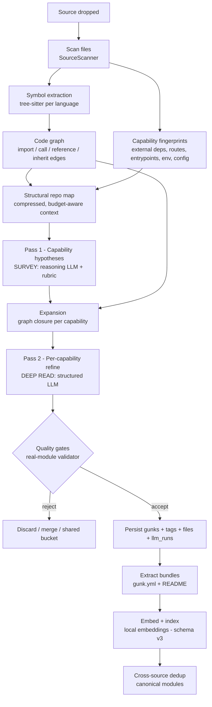
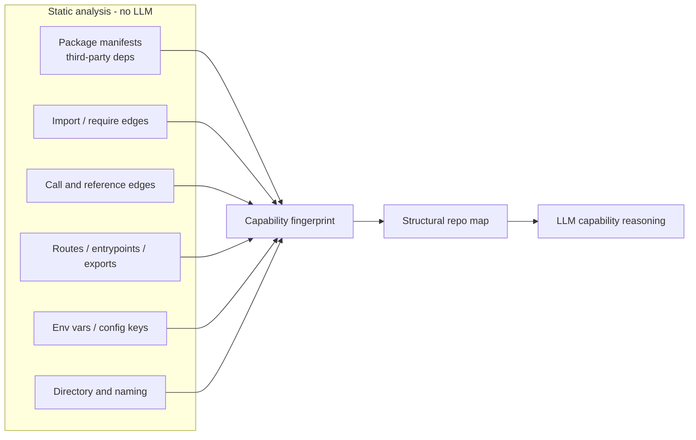
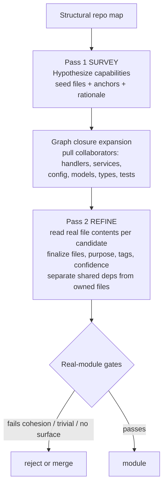
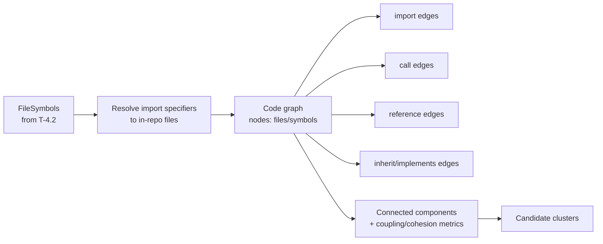
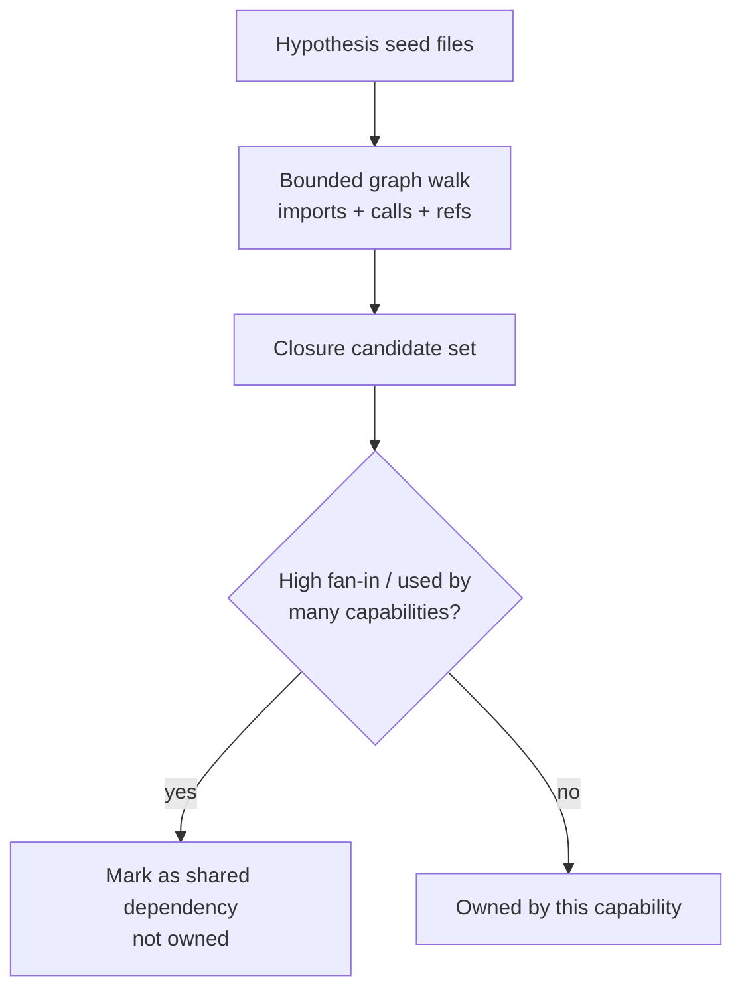
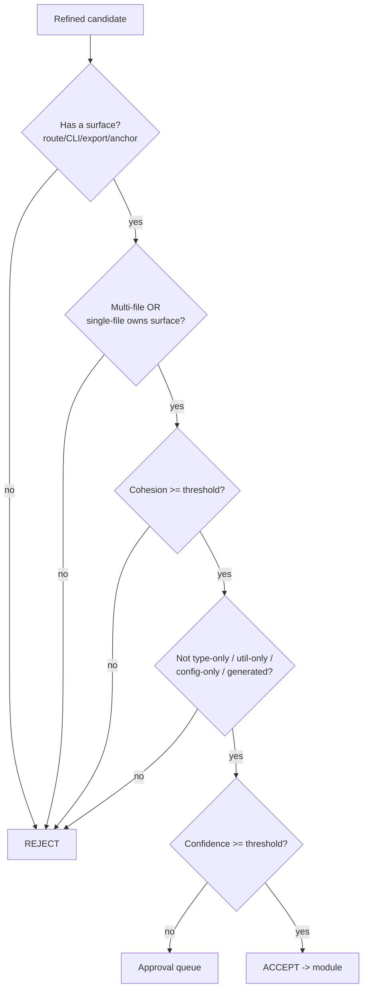

# Phase 4 — Capability-centric AI decomposition

> The phase where AI decomposition stops being a single shallow LLM call and
> becomes a **capability-centric**, statically-grounded, multi-pass pipeline that
> finds *real* modules. The product is still local-only (no cloud, no shared
> marketplace) per [ADR-0001](../adr/0001-what-is-gunk.md).

**Scope: AI only.** This phase deliberately makes **no UI changes**. The current
menu-bar popover, Dock bin, drop zone, browse list, approval queue, and settings
stay exactly as they are. The standalone-window app and in-window marketplace are
**deferred to a later phase** (see "Deferred to a later phase" at the bottom).
Everything here is the decomposition pipeline, the eval harness, the MCP search
surface, and the data they produce.

**We do not optimize for speed in this phase.** A drop may run many LLM calls and
a full static analysis. Correctness and module quality win over latency every
time.

**Demo at end of phase (no UI work required):**

1. From a clean state (`rm -rf ~/.gunk`), drop an old project on the existing
   Dock bin. The pipeline runs multiple passes.
2. Inspect the store / bundles: gunk extracted a genuine **multi-file capability**
   (e.g. a Google-OAuth module spanning route + service + provider client +
   config + types), and a stray `types.ts` is **not** a module.
3. The eval scorecard shows the new pipeline beats the Phase 3 baseline on
   file-membership precision/recall and emits **zero** trivial-module false
   positives.
4. In Cursor, `search_gunks("oauth")` returns the right module even though it's
   tagged `auth`; `get_gunk(id)` returns the multi-file bundle.

If that works end-to-end, Phase 4 is done.

---

## The core problem this phase fixes

The Phase 3 pipeline is *one* LLM call over a `chars/4`, README-first text blob
([`ContextBuilder.swift`](../../app/Sources/GunkApp/Ingest/ContextBuilder.swift)
→ [`DecompositionEngine.swift`](../../app/Sources/GunkApp/Decompose/DecompositionEngine.swift)).
With no structural grounding, the model guesses at boundaries and routinely
returns **file-level junk** — e.g. it extracted a lone `types.ts` and called it
a "module."

A `types.ts` is not a module. **A module is a capability** — a coherent unit of
functionality a developer would actually ask for ("Google OAuth login", "Stripe
subscription billing", "S3 image upload") — and it almost always spans *many
collaborating files*: a route/controller, a service, a provider client, config,
models, types, and tests.

### Definition: what counts as a "real module" (capability)

A candidate is a real module only if it meets **all** of these:

1. **External-facing capability.** It delivers something a developer would
   request by name, with an identifiable surface: an HTTP route, a CLI command,
   an exported public API, or a domain workflow. Not an internal implementation
   detail.
2. **Multi-file cohesion.** It is the *closure* of collaborating files needed to
   deliver the capability, not a single file. (A genuinely single-file capability
   is allowed only when that one file owns the entire surface — rare.)
3. **An anchor.** It is anchored by a recognizable signal: a third-party
   capability library (`passport-google-oauth20`, `stripe`, `nodemailer`,
   `@aws-sdk/client-s3`), a route group, a domain noun, or a distinct subsystem.
4. **Internal cohesion / low coupling.** Its files reference each other far more
   than they reference the rest of the repo.
5. **Right granularity.** Feature-level — between file-level (too small:
   `types.ts`, a single util) and app-level (too big: "the whole backend").

Explicit **non-modules** (must be rejected or absorbed as shared deps): a lone
type/interface file, a single utility function, a bare config file, generated
code, an arbitrary directory, or "everything else."

Shared/utility files that many capabilities touch are **referenced as
dependencies** (and optionally collected into a single `shared` bucket), never
emitted as standalone modules.

---

## AI architecture overview

The new pipeline is **structure first, LLM second, gates last.** Deterministic
static analysis builds a code graph and capability fingerprints; the LLM reasons
about capabilities *over that structure* in multiple passes; quality gates throw
out anything that is not a real module.

### Master pipeline



### Where capability signals come from

The LLM never guesses boundaries from raw text. It reasons over deterministic
signals:



### Two-pass reasoning loop



### Model & tool responsibilities

| Stage | Tool / model | Why |
|-------|--------------|-----|
| Symbol extraction | **tree-sitter** (deterministic) | Accurate symbols/imports per language; no token cost. Un-defers the tree-sitter item deferred in [ADR-0011](../adr/0011-ai-decomposition-pipeline.md). |
| Code graph | In-house Swift | Edges = imports + calls + references + inheritance; connected components = candidate clusters. |
| Fingerprints | In-house Swift | Third-party capability libs, routes, entrypoints, env, config are the strongest capability anchors. |
| Pass 1 survey | **Reasoning LLM** (largest-context model the provider offers) | Holistic capability hypotheses over the whole structural map. |
| Pass 2 refine | **Structured-output LLM** | Focused, schema-constrained per-candidate decision over real file contents. |
| Quality gates | In-house Swift (deterministic) | The rubric must be enforced in code, not left to the model. |
| Embeddings | **Local Ollama** (`nomic-embed-text`) by default; OpenAI optional | Semantic search + dedup, local-first per ADR-0001. Un-defers the embeddings item deferred in ADR-0011. |

All LLM passes are recorded in `llm_runs` (token accounting persists; the
Phase 3 cost-meter *UI* was already removed, but the run rows are still written).

---

## Terminology

Carries over from [Phase 3](phase-3-ai-decomposition.md): **source** = a dropped
folder; **gunk** = an AI-extracted module; **bundle** = the physical extracted
folder for a gunk; **tag** = a taxonomy label.

New in this phase:

| Term            | Meaning                                                          |
|-----------------|-----------------------------------------------------------------|
| **capability**  | A real module: an external-facing feature spanning files.       |
| **code graph**  | Files+symbols as nodes; import/call/ref/inherit as edges.       |
| **fingerprint** | Deterministic capability signals (deps, routes, env, naming).   |
| **closure**     | The transitive set of files a capability needs to stand alone.  |
| **quality gate**| A deterministic check that rejects non-modules.                 |
| **canonical**   | The representative gunk for a cluster of near-duplicates.        |
| **scorecard**   | Eval output comparing a decomposition to a golden fixture.       |

---

## Status going in (what already exists)

- Decomposition is wired end-to-end but is **one shallow LLM pass**:
  [`SourceProcessingRunner.swift`](../../app/Sources/GunkApp/Decompose/SourceProcessingRunner.swift)
  -> [`ContextBuilder.swift`](../../app/Sources/GunkApp/Ingest/ContextBuilder.swift)
  (chars/4 budget) ->
  [`DecompositionEngine.swift`](../../app/Sources/GunkApp/Decompose/DecompositionEngine.swift)
  -> [`Extractor.swift`](../../app/Sources/GunkApp/Extract/Extractor.swift).
  This is the pass that emits `types.ts`-as-a-module; this phase replaces it.
- The existing UI (Dock bin, `DropZoneView`, `BrowseModel`/`BrowseView`,
  `ApprovalQueueView`, `SettingsView`, `ProcessingModel`) is **left untouched**.
  The pipeline reuses the existing drop path, the existing Dock processing
  state/badge, and the existing approval-queue flow — no new views.
- The Phase 3 **cost-meter UI was already removed**; only token rows in
  `llm_runs` remain (the `cost_usd` column is inert). The new pipeline keeps
  recording runs (now multiple per drop).
- MCP exposes `list_gunks`, `list_sources`, `search_gunks`, `get_gunk` over
  schema v2; this phase adds a semantic ranking to `search_gunks`.

---

## Dependency graph

```
T-4.0  ADR-0012 capability-centric decomposition (+ "real module" rubric)
   │
   ▼
T-4.1  Eval harness + golden fixtures (incl. negative "types.ts" traps) + baseline
   │
   ▼
T-4.2  Symbol extraction (tree-sitter, multi-language)
   │
   ▼
T-4.3  Code graph builder (import/call/ref/inherit + clustering)
   │
   ▼
T-4.4  Capability fingerprinting (deps/routes/entrypoints/env/config)
   │
   ▼
T-4.5  Structural repo-map context builder (replaces chars/4)
   │
   ▼
T-4.6  Pass 1 — capability hypotheses (survey LLM + rubric)
   │
   ▼
T-4.7  Capability expansion (graph closure + shared-file detection)
   │
   ▼
T-4.8  Pass 2 — per-capability refinement (deep read)
   │
   ▼
T-4.9  Quality gates — real-module validator (reject trivial)
   │
   ▼
T-4.10 Orchestrator — multi-stage pipeline + approval + llm_runs
   │
   ▼
T-4.11 Re-run eval — beat the Phase 3 baseline (gate)
   │
   ├──► T-4.12 Local semantic index (schema v3) + MCP semantic search
   │
   ▼
T-4.13 Cross-source dedup / canonical modules (data + MCP, no UI)
   │
   ▼
T-4.14 Demo + retro + roadmap renumber
```

---

## Phase complete checklist

- [ ] All tasks merged to `main`, CI green (incl. schema-parity)
- [ ] No UI changes landed (existing popover/Dock/approval flow unchanged)
- [ ] ADR-0012 (capability-centric decomposition) accepted and linked from the
      ADR index
- [ ] Pipeline is **structure-grounded**: tree-sitter symbols + code graph +
      fingerprints feed the LLM (no more raw chars/4 boundary guessing)
- [ ] Quality gates **reject** non-modules; a `types.ts`-only candidate never
      becomes a module (proven by a negative fixture test)
- [ ] Eval scorecard exists; the new pipeline beats the Phase 3 baseline on
      file-membership precision/recall **and** on real-module count
      (no trivial-module false positives)
- [ ] On a real project, gunk extracts a genuine multi-file capability
      (e.g. a Google-OAuth module spanning route + service + client + config)
- [ ] `search_gunks` is semantic (local embeddings) on both app and MCP sides
- [ ] At least one cross-source duplicate is detected and recorded as
      "built N times" (queryable via the store / MCP)
- [ ] Demo recorded (<=90s); Friday thread posted

---

## Tasks

### T-4.0 — ADR-0012 (capability-centric decomposition architecture)

**Status:** Not started

#### Goal
Ratify the new AI architecture before building it: the **definition of a real
module**, the **structure-first** principle, the multi-pass reasoning contract,
and the quality-gate stance. Lock the contract so T-4.1 → T-4.11 stay aligned.

#### Why
The Phase 3 pipeline ([ADR-0011](../adr/0011-ai-decomposition-pipeline.md)) was
a single shallow pass and explicitly *deferred* tree-sitter and embeddings. This
phase reverses both deferrals and reshapes the pipeline. That is a hard-to-
reverse architectural decision and needs its own ADR superseding ADR-0011's
pipeline shape (but keeping its `gunk.yml`, secret-safety, provenance, and
license rules).

#### Files
- `docs/adr/0012-capability-centric-decomposition.md` (NEW; supersedes the
  *pipeline* of ADR-0011, retains ADR-0011's manifest/secret/provenance/license
  rules verbatim by reference)
- `docs/adr/README.md` (index)

#### Execution steps
Write ADR-0012 (Status: Accepted) capturing:
1. **Real-module definition + non-module list** (copy the rubric from this doc's
   "core problem" section, verbatim, as the normative spec).
2. **Structure-first principle:** the LLM never proposes boundaries from raw
   text; it reasons over a code graph + fingerprints. tree-sitter and local
   embeddings are now in-scope (un-defer from ADR-0011).
3. **Multi-pass contract:** Pass 1 survey (hypotheses) → graph-closure expansion
   → Pass 2 refine (deep read). Define each pass's input/output schema.
4. **Quality gates are deterministic** and run after the LLM; the rubric is
   enforced in code, not trusted to the model.
5. **Granularity policy** (feature-level), **shared-file policy** (referenced as
   deps / a `shared` bucket, never standalone modules).
6. **Cost stance:** correctness over speed; many LLM calls per drop are
   acceptable; all calls are recorded in `llm_runs`.
7. **Scope note:** no UI changes this phase; pipeline reuses existing drop/Dock/
   approval surfaces.
8. **Retained from ADR-0011:** `gunk.yml` spec, secret redaction, home-relative
   provenance, license flagging — unchanged.

#### Tests required
None — documentation only.

#### Definition of done
- [ ] ADR-0012 accepted, linked, supersedes ADR-0011's pipeline (retains its
      manifest/secret/provenance/license rules)
- [ ] Includes the real-module rubric and per-pass I/O schemas verbatim
- [ ] PR title: `docs: ratify capability-centric decomposition (ADR-0012)`

---

### T-4.1 — Eval harness + golden fixtures (with negative traps) + baseline

**Status:** Not started

#### Goal
Make decomposition quality measurable **before** changing it: golden fixture
projects with hand-labeled expected modules, a scorer, **and negative fixtures**
that encode the failure we're fixing (a stray `types.ts`/utils file must NOT
become a module). Record the current Phase 3 pipeline as the baseline.

#### Why
"Serious processing" only means something if we can measure it. This harness is
the instrument that proves T-4.2 → T-4.10 actually improve module quality, and
the number we cite for "how good the modules are." Negative fixtures are what
keep the gates honest.

#### Files
- `app/Tests/GunkAppTests/Fixtures/<project>/` (NEW; small real-ish projects,
  e.g. an Express app with a real Google-OAuth flow + Stripe + a shared utils
  dir + a lone `types.ts`)
- `app/Tests/GunkAppTests/Fixtures/<project>/expected.json` (golden labels:
  modules -> {tags, files}; PLUS `must_not_be_modules: [...]` for the traps)
- `app/Sources/GunkApp/Decompose/DecompositionEval.swift` (NEW; precision/recall
  on file membership, tag accuracy, module-count delta, **trivial-module false-
  positive rate**)
- `app/Tests/GunkAppTests/DecompositionEvalTests.swift` (NEW; prints a scorecard)
- `docs/retros/phase-4-eval-baseline.md` (NEW; committed baseline numbers)

#### Execution steps
1. Add 2–3 golden fixtures with known capability boundaries; each must include at
   least one **trap** file (lone `types.ts`, a `utils/` dir) labeled in
   `must_not_be_modules`.
2. `DecompositionEval.score(actual:expected:) -> Scorecard` computing per-module
   file precision/recall, tag accuracy, module-count delta, and the
   **false-positive rate on `must_not_be_modules`**.
3. Run the current (Phase 3) engine against the fixtures with a mocked LLM
   replaying a canned response; record the **baseline** scorecard (expect it to
   fail the trap test — that's the point).

#### Tests required
- [ ] `DecompositionEvalTests.testScoresFileMembershipPrecisionRecall`
- [ ] `DecompositionEvalTests.testCountsTrivialModuleFalsePositives`
- [ ] `DecompositionEvalTests.testBaselinePipelineScorecardRecorded`

#### Definition of done
- [ ] Golden + negative fixtures + scorer + baseline scorecard committed
- [ ] Baseline visibly fails the trap (documents the `types.ts` bug numerically)
- [ ] PR title: `test(app): decomposition eval harness + golden/negative fixtures`

---

### T-4.2 — Symbol extraction (tree-sitter, multi-language)

**Status:** Not started

#### Goal
Parse scanned source files into a structured symbol table — functions, classes,
methods, exports, and import statements with their targets — per language, using
tree-sitter. This is the deterministic foundation everything else stands on.

#### Why
Per ADR-0012, the LLM must reason over real structure. Regex import-scraping is
too brittle for call/reference edges and exports. tree-sitter gives accurate,
language-aware symbols at zero token cost. (Un-defers ADR-0011's deferral.)

#### Files
- `app/Package.swift` (add `SwiftTreeSitter` + grammar packages:
  tree-sitter-javascript, -typescript, -python, -swift, -go)
- `app/Sources/GunkApp/Analyze/SymbolExtractor.swift` (NEW; protocol +
  per-language adapters)
- `app/Sources/GunkApp/Analyze/Symbol.swift` (NEW; `Symbol`, `ImportRef`,
  `ExportRef`, `LanguageKind`)
- `app/Tests/GunkAppTests/SymbolExtractorTests.swift` (NEW; small per-language
  snippets)

#### Execution steps
1. Add the tree-sitter SPM dependencies. Confirm `swift build` resolves the C
   grammars on macOS 14.
2. Define `SymbolExtractor.extract(file:) -> FileSymbols` returning declared
   symbols, exports, and imports (with raw module specifier + resolved target
   where possible).
3. Implement adapters for JS/TS, Python, Swift, Go first; unknown languages fall
   back to a thin import-regex extractor so the pipeline degrades gracefully.
4. Tests: each adapter extracts exports + imports from a representative snippet.

#### Tests required
- [ ] `SymbolExtractorTests.testTypeScriptExportsAndImports`
- [ ] `SymbolExtractorTests.testPythonImports`
- [ ] `SymbolExtractorTests.testSwiftImportsAndDecls`
- [ ] `SymbolExtractorTests.testUnknownLanguageFallsBackToRegex`

#### Definition of done
- [ ] tree-sitter wired into the build; adapters for JS/TS, Python, Swift, Go
- [ ] Symbols + imports + exports extracted and tested per language
- [ ] PR title: `feat(app): tree-sitter symbol extraction`

---

### T-4.3 — Code graph builder (import/call/ref/inherit + clustering)

**Status:** Not started

#### Goal
Build a directed code graph from the symbol table: nodes are files (and key
symbols); edges are imports, calls, references, and inheritance. Compute
connected components and coupling metrics as candidate clusters.

#### Why
Capability detection is fundamentally a graph problem: a capability is a densely
connected sub-graph with a public surface. The graph drives both Pass-1 context
and Pass-2 closure expansion (T-4.7), and powers the cohesion gate (T-4.9).



#### Files
- `app/Sources/GunkApp/Analyze/CodeGraph.swift` (NEW; graph + edge kinds)
- `app/Sources/GunkApp/Analyze/ImportResolver.swift` (NEW; specifier → in-repo
  path, honoring tsconfig paths / relative / package-style)
- `app/Sources/GunkApp/Analyze/GraphClustering.swift` (NEW; components +
  cohesion/coupling)
- `app/Tests/GunkAppTests/CodeGraphTests.swift` (NEW)

#### Execution steps
1. Resolve each `ImportRef` to an in-repo file (drop third-party/unresolved; keep
   them as external-dep signals for T-4.4).
2. Build the graph with typed edges; expose neighbor queries + transitive closure
   with a bound.
3. Compute connected components and a per-cluster cohesion score (intra/inter
   edge ratio).
4. Tests: a fixture with two clearly separate feature subgraphs yields two
   clusters; shared utils show up as high-fan-in nodes bridging clusters.

#### Tests required
- [ ] `CodeGraphTests.testResolvesRelativeAndAliasImports`
- [ ] `CodeGraphTests.testConnectedComponentsSeparateFeatures`
- [ ] `CodeGraphTests.testSharedUtilIsHighFanInBridge`

#### Definition of done
- [ ] Graph with import/call/ref/inherit edges; closure queries; clustering
- [ ] Shared/bridge files identifiable for the shared-dep policy
- [ ] PR title: `feat(app): code graph + clustering`

---

### T-4.4 — Capability fingerprinting (deps / routes / entrypoints / env / config)

**Status:** Not started

#### Goal
Extract the deterministic **capability anchors** that name a module: which files
use which third-party capability libraries, which files declare HTTP routes / CLI
commands / public exports, and which env vars / config keys they read.

#### Why
External libraries are the single strongest capability signal: a file importing
`passport-google-oauth20` is almost certainly part of "Google OAuth". Routes and
entrypoints define the surface that makes something a *real* module per the
rubric. These anchors keep Pass 1 grounded and the gates strict.

#### Files
- `app/Sources/GunkApp/Analyze/CapabilityFingerprint.swift` (NEW)
- `app/Sources/GunkApp/Analyze/DependencyManifest.swift` (NEW; parse
  package.json, Package.swift, pyproject/requirements, go.mod, Cargo.toml)
- `app/Sources/GunkApp/Analyze/RouteDetector.swift` (NEW; Express/Next/FastAPI/
  Flask/Gin route + handler patterns)
- `app/Sources/GunkApp/Analyze/CapabilityLexicon.swift` (NEW; curated map of
  known capability libraries -> capability hints, e.g. `stripe` -> payments,
  `passport-google-oauth20` -> auth/google)
- `app/Tests/GunkAppTests/CapabilityFingerprintTests.swift` (NEW)

#### Execution steps
1. Parse dependency manifests; map declared third-party deps to the files that
   import them (via T-4.2 imports).
2. Detect routes/entrypoints/exports as the capability *surface*.
3. Collect env-var / config-key reads per file.
4. Combine into a per-file `CapabilityFingerprint` and a per-cluster aggregate;
   attach a capability hint from `CapabilityLexicon` where a known anchor lib is
   present.

#### Tests required
- [ ] `CapabilityFingerprintTests.testMapsThirdPartyDepToImportingFiles`
- [ ] `CapabilityFingerprintTests.testDetectsExpressRoutesAsSurface`
- [ ] `CapabilityFingerprintTests.testLexiconHintsForKnownLibraries`

#### Definition of done
- [ ] Fingerprints combine deps + routes + entrypoints + env + naming
- [ ] Known capability libraries produce capability hints
- [ ] PR title: `feat(app): capability fingerprinting`

---

### T-4.5 — Structural repo-map context builder (replaces chars/4)

**Status:** Not started

#### Goal
Replace the `chars/4`, README-first text blob with a compact **structural repo
map**: the file tree annotated with per-file symbols/exports, resolved internal
edges, cluster groupings, and capability fingerprints — budgeted to fit the
survey model's context.

#### Why
This is the single artifact Pass 1 reasons over. It must convey *structure*, not
prose, so the model proposes capability boundaries instead of guessing from
README ordering.

#### Files
- `app/Sources/GunkApp/Ingest/ContextBuilder.swift` (rewrite: structural map)
- `app/Sources/GunkApp/Ingest/RepoMap.swift` (NEW; the serialized structure)
- `app/Tests/GunkAppTests/ContextBuilderTests.swift` (rewrite/extend)

#### Execution steps
1. Assemble a `RepoMap`: tree + per-file `{exports, key symbols, imports→targets,
   fingerprint hints, cluster id}`; include small high-signal file snippets
   (route definitions, manifests) but NOT whole files.
2. Budget by importance: surface/anchor files first, then cluster representatives;
   truncate with a marker, never mid-cluster silently.
3. Tests: map includes clusters + fingerprints; respects budget; deterministic
   ordering.

#### Tests required
- [ ] `ContextBuilderTests.testRepoMapIncludesClustersAndFingerprints`
- [ ] `ContextBuilderTests.testRepoMapRespectsTokenBudget`
- [ ] `ContextBuilderTests.testRepoMapIsDeterministic`

#### Definition of done
- [ ] Context is a structural map (symbols + edges + clusters + fingerprints)
- [ ] Old chars/4 README-first blob removed
- [ ] PR title: `feat(app): structural repo-map context builder`

---

### T-4.6 — Pass 1: capability hypotheses (survey LLM + rubric)

**Status:** Not started

#### Goal
The survey pass: send the structural repo map to a reasoning LLM and get back
**capability hypotheses** — each with a name, rationale, anchors, seed files, and
expected collaborators — constrained by the real-module rubric so it proposes
features, not files.

#### Why
This is where boundaries are *proposed* (not finalized). Grounding it in the repo
map + rubric is what stops the model from emitting `types.ts`-as-module.

#### Files
- `app/Sources/GunkApp/Decompose/CapabilitySurvey.swift` (NEW; Pass-1 prompt +
  structured schema + parse/validate)
- `app/Sources/GunkApp/Decompose/CapabilityHypothesis.swift` (NEW)
- `app/Tests/GunkAppTests/CapabilitySurveyTests.swift` (NEW; mocked LLM)

#### Execution steps
1. Define the Pass-1 structured output: `[{ name, rationale, anchors[],
   seedFiles[], expectedCollaborators[], granularity }]`.
2. Embed the rubric in the system prompt: reject single-file/util/type-only
   groupings; prefer feature-level; cite an anchor for each hypothesis.
3. Validate: seed files must exist in the source; hypotheses with no anchor and
   no multi-file seed are flagged low-priority (gates handle final rejection).
4. Record the call in `llm_runs`. Tests use a mocked LLM with a canned survey.

#### Tests required
- [ ] `CapabilitySurveyTests.testParsesHypothesesWithAnchors`
- [ ] `CapabilitySurveyTests.testDropsHypothesesCitingUnknownFiles`
- [ ] `CapabilitySurveyTests.testRecordsLLMRun`

#### Definition of done
- [ ] Pass 1 returns rubric-constrained, anchor-backed hypotheses
- [ ] Survey LLM call recorded in `llm_runs`
- [ ] PR title: `feat(app): capability survey pass`

---

### T-4.7 — Capability expansion (graph closure + shared-file detection)

**Status:** Not started

#### Goal
Grow each hypothesis from its seed files into its **closure** by walking the code
graph (imports/calls/refs), pulling in the collaborators a capability needs to
stand alone, while detecting **shared files** that belong to many capabilities.

#### Why
A capability is its closure, not its seed. Expansion is what turns "the OAuth
route" into "route + service + google client + session config + types + tests."
Shared-file detection enforces the rubric's shared-dep policy.



#### Files
- `app/Sources/GunkApp/Decompose/CapabilityExpander.swift` (NEW)
- `app/Tests/GunkAppTests/CapabilityExpanderTests.swift` (NEW)

#### Execution steps
1. For each hypothesis, BFS/DFS the graph from seeds with a depth/size bound;
   collect the closure.
2. Compute file ownership: files reachable from many hypotheses (high fan-in) are
   `shared`, not owned; record them as deps.
3. Tests: a fixture where two capabilities share a `db` util → util is shared,
   each capability still gets its own owned closure.

#### Tests required
- [ ] `CapabilityExpanderTests.testClosureIncludesCollaborators`
- [ ] `CapabilityExpanderTests.testSharedUtilNotOwnedByMultipleModules`
- [ ] `CapabilityExpanderTests.testRespectsClosureBound`

#### Definition of done
- [ ] Closures include real collaborators; shared files separated from owned
- [ ] PR title: `feat(app): capability closure expansion`

---

### T-4.8 — Pass 2: per-capability refinement (deep read)

**Status:** Not started

#### Goal
For each expanded candidate, a focused LLM call that reads the **actual contents**
of the closure files and finalizes: file membership, a real `purpose`, tags from
the taxonomy, language, owned-vs-shared split, and a calibrated confidence.

#### Why
Pass 1 reasons over structure; Pass 2 verifies against reality. Reading the real
code is what produces accurate membership, an honest purpose, and confidence the
gates can trust.

#### Files
- `app/Sources/GunkApp/Decompose/CapabilityRefiner.swift` (NEW; Pass-2 prompt +
  schema + validation)
- `app/Sources/GunkApp/Decompose/Module.swift` (extend: `ownedFiles`,
  `sharedDeps`, `surface`, `anchors`)
- `app/Tests/GunkAppTests/CapabilityRefinerTests.swift` (NEW; mocked LLM)

#### Execution steps
1. Per candidate, build a focused context of its closure file contents (budgeted)
   and call the structured-output LLM.
2. Finalize membership (must be a subset of the closure's real files), purpose,
   tags (taxonomy-constrained), language, confidence (clamped 0…1), and the
   owned/shared split.
3. Record **each** Pass-2 call in `llm_runs`.
4. Tests: refinement drops files not in the closure; confidence clamped; per-call
   `llm_runs` recorded.

#### Tests required
- [ ] `CapabilityRefinerTests.testFinalizesMembershipFromRealFiles`
- [ ] `CapabilityRefinerTests.testTagsConstrainedToTaxonomy`
- [ ] `CapabilityRefinerTests.testRecordsLLMRunPerCandidate`

#### Definition of done
- [ ] Pass 2 produces accurate membership + purpose + tags + confidence
- [ ] Owned/shared split persisted; every refine call in `llm_runs`
- [ ] PR title: `feat(app): per-capability refinement pass`

---

### T-4.9 — Quality gates: real-module validator (reject trivial)

**Status:** Not started

#### Goal
Enforce the real-module rubric **in code**, after the LLM: reject candidates that
are trivial (single non-surface file, type-only, util-only, config-only,
generated), lack a surface, fall below a cohesion threshold, or below the
confidence threshold. Merge near-identical overlaps.

#### Why
This is the gate that guarantees a `types.ts` never ships as a module again. The
rubric must not be left to the model's discretion — gates are deterministic and
testable.



#### Files
- `app/Sources/GunkApp/Decompose/ModuleQualityGate.swift` (NEW)
- `app/Tests/GunkAppTests/ModuleQualityGateTests.swift` (NEW; incl. the
  `types.ts` trap from T-4.1)

#### Execution steps
1. Implement each gate as a pure predicate over the refined candidate +
   fingerprint + graph metrics; compose them.
2. Classify file content kinds (type-only, generated, config) to power the
   triviality gate.
3. Below-confidence-but-otherwise-valid candidates go to the existing approval
   queue, not the trash (reuse Phase 3's approval flow — no UI change).
4. Tests: the negative fixtures (lone `types.ts`, `utils/`) are rejected; a real
   multi-file OAuth capability passes.

#### Tests required
- [ ] `ModuleQualityGateTests.testRejectsLoneTypesFile`
- [ ] `ModuleQualityGateTests.testRejectsUtilOnlyAndConfigOnly`
- [ ] `ModuleQualityGateTests.testAcceptsRealMultiFileCapability`
- [ ] `ModuleQualityGateTests.testBelowConfidenceGoesToApprovalQueue`

#### Definition of done
- [ ] Gates reject every negative-fixture trap; accept real capabilities
- [ ] PR title: `feat(app): real-module quality gates`

---

### T-4.10 — Orchestrator: multi-stage pipeline + approval + llm_runs

**Status:** Not started

#### Goal
Wire the stages into one orchestrated pipeline behind the **existing** drop path:
scan → symbols → graph → fingerprints → repo map → Pass 1 → expansion → Pass 2 →
gates → persist → extract. Drive the existing Dock processing/progress state
through each stage and record every LLM call. No new UI.

#### Why
T-4.2 → T-4.9 are components; this is the conductor that replaces the Phase 3
`DecompositionEngine` single-call path inside `SourceProcessingRunner`.

#### Files
- `app/Sources/GunkApp/Decompose/DecompositionPipeline.swift` (NEW; orchestrator)
- `app/Sources/GunkApp/Decompose/SourceProcessingRunner.swift` (call the
  pipeline; map stages to the existing `ProcessingModel` progress)
- `app/Sources/GunkApp/Decompose/DecompositionEngine.swift` (retire or reduce to
  a thin Pass-2 client used by the pipeline)
- `app/Tests/GunkAppTests/DecompositionPipelineTests.swift` (NEW; mocked LLM +
  temp gunk home, end-to-end over a fixture)

#### Execution steps
1. Implement `DecompositionPipeline.run(source:using:) async throws -> [Gunk]`
   chaining all stages; persist gunks/tags/files for accepted modules and route
   below-threshold ones to the existing approval queue.
2. Map each stage to a `ProcessingModel` progress fraction + module count so the
   existing Dock bin reflects real progress across passes (reuses existing UI).
3. Ensure every survey + refine call lands in `llm_runs`.
4. End-to-end test: a fixture drop (mocked LLM) yields the expected real modules,
   no traps, with bundles under a temp `~/.gunk`.

#### Tests required
- [ ] `DecompositionPipelineTests.testEndToEndProducesRealModules`
- [ ] `DecompositionPipelineTests.testNoTrivialModulesEmitted`
- [ ] `DecompositionPipelineTests.testProgressAndLLMRunsRecorded`

#### Definition of done
- [ ] Drop path runs the full multi-stage pipeline; Phase 3 single-call retired
- [ ] Existing Dock progress reflects stages; all LLM calls recorded; no new UI
- [ ] PR title: `feat(app): capability-centric decomposition pipeline`

---

### T-4.11 — Re-run eval: beat the Phase 3 baseline (gate)

**Status:** Not started

#### Goal
Run the full new pipeline through the T-4.1 eval harness and prove it beats the
Phase 3 baseline on file precision/recall **and** drives the trivial-module
false-positive rate to zero.

#### Why
This is the phase's quality gate: "serious AI" must be demonstrably better, not
just more code.

#### Files
- `app/Tests/GunkAppTests/DecompositionEvalTests.swift` (extend: new pipeline)
- `docs/retros/phase-4-eval-baseline.md` (append the new-pipeline scorecard)

#### Execution steps
1. Score the new pipeline (mocked LLM replaying realistic survey+refine outputs)
   on every fixture.
2. Assert improvement vs. baseline on file precision/recall and module-count
   accuracy; assert **zero** trap false-positives.
3. Commit the before/after scorecard for the retro/thread.

#### Tests required
- [ ] `DecompositionEvalTests.testNewPipelineBeatsBaseline`
- [ ] `DecompositionEvalTests.testNewPipelineZeroTrapFalsePositives`

#### Definition of done
- [ ] New pipeline beats baseline on at least one fixture; zero trap FPs
- [ ] Before/after scorecard committed
- [ ] PR title: `test(app): prove new pipeline beats baseline`

---

### T-4.12 — Local semantic index (schema v3) + MCP semantic search

**Status:** Not started

#### Goal
Embed each extracted module locally and persist vectors; rank MCP `search_gunks`
semantically. Embeddings via Ollama by default (local, honoring ADR-0001);
OpenAI optional. (No app UI — this powers the MCP tool and the data layer.)

#### Why
Tag/substring search misses paraphrases ("oauth" vs tag `auth`). Local embeddings
make MCP search match meaning, and feed dedup (T-4.13). Un-defers ADR-0011's
embeddings deferral (ratified in ADR-0012).

#### Files
- `mcp/src/schema/v3.sql` (NEW; `gunk_embeddings`) + `mcp/src/schema/migrate.ts`
- `app/Sources/GunkApp/Store/Schema.swift` (mirror v3, keep parity check green)
- `app/Sources/GunkApp/Search/EmbeddingIndex.swift` (NEW; embed + cosine search)
- `app/Sources/GunkApp/Decompose/DecompositionPipeline.swift` (index after extract)
- `mcp/src/store/index.ts` + `mcp/src/tools/search_gunks.ts` (semantic rank)
- Tests: `app/Tests/GunkAppTests/EmbeddingIndexTests.swift` (mocked embedder),
  `mcp/test/tools/search_gunks.test.ts` (extend)

#### Execution steps
1. Add `gunk_embeddings (gunk_id, vector BLOB, dim, model)`; v3 migration on both
   sides; keep `scripts/check-schema-parity.sh` green.
2. `EmbeddingIndex`: embed module (purpose + surface + key signatures), store
   vector, cosine query. Mocked embedder in tests (no live network).
3. Wire MCP `search_gunks` to rank by similarity with a substring fallback when
   no embeddings exist.

#### Tests required
- [ ] `EmbeddingIndexTests.testCosineRanksParaphraseMatch`
- [ ] `mcp/test/tools/search_gunks.test.ts > semantic match for paraphrase`
- [ ] schema parity remains green for v3

#### Definition of done
- [ ] Schema v3 migrates idempotently both sides; parity green
- [ ] Semantic `search_gunks` returns the right module for a paraphrase
- [ ] PR title: `feat: local semantic search for gunks (schema v3)`

---

### T-4.13 — Cross-source dedup / canonical modules (data + MCP, no UI)

**Status:** Not started

#### Goal
Detect near-duplicate modules across sources (e.g., auth implemented many times),
mark a canonical, and record a "built N times" count in the store, exposed via
MCP. No UI surface this phase.

#### Why
The local-first payoff is realizing you keep rebuilding the same capability.
Embedding similarity from T-4.12 makes this cheap and meaningful, and the count
is queryable by AI tools even before any gallery UI exists.

#### Files
- `app/Sources/GunkApp/Decompose/ModuleDeduper.swift` (NEW; cluster by embedding
  similarity + tag overlap)
- `app/Sources/GunkApp/Store/Schema.swift` + `mcp/src/schema/` (add
  `canonical_gunk_id` / a `gunk_clusters` link; fold into v3)
- `mcp/src/store/index.ts` + `mcp/src/tools/` (expose variant count / canonical
  on `list_gunks` / `get_gunk`)
- Tests: `app/Tests/GunkAppTests/ModuleDeduperTests.swift` (NEW),
  `mcp/test/` (variant count surfaced)

#### Tests required
- [ ] `ModuleDeduperTests.testClustersNearDuplicateAuthModules`
- [ ] `ModuleDeduperTests.testChoosesCanonicalAndCountsVariants`

#### Definition of done
- [ ] Duplicates clustered; canonical chosen; "built N times" stored + in MCP
- [ ] PR title: `feat: cross-source module dedup`

---

### T-4.14 — Demo + retro + roadmap renumber

**Status:** Not started

#### Files
- `docs/retros/phase-4.md` (NEW; include before/after eval scorecards + a real
  multi-file capability example)
- `docs/demos/phase-4.mov` (or link)
- `docs/roadmap.md` (insert this phase; note the window-app/marketplace work is
  deferred to a later phase)

#### Execution steps
1. From a clean state, drop a real project; show (via store/bundles) a genuine
   multi-file capability (route + service + client + config) extracted as one
   module, and a `types.ts` that is **not** a module.
2. Show the eval scorecard beating baseline.
3. In Cursor, `search_gunks("oauth")` + `get_gunk(id)` returns the semantic match
   and its multi-file bundle.

#### Definition of done
- [ ] Demo recorded; retro written with real eval numbers + a real capability
- [ ] Roadmap renumbered; Phase 4 boxes ticked
- [ ] PR title: `chore: phase-4 retro, demo, roadmap renumber`

---

## Deferred to a later phase

These were considered for this phase but are **out of scope** to keep the focus
purely on AI quality:

- **Standalone window app** (replace the menu-bar popover with a real main
  window, `NavigationSplitView`, remove `MenubarController`/`PopoverView`).
- **In-window marketplace UI** (gallery, search field, tag-filter chips, sort,
  module detail pane / `ModuleDetailView`).
- **Dedup UI badge** ("built N times" shown in a detail pane — this phase only
  stores the count and exposes it via MCP).
- **Dead Phase 2 UI cleanup** (`GunkListView` / `GunkListModel` removal) — defer
  with the rest of the UI work so this phase touches no view code.

When the AI is good, a follow-up phase can build the window app and marketplace
on top of the higher-quality modules this phase produces.

---

## Notes on existing code

- The Phase 3 `DecompositionEngine` / `ContextBuilder` are **superseded** by the
  T-4.5/T-4.10 pipeline; retire or reduce them to thin Pass-2 helpers rather than
  leaving two decomposition paths.
- `recordLLMRun(...)` and the `cost_usd` column remain: runs are still recorded
  (now multiple passes per drop), and the column is inert, parity-locked storage.
  The cost-meter UI was already removed in a prior change.
- All existing views (`BrowseView`, `ApprovalQueueView`, `SettingsView`,
  `DropZoneView`, the Dock bin) are reused **unchanged**.
