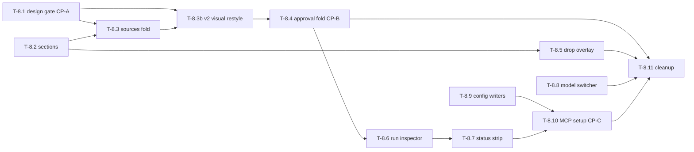

# Phase 8 — Shell & IA restructure

This phase restructures the app's information architecture so the layout
makes sense without explanation: a **Library**-centered IA (Sources and
Approval fold into it, Runs demotes to an inspector), the **whole window as
a drop target**, the **model switcher in the shell chrome**, **MCP status
front and center with one-click setup**, and the overloaded status strip
decomposed into single-purpose pieces.

Roadmap: [docs/roadmap.md → Phase 8](../roadmap.md). Ground truth for every
existing surface: [docs/design/feature-report/](../design/feature-report/README.md).
Design iterations land in [docs/design/explorations/](../design/explorations/)
— [toolbox-v1](../design/explorations/toolbox-v1.md) locked the shell IA
(sidebar: Toolbox/Library, Runs, Settings + MCP chip) and the library cell
content; its styling was rejected.

## How to read this document

Written to be executed by an AI agent **with a human ("me") in the loop**.
Each task has the same shape:

- **Task execution (agent prompt):** the literal instruction block.
- **Refining loop:** iterate-until-good cycle.
- **Human-in-the-loop (me):** what I review or provide. The agent **must
  stop at every `[HOLD FOR ME]` gate.**
- **Acceptance:** objective done criteria.

### Working agreement for the agent

1. One task at a time, in order, unless I say otherwise.
2. After any visible change: `swift build`, run the app (`make app` when
   packaging matters), capture a screenshot of the affected surface, paste
   it in your summary.
3. Never proceed past `[HOLD FOR ME]` without my explicit approval.
4. Keep each task PR-sized and reversible.
5. Do not touch `Store/Schema.swift`, `engine/`, or `mcp/` server code.
   T-8.9 writes *client config files* for external tools — that is the only
   filesystem-config work allowed, and it must be behind tests.
6. `swift test` stays green after every task.
7. Use the frozen design system (`Design/` tokens + components). Respect
   the toolbox-v1 styling constraints: glass material on the floating
   controls layer only (sidebar, toolbars, overlays), solid surfaces for
   content; mono type only for paths/code; accent green only on meaningful
   state.

## Decisions locked in (do not relitigate)

- Top-level sections become **Library, Marketplace (placeholder), Settings**.
- Sources and Approval cease to exist as tabs; Runs ceases to exist as a tab.
- The entire window is a drop target with a full-window overlay;
  **nothing in the underlying layout moves during a drag** (D15 extended to
  the drag gesture).
- The model switcher lives in the shell chrome, not behind Settings.
- The status strip is decomposed; the MCP chip is the only persistent
  global status element.
- Reject/delete get confirmation. No more one-click permanent deletes.

## Checkpoint map

| Gate | What I review | Blocks |
| --- | --- | --- |
| CP-A | Approved toolbox-v2 design (native-Tahoe restyle of v1) | T-8.3+ visual work |
| CP-B | Library surface with sources + review folded in | T-8.6 |
| CP-C | MCP one-click setup flow end-to-end | phase exit |

---

## T-8.1 — Design packet refresh + toolbox-v2 gate (CP-A)

**Owner:** me (Claude Design) + agent (documentation)
**Checkpoint:** CP-A

### Goal
Get an approved visual target before structural work ships. toolbox-v1
locked the IA; v2 is the restyle.

### Files
- `docs/design/explorations/` (new `toolbox-v2.md` + screenshot)
- `docs/design/feature-report/library-view-prompt.md` (status update)

### Task execution (agent prompt)

> 1. Verify the revision instruction at the bottom of
>    `docs/design/explorations/toolbox-v1.md` is current; if any phase-8
>    decision above contradicts it, update it and flag the change.
> 2. Hand the instruction back to me; I will run the iteration in Claude
>    Design and return screenshots.
> 3. When I return an approved iteration, save the image into
>    `docs/design/explorations/` and write `toolbox-v2.md` in the same
>    format as v1: verdict line, what is locked, what changed from v1,
>    and any new constraints for implementation.

### Human-in-the-loop (me)
- `[HOLD FOR ME]` I produce and approve toolbox-v2. Nothing visual in
  T-8.3+ starts before this gate clears.

### Acceptance
- `toolbox-v2.md` exists with an embedded screenshot and an "approved"
  verdict, cross-linked from the roadmap Phase 8 item.

---

## T-8.2 — Section model restructure (Library / Marketplace / Settings)

**Owner:** agent
**Checkpoint:** none (structural; ships with existing styling)

### Goal
Replace the five-section navigation with the new three-section IA without
yet redesigning any page content.

### Files
- `app/Sources/GunkApp/Views/AppShellView.swift` (`AppSection`, sidebar,
  `detailView(for:)`, landing logic)

### Task execution (agent prompt)

> Restructure `AppSection` in `AppShellView.swift`:
> 1. New cases: `library`, `marketplace`, `settings` (SF Symbols:
>    `shippingbox` or keep `square.grid.2x2` for library; `storefront` for
>    marketplace; `gearshape` stays). Remove the journey/utility split and
>    the separator.
> 2. `library` renders the existing `ModulesSectionView` for now (the
>    merge happens in T-8.3/T-8.4). Keep `SourcesSectionView`,
>    `ApprovalSectionView`, and `RunsView` compiling but unrouted — they
>    are dismantled in later tasks, not this one.
> 3. `marketplace` renders a branded `EmptyStateView`: "Marketplace —
>    coming soon" plus one caption line ("Use other people's modules, and
>    publish yours."). No other content.
> 4. Landing rule simplifies to: always land on `library` (its empty state
>    covers first-run; the old sources-vs-modules split dies with the
>    Sources tab).
> 5. The `sourcesArrivedViaOpen` handler navigates to `library`.
> 6. Sidebar accessories: keep the processing dot (now on Library) and the
>    pending-review count (now on Library as well — combine: processing
>    dot wins while processing, count otherwise). The status strip is
>    untouched until T-8.7.
> 7. `swift build`, `swift test`, screenshot the new sidebar with each
>    section selected.

### Refining loop
- If `BrowseModel`/`GunkListModel` refresh wiring assumed section identity
  (e.g. `.sources` checks), fix the references mechanically; do not
  redesign refresh behavior here.

### Human-in-the-loop (me)
- I review the three-section sidebar screenshots. No gate — this is
  scaffolding.

### Acceptance
- Sidebar shows exactly Library / Marketplace / Settings.
- App launches into Library; marketplace placeholder renders; settings
  unchanged. Build + tests green.

---

## T-8.3 — Sources fold into Library

**Owner:** agent
**Checkpoint:** CP-B (jointly with T-8.4)

### Goal
Library becomes the one place sources live: their list, status, outcomes,
and management — no separate tab.

### Files
- `app/Sources/GunkApp/Views/AppShellView.swift` (Library section wrapper)
- `app/Sources/GunkApp/Views/BrowseView.swift`
- `app/Sources/GunkApp/Views/GunkListView.swift` (source rows reused)
- `app/Sources/GunkApp/Views/DropZoneView.swift` (`DropZoneHandler` stays;
  `BrandDropZone` will be retired in T-8.5)

### Task execution (agent prompt)

> Fold source management into the Library surface:
> 1. Add a "Sources (N)" affordance to the Library header area (next to
>    the filter bar). Clicking opens a sources panel (sheet or popover —
>    follow toolbox-v2 if it specifies; otherwise a sheet) listing source
>    rows reusing the `SourceRow` status-slot logic from `GunkListView`:
>    processing progress, "N modules" (closes the panel and applies the
>    source filter), failed state with error, delete.
> 2. Source delete gets a confirmation dialog stating the consequence
>    ("Removes the source from gunk. Its modules remain until deleted.")
>    — verify the actual store behavior for orphaned modules first and
>    write the copy to match what really happens; report what you find.
> 3. A compact "Add folder" button (folder-picker via `NSOpenPanel`)
>    joins the header — drag-and-drop stops being the only intake path.
>    Route picked folders through the existing `DropZoneHandler.handleDrop`.
> 4. The arrival highlight (2s accent treatment) moves to the module grid:
>    when a run completes, newly created module cells carry it.
> 5. Delete `SourcesSectionView`. `swift build`, `swift test`, screenshots
>    of the Library header, the sources panel in every row state, and the
>    add-folder flow.

### Refining loop
- If the sources panel fights the filter bar for space at the 960pt window
  minimum, collapse the header into two rows rather than shrinking touch
  targets; screenshot both widths.

### Human-in-the-loop (me)
- I review the sources panel and confirm the delete-confirmation copy
  matches the real store behavior the agent reports.

### Acceptance
- No Sources tab anywhere; all source capabilities (list, status, outcome
  navigation, delete, add) reachable from Library.
- Source delete requires confirmation. Build + tests green.

---

## T-8.3b — Toolbox-v2 visual restyle (palette + Library grid)

**Owner:** agent
**Checkpoint:** CP-A (the approved target this implements)

### Why this exists
CP-A approved a *look* ([toolbox-v2](../design/explorations/toolbox-v2.md))
but no task ever **implemented** it. T-8.2/T-8.3 shipped the IA on the *old*
green-tinted "ooze" design system; every later task says "styled per
toolbox-v2" while assuming the design system already encodes v2 — it does not.
This task closes that gap: it retunes the palette and rebuilds the Library grid
to match the approved screenshot, so the surfaces T-8.4+ touch inherit the
right look instead of compounding the debt. It runs **next, before T-8.4**
(T-8.4 then layers the needs-approval state onto the new cell).

### Read first (non-negotiable)
- [`docs/design/explorations/toolbox-v2-library.html`](../design/explorations/toolbox-v2-library.html)
  — **the source of truth.** Open it in a browser and read its `<style>`
  `:root`/CSS: every exact token, radius, grid, and material value below comes
  from this file. When anything disagrees, the HTML wins.
- [`docs/design/explorations/toolbox-v2.md`](../design/explorations/toolbox-v2.md)
  and its screenshot `toolbox-v2-library.png` — the annotated spec (exact tokens,
  geometry/type table, resolved questions, and the later-phase surfaces the
  mockup also pins).
- [`docs/design/explorations/toolbox-v1.md`](../design/explorations/toolbox-v1.md)
  — the locked cell-content brief and the five "robotic futuristic" problems
  this restyle must *not* reintroduce.

### Files
- `app/Sources/GunkApp/Design/BrandColors.swift` (palette retune + new
  provider-accent art colors)
- `app/Sources/GunkApp/Design/Components/TagChip.swift` (confirm system font,
  neutral pill — no mono, no green tint)
- `app/Sources/GunkApp/Views/BrowseView.swift` (header, search, grouping
  segmented, the briefing-card cell, the usage-ranked hero cell, provider
  badge)
- `app/Sources/GunkApp/Models/BrowseModel.swift` (search query, `Project|Model`
  grouping, per-gunk provenance + hero election — all model-layer, allowed)
- New components are encouraged: e.g. `Design/Components/ProviderBadge.swift`,
  `Views/ModuleCell.swift`. Keep them in `Design/`/`Views/`.

### Hard data facts (verified — do not fight these)
1. **No usage telemetry exists.** There is no "uses this week" column or table
   anywhere, and `Store/Schema.swift` is **off-limits**. The screenshot's
   "31 uses this week" is mockup data. You may **not** invent it.
2. **Provenance is available without touching the store.** `RunTrace` carries
   `provider` + `model`, and `BrowseModel.indexTraces` already loads traces per
   source/gunk. Derive the `via <model>` line and the provider-badge color from
   the most recent `RunTrace` for the gunk (fall back to its source's trace).
3. **The model picker (top-right `provider · model`) is T-8.8's**, not yours.
   Leave a stable slot for it; do not build the switcher here.

### Task execution (agent prompt)

> Implement the toolbox-v2 look in two landable parts. **Part A (palette) is
> its own commit and must build/test green before Part B starts** — it is
> low-risk and foundational; everything else inherits it.
>
> **PART A — Palette retune (de-green the *surfaces* to neutral graphite).**
> 1. Retune `BrandColors` **dark** tokens to the graphite surfaces. These are
>    **exact** values read from the source mockup
>    (`docs/design/explorations/toolbox-v2-library.html` `:root`) — use them
>    verbatim, not approximations:
>    - `backgroundPrimary` (window/deepest): `#0B0D0C` → `#161618`
>    - the content scrolling surface (behind cards): → `#1d1d20`
>    - `backgroundElevated` (cards): `#121613` → `#27272b`
>    - card hover step: → `#303036`
>    - `surfaceGlass` (the floating controls layer): `#171C18` →
>      `rgba(48,48,54,0.55)` over `blur(42) saturate(1.7)`, hairline
>      `rgba(255,255,255,0.09)`
>    - text ramp: primary `#f3f3f5`, muted `#9b9ba2`, faint `#6c6c74`;
>      separators `rgba(255,255,255,0.07)`
>    - **There is no separate dimmed-card or tag-pill token.** *Not in toolbox*
>      is the standard card at `opacity 0.5` (hover → 1); tag chips are
>      `rgba(255,255,255,0.06)` (language chip `0.09`) on the card.
>    - **`accent` green stays `#5FE08C` (unchanged).** The de-green is surfaces
>      only — do **not** re-tune the accent. `warning` → `#e7b765`, `danger` →
>      `#e5786a`. Keep green-on-meaning-only.
>    Re-derive the **light** values to stay legible; keep the resolver and the
>    `Assets.xcassets` named-color path intact. Do not change the brand-mark
>    art colors.
> 2. Add a **provider-accent palette** as fixed art colors (like `Mark`):
>    Anthropic ~`#D26D43` (coral), OpenAI ~`#639FA9` (teal), Google/Gemini
>    ~`#33508A` (indigo), plus a neutral fallback. Add a
>    `providerAccent(for provider: String) -> Color` resolver (case-insensitive
>    on the `RunTrace.provider` string; `ollama`/unknown → neutral).
> 3. Audit the existing screens for contrast against the lighter surfaces
>    (rows, badges, separators) and fix anything that goes muddy or invisible.
>    Confirm `TagChip` is system font on a neutral pill (no mono, no green).
> 4. `swift build`, `swift test`, screenshot the Library + Settings on the new
>    palette. Commit Part A.
>
> **PART B — Library grid as briefing cards with a usage-ranked hero.**
> 5. **Header.** Replace the dense filter card with the v2 controls layer:
>    `Library` title + a count chip (total capabilities), a **`Project |
>    Model`** segmented control, and a **Search** field. Leave a trailing slot
>    for T-8.8's model picker (do not build it). Glass on this controls layer
>    only. **Do not delete existing filter power**: move
>    tag/language/approval/source filtering into a compact "Filters" popover so
>    nothing regresses (the segmented `Project|Model` replaces the old
>    Tag/Source/Language/Approval *grouping*, not the filters).
> 6. **Search.** Add `filters.query` to `BrowseModel`; match (case-insensitive)
>    name + purpose + tags. Wire it to the field.
> 7. **Grouping.** `Project` groups by source (existing `.source`); add a new
>    `Model` grouping that buckets by the gunk's extracting `provider · model`
>    (from `RunTrace`; gunks with no trace fall in an "Unknown model" bucket).
>    Group headers show the bucket name + a right-aligned `N capabilities`
>    count.
> 8. **Cell = briefing card** (kill the instrument-panel row). Per cell: the
>    one trust verdict as the headline state (`Agent-ready` green /
>    `Needs approval` amber / `Not in toolbox` dimmed — `Not in toolbox` is the
>    `extractedAt == nil` + below-threshold case, fully dimmed, no glyph);
>    prominent name (system semibold); a purpose line (regular, truncated on
>    standards, full on the hero); a quiet provenance line `via <model>`; the
>    provider-colored corner badge (top-right, from step 2); tag pills. **Do
>    not** render the confidence/containment/build readout on the cell — that
>    stays in the detail pane (already there). **Do not** render a fake "uses"
>    number: omit the usage line entirely until telemetry exists (leave a
>    single clearly-marked `// FUTURE: usage telemetry` seam).
> 9. **Usage-ranked hero.** Within each group, promote the top-ranked module to
>    a hero cell spanning **2 columns and taller**, top-left; the rest are
>    standard 1-column cells in a 3-column grid. Because real usage data does
>    not exist yet, rank by this **documented fallback**: `extractedAt`/agent-
>    ready first, then confidence desc, then name — and isolate it behind a
>    single `heroRank` comparator with a `// FUTURE: rank by uses/week` note so
>    it swaps cleanly when telemetry lands. Define the empty/tie behavior: a
>    group with one module shows just the hero; an all-equal group falls
>    through to name order; never crash on an empty group.
> 10. **Geometry & material (the v1 fixes).** Large concentric radii, generous
>     interior padding, separation by spacing/elevation not strokes; cards on
>     solid `backgroundElevated`, scrolling beneath the glass controls layer;
>     mono only for paths/code; accent green only on agent-ready/positive.
> 11. Verify the grid still fits at the **960pt** minimum next to the 192pt
>     sidebar (the hero must reflow, not clip). `swift build`, `swift test`,
>     screenshot every cell state (hero, agent-ready, needs-approval, not-in-
>     toolbox), both groupings, search active, and the 960pt + default widths.

### Refining loop
- If the 2-up hero + 3-col grid can't both hold at 960pt, drop the hero to
  full-width-at-narrow (single column) rather than shrinking cells; screenshot
  the breakpoint.
- If de-greening the surfaces makes the accent feel disconnected, tune the
  accent and `success`/`warning`/`danger` together against the new graphite —
  do not re-tint the surfaces green to compensate (that's the v1 mistake).
- Keep Part A and Part B as separate commits so the palette can land even if
  the grid needs another pass.

### Human-in-the-loop (me)
- `[HOLD FOR ME]` I compare the running app side-by-side with
  `toolbox-v2-library.png` and sign off on the palette and the cell/hero
  before T-8.4 builds on it. I will provide exact source-file hex if my
  approximations are off.

### Acceptance
- Surfaces are neutral graphite (no green-tinted backgrounds/borders/chips);
  `BrandColors` retuned with a provider-accent palette + resolver.
- Library renders briefing-card cells with one trust verdict, a provider badge,
  `via <model>` provenance, and a usage-ranked hero per group; `Project|Model`
  grouping + search work; existing filters preserved (not deleted).
- No fabricated usage numbers; usage seam documented. Mono only for paths/code;
  accent green only on meaningful state. Fits at 960pt. Build + tests green.

### Follow-ups from Mark's review of the landed Part A + Part B (2026-06-11)

Documented design decisions from the screenshot-annotated review; the items
marked *landed* shipped immediately after Part B, the rest are scheduled.

1. **The inline detail pane is interim — including the resting "Select a
   module" empty state on the right.** It is a leftover of the pre-v2 layout
   and is **removed when the module detail moves into the toolbox-v2 centered
   glass sheet** (radius `22`, `blur(50)` — see "Beyond the Library" in
   `docs/design/explorations/toolbox-v2.md`, pinned to **T-8.6**). This is a
   *design* removal only: every detail capability (trust readout, files,
   bundle, approve/reject, actions) survives inside the sheet. Until then the
   pane stays as scaffolding; do not invest further design effort in it.
   - **Resting placeholder removed early** (*landed*, 2026-06-12, Mark's
     direction). The "Select a module" empty state is gone ahead of T-8.6:
     with nothing selected the grid owns the full content width, and the
     inline pane only appears once a module is selected. The
     selected-module presentation is intentionally untouched — that design
     is T-8.6's centered glass sheet.
2. **The top app bar (Library controls layer) needs another pass.** Target is
   Mark's annotated mockup: title + count chip, `Project | Model` segmented,
   one long search field, trailing `provider · model` switcher. Landed now:
   - **`Add folder` → `Add module`** (*landed*). The user is adding a
     capability to their toolbox, not filing a folder; the folder picker is
     just the mechanism. Intake path unchanged.
   - **Filters UI removed for now** (*landed*). The popover is gone; the
     segmented control + search are the only controls. `BrowseModel`'s
     source/tag/language/approval filter state is intact and tested — nothing
     was deleted below the view layer (T-8.4 still wires the needs-approval
     filter to the sidebar badge).
   - **Search bar extended** to fill the remaining controls-row width
     (*landed*). The filters will eventually return **layered inside the
     search bar**; that design is Mark's to explore — `[HOLD FOR ME]` do not
     pre-design or land a filters-in-search treatment without his direction.
   - **Segmented selection is neutral, not green** (*landed*). The selected
     `Project | Model` segment was accent-tinted; that violates
     green-on-meaning-only (a grouping toggle carries no meaning-state). It
     now uses the system's neutral selected-segment treatment.
   - The trailing slot stays reserved for the **T-8.8** `provider · model`
     switcher (visible in the annotated mockup as `Anthropic · Claude
     Sonnet 4 ⌄`).
   - **Single-row appbar** (*landed*, 2026-06-12). The controls layer now
     matches the annotated mockup's one-row `.toolbar`: `Library` + a plain
     muted count (the pill chip is gone — mockup `.tb-title .count`),
     `Project | Model` segmented, one long search field (with the mockup's
     hairline border), and the labeled **Add module** button per Mark's
     direction. Controls are regular weight at mockup `.search input`
     proportions — the first pass used `controlSize(.small)` and read too
     thin against the cards. At the 960pt window minimum the row falls back
     to the two-row stack (`ViewThatFits`) instead of shrinking touch
     targets.
   - **No sources entry point in the appbar for now** (*landed*,
     2026-06-12, Mark's direction). The folder glyph that opened the
     sources panel is removed; sources management returns when the
     filters-in-search treatment lands (`[HOLD FOR ME]` above — Mark's
     design). The panel itself (`SourcesPanelView`) and `BrowseModel`'s
     filter state are untouched; only the appbar affordance is gone, so
     T-8.4+ must restore an entry point alongside that design.
   - **Window background is solid** (*landed*, 2026-06-12). The detail
     container's pre-v2 flush glass wash drew a thin hairline rim around
     the whole modules surface; it is replaced with solid
     `backgroundPrimary` (toolbox-v2: glass lives on the floating controls
     layer only).
   - **Appbar vertical-weight pass + model readout** (*landed*, 2026-06-12,
     Mark's review). The bar, segmented, and search field all get taller:
     the search field takes 12pt vertical padding and is capped at the
     mockup's 300pt max width (it no longer runs the whole bar); the
     `Project | Model` segmented is now custom-built (mockup `.seg`,
     scaled up — the system control reads too thin at any size). The
     trailing slot now renders the `provider · model ⌄` readout from the
     Settings `llm.provider`/`llm.model` storage — **visual only**; T-8.8
     still owns the switching menu behind it.
   - **`Add module` moves to the sidebar** (*landed*, 2026-06-12, Mark's
     direction). The appbar button is gone; the sidebar gains an
     `Add module` nav row whose screen is intentionally blank — Mark
     designs it later. Drag-and-drop and the empty-Library button remain
     intake paths; the folder-picker plumbing (`addFolder` →
     `DropZoneHandler`) is untouched for that screen to use.
   - **Sidebar widens to the mockup's 232pt** (*landed*, 2026-06-12). The
     192pt fit-math width read too narrow; the Library's browser-pane
     minimum relaxes to 400pt so 232 + content still fits the 960pt
     minimum window.
   - **Glass shadows matched to the mockup** (*landed*, 2026-06-12). The
     appbar and the sidebar now carry the exact `.glass` box-shadow from
     `gunk Library (standalone).html` / `toolbox-v2-library.html`:
     `inset 0 1px 0 rgba(255,255,255,0.10)` (a crisp 1pt inner top
     highlight) plus `0 12px 40px -16px rgba(0,0,0,0.6)` (mapped to SwiftUI
     shadow radius 12 / y 12 / opacity 0.6 — the −16px spread pulls the
     40px CSS blur to a ~24px falloff). The sidebar was previously
     un-shadowed (`elevated: false`), which diverged from the HTML — both
     surfaces now share the same elevated treatment.

---

## T-8.4 — Approval folds into Library

**Owner:** agent
**Checkpoint:** CP-B (jointly with T-8.3)

### Goal
Review stops being a separate room: needs-approval modules are a state in
the Library, and approve/reject happen in the module detail with real
feedback and safe destructive actions.

### Files
- `app/Sources/GunkApp/Views/BrowseView.swift` (rows + detail pane)
- `app/Sources/GunkApp/Views/AppShellView.swift` (badge, routing)
- `app/Sources/GunkApp/Views/ApprovalQueueView.swift` (deleted at the end)
- `app/Sources/GunkApp/Models/BrowseModel.swift` (read-only usage; the
  queue rule already lives here)

### Task execution (agent prompt)

> 1. Module rows in the needs-approval state (use
>    `BrowseModel.approvalQueue` membership) get the needs-attention
>    treatment from toolbox-v1/v2 (colored top edge) and a "Needs
>    approval" badge instead of the neutral state.
> 2. The detail pane for a needs-approval module gains a review block
>    above the actions row: confidence shown *with threshold context*
>    ("62% — below the 70% auto-accept threshold") and two labeled
>    buttons: **Approve** (primary; calls `model.approve`) and **Reject**
>    (destructive; calls `model.reject` **behind a confirmation dialog**
>    that says it permanently deletes the module).
> 3. Approve gives feedback: the detail's Agent-ready line transitions to
>    its success state in place (animate with `BrandMotion`); do not let
>    the row silently vanish if a filter hides it — keep selection on the
>    module.
> 4. Add a "Needs approval (N)" filter chip or scoped control in the
>    Library header that applies the existing
>    `BrowseApprovalFilter.needsApproval`; wire the sidebar Library badge
>    count tap-through to it.
> 5. Delete `ApprovalQueueView.swift` and the `ApprovalSectionView`
>    wrapper. `swift build`, `swift test`, screenshots: a needs-approval
>    cell, the review block, the reject confirmation, and the
>    post-approve state.

### Refining loop
- If approving the last queued module leaves the needs-approval filter
  showing an empty grid, land on a friendly cleared-queue state ("All
  caught up") rather than the generic empty state.

### Human-in-the-loop (me)
- `[HOLD FOR ME]` CP-B: I walk the full review journey (badge → filter →
  detail → approve and reject) on a real store before T-8.6 starts.

### Acceptance
- No Approval tab; review is reachable from the badge, the filter, and any
  needs-approval cell. Reject confirms before deleting. Approve animates
  to Agent-ready. Build + tests green.

---

## T-8.5 — Whole-window drop target + overlay

**Owner:** agent
**Checkpoint:** none (behavior specified; visuals from toolbox-v2)

### Goal
Dragging a folder anywhere over the window raises a full-window overlay;
nothing in the layout moves; drops work from any section. Drag is the
*accelerant*, never the only door: a persistent, no-gesture-required add
affordance is always visible in both the empty and populated Library, so a
user who skips onboarding still knows where to add a folder.

### Files
- `app/Sources/GunkApp/Views/AppShellView.swift`
- `app/Sources/GunkApp/Views/DropZoneView.swift` (`BrandDropZone` retired;
  `DropZoneHandler` unchanged)
- `app/Sources/GunkApp/Views/BrowseView.swift` (module grid: persistent
  add tile + first-run empty state)
- `app/Sources/GunkApp/Views/EmptyStateView.swift` (empty-Library
  click-or-drag zone)

### Task execution (agent prompt)

> 1. Move drop handling to the shell: `.onDrop(of: [UTType.fileURL], ...)`
>    on the shell's root container (over sidebar *and* detail), reusing
>    `DropZoneHandler` exactly as-is.
> 2. While a drag with file URLs is targeted, render a **full-window
>    overlay** in a `ZStack` above everything: dimmed scrim + a centered
>    glass card ("Drop folders to add them to your library", folder icon,
>    accent border). Two visual states: drag-over-window and
>    ready-to-drop (cursor inside the window vs. the system's drop-ready
>    targeting), per toolbox-v2 if it specifies.
> 3. Hard rule: the overlay floats; the underlying layout must not
>    reflow, resize, or scroll — verify by screenshotting during a drag.
> 4. Invalid drops (no directories) show the "Only folders can be added."
>    error *inside the overlay* before it dismisses, not as injected
>    layout.
> 5. After a successful drop from any section, navigate to Library (same
>    behavior as Dock drops).
> 6. Remove `BrandDropZone` and its fixed 170pt slot.
> 7. **Persistent add affordance (drag is never the only door).** Two
>    no-gesture-required entry points replace the retired slot, so a user
>    who skips onboarding always sees where to add a folder:
>    - **First-run (empty Library):** the content area itself is a
>      click-or-drag zone — a centered glass/dashed panel with a folder
>      icon, "Drag a folder here, or click to browse," and an accent
>      **Add folder** button (same `NSOpenPanel` →
>      `DropZoneHandler.handleDrop` path as T-8.3). Share the visual
>      language with the full-window overlay so the empty state *teaches*
>      the drag gesture.
>    - **Populated Library:** a persistent dashed **"+ Add folder"** tile
>      is always the first cell of the module grid, so the door never
>      disappears once modules exist. Same picker action; styled per
>      toolbox-v2.
>    Keep a single canonical add path: the grid tile is the primary
>    persistent affordance. Reconcile with the T-8.3 header "Add folder"
>    button — if toolbox-v2 keeps both, they must call the same handler,
>    not diverge or duplicate logic.
> 8. `swift build`, `swift test`, screen-record or screenshot: the overlay
>    in both states from the Settings section (proves section-agnostic
>    drops), the empty-Library click-or-drag zone, and the persistent
>    "+ Add folder" grid tile in a populated Library.

### Refining loop
- SwiftUI `.onDrop` + window-level overlays can fight `NSWindow` first
  responder during drags; if the overlay flickers, debounce the targeted
  state (~100ms) rather than restructuring views.
- If the dashed add tile competes with module cells for scan attention,
  keep it visually quiet (dashed outline, no accent fill) so it reads as
  an affordance, not a module — accent green stays reserved for trust
  state per the toolbox-v1 styling rules.

### Human-in-the-loop (me)
- I drag real folders from Finder over every section and confirm nothing
  shifts.
- I confirm the add affordance is findable without dragging in both the
  empty and populated Library.

### Acceptance
- Drops accepted over any part of the window from any section; overlay
  appears/dismisses cleanly; zero layout movement; `BrandDropZone` gone.
- A persistent, labeled add-folder affordance is visible without a drag
  gesture in both the empty Library (click-or-drag zone) and the populated
  Library ("+ Add folder" grid tile); both route through
  `DropZoneHandler`. Build + tests green.

---

## T-8.6 — Runs tab becomes a run inspector

**Owner:** agent
**Checkpoint:** none

### Goal
Run traces stay reachable but stop being a top-level destination: an
inspector opened from the places users actually are.

### Files
- `app/Sources/GunkApp/Views/RunsView.swift` (refactored, not deleted)
- `app/Sources/GunkApp/Views/AppShellView.swift`
- `app/Sources/GunkApp/Views/BrowseView.swift` (detail pane entry point)

### Task execution (agent prompt)

> 1. Refactor `RunsView` into `RunInspectorView`: same trace list +
>    detail content, presented as a sheet (or inspector panel if
>    toolbox-v2 specifies) instead of a tab. Add an optional
>    `initialSourceId:` so it opens pre-filtered/selected to the most
>    recent run for a given source.
> 2. Entry points: (a) "View runs" in the sources panel rows (T-8.3),
>    (b) "Last run" affordance in the module detail header area, (c) the
>    run-failed status element (T-8.7) opens it at the failed run.
> 3. While a run is active and the inspector is open, auto-refresh traces
>    on a timer (2–3s) — the current view never refreshes during a run.
> 4. Format for humans: durations as seconds ("83.2s" not "83214 ms"),
>    timestamps with date when not today.
> 5. Remove `runs` from `AppSection`. `swift build`, `swift test`,
>    screenshots of the inspector from each entry point.

### Refining loop
- Keep the inspector content on solid surfaces; only its container chrome
  may be glass (controls layer).

### Human-in-the-loop (me)
- I confirm a failed run is diagnosable end-to-end: failure indicator →
  inspector → failing stage error text.

### Acceptance
- No Runs tab. Inspector reachable from sources panel, module detail, and
  failure state; auto-refreshes while processing. Build + tests green.

---

## T-8.7 — Decompose the status strip

**Owner:** agent
**Checkpoint:** none

### Goal
Split the four-jobs-in-one chip into single-purpose elements with
predictable click targets.

### Files
- `app/Sources/GunkApp/Views/AppShellView.swift` (`ShellStatusStrip`,
  `ShellStripState`, summary/decay logic)

### Task execution (agent prompt)

> Replace `ShellStatusStrip` with three independent elements:
> 1. **MCP chip (persistent, sidebar bottom):** exactly two states —
>    "Agent connected" (green, *not clickable*; hover shows the config
>    path as help text) and "MCP not set up → Connect" (warning, clicks
>    into the T-8.10 setup flow; until T-8.10 lands, it routes to
>    Settings as today).
> 2. **Processing element:** while `ProcessingModel.isProcessing`, a
>    compact progress element above the MCP chip: source name, linear
>    progress, modules found. Click → Library (which now owns processing
>    visibility). It disappears when idle — it does not become a toast.
> 3. **Completion/failure toast:** a transient overlay toast (bottom of
>    the detail area, floating, glass) on run end: success reads "N
>    modules added · M need review" with a View action (→ Library,
>    needs-review filter applied when M > 0); failure reads "Run failed"
>    with an Inspect action (→ run inspector at that run). Auto-dismiss
>    8s, manual dismiss X. Toasts must not shift layout.
> 4. Delete `ShellStripState` and the old strip. Keep the
>    capture-during-run summary logic (`modulesFoundDuringRun`,
>    pending-review delta) — it feeds the toast now.
> 5. `swift build`, `swift test`, screenshots: idle (both MCP states),
>    processing, success toast, failure toast.

### Refining loop
- If the toast overlaps the module detail's action row at minimum window
  size, dock it bottom-center with margin rather than bottom-trailing.

### Human-in-the-loop (me)
- I run a real folder through and confirm the completion moment feels
  like feedback, not a vanishing chip.

### Acceptance
- Each element has one job and one predictable click target; the green
  healthy chip no longer navigates anywhere surprising. Build + tests
  green.

---

## T-8.8 — Model switcher in the shell chrome

**Owner:** agent
**Checkpoint:** none

### Goal
Provider/model switching without opening Settings.

### Files
- `app/Sources/GunkApp/Views/AppShellView.swift` (toolbar)
- `app/Sources/GunkApp/Views/SettingsView.swift` (read-only reference for
  the storage contract)

### Task execution (agent prompt)

> 1. Add a compact model switcher to the shell toolbar (trailing side): a
>    menu showing `provider · model` as its label. Menu contents: the
>    three providers as sections, each listing that provider's default
>    model plus the currently-saved custom model if different; a "Model
>    settings…" item routes to Settings.
> 2. It reads/writes the exact same storage as Settings:
>    `@AppStorage("llm.provider")`, `@AppStorage("llm.model")`; switching
>    provider loads that provider's Keychain key state. If the selected
>    provider has no saved key (and is not Ollama), show a small warning
>    dot on the switcher and route the user to Settings on selection.
> 3. Do not duplicate save/test logic — the switcher only selects;
>    key entry stays in Settings.
> 4. `swift build`, `swift test`, screenshots: switcher closed, open, and
>    the missing-key warning state.

### Refining loop
- Keep the label width stable (middle-truncate long model names) so the
  toolbar doesn't jump when switching.

### Human-in-the-loop (me)
- I switch providers with and without saved keys and confirm the engine
  picks up the change on the next run (it reads the same defaults).

### Acceptance
- Provider/model switchable from the chrome; storage contract identical to
  Settings; missing-key state visible. Build + tests green.

---

## T-8.9 — Multi-client MCP config writers (logic, no UI)

**Owner:** agent
**Checkpoint:** none (pure logic + tests)

### Goal
Idempotent detect/read/write support for wiring gunk-mcp into each AI
client's config, fully unit-tested against temp directories.

### Files
- `app/Sources/GunkApp/Integrations/MCPClientConfigurator.swift` (new)
- `app/Sources/GunkApp/Models/MCPStatusProvider.swift` (generalized)
- `app/Tests/GunkAppTests/MCPClientConfiguratorTests.swift` (new)
- `docs/integration/` (read for the documented config shapes)

### Task execution (agent prompt)

> 1. Define `MCPClient` (cursor, claudeCode, claudeDesktop, codex,
>    opencode) with per-client: display name, config file location,
>    config format (JSON vs TOML), and the entry shape that spawns
>    `gunk-mcp`. Source the shapes from `docs/integration/` and each
>    tool's current documentation — verify, do not guess; list your
>    sources in the summary.
> 2. `MCPClientConfigurator` API: `detectInstalled() -> [MCPClient]`
>    (config dir or app presence), `status(for:) -> ready/needsSetup/...`
>    (generalizing the existing `MCPStatusProvider` Cursor check),
>    `wire(_ client:) throws` and `unwire(_ client:) throws`.
> 3. Idempotency is the core requirement: `wire` twice produces byte-stable
>    config; existing unrelated entries are preserved exactly; malformed
>    existing config aborts with a clear error rather than clobbering.
>    `unwire` removes only the gunk entry.
> 4. Resolve the `gunk-mcp` binary path the same way the app resolves the
>    engine binary; if no robust path exists for packaged builds, stop
>    and report options instead of inventing one.
> 5. Every path is injected (config URLs, FileManager) so tests run
>    against temp dirs: wire-into-empty, wire-into-existing,
>    double-wire, malformed-config, unwire. No test touches the real
>    home directory.
> 6. `swift build`, `swift test`.

### Refining loop
- TOML (Codex) has no Foundation parser; prefer a minimal targeted
  read-modify-write for the specific table rather than adding a
  dependency — flag it if that proves too fragile.

### Human-in-the-loop (me)
- `[HOLD FOR ME]` I review the per-client config shapes against the tools
  I actually have installed before the UI task consumes this.

### Acceptance
- Configurator with tests covering idempotency and preservation for all
  five clients; real `~/.cursor/mcp.json` behavior identical to the old
  provider for the Cursor case. Build + tests green.

---

## T-8.10 — MCP front and center: one-click setup UI (CP-C)

**Owner:** agent
**Checkpoint:** CP-C

### Goal
The main selling point gets the main treatment: when MCP isn't wired, the
app says so prominently and fixes it in one click.

### Files
- `app/Sources/GunkApp/Views/AppShellView.swift` (MCP chip → setup flow)
- `app/Sources/GunkApp/Views/MCPSetupView.swift` (new)
- `app/Sources/GunkApp/Views/SettingsView.swift` (per-tool toggles in the
  Status section)

### Task execution (agent prompt)

> 1. Build `MCPSetupView` (sheet, branded): the detected clients listed
>    with their status (Connected / Not set up / Not detected), one
>    **Connect** button per client calling `wire`, with success/error
>    inline per row. A "Connect all" primary button when 2+ clients are
>    unwired. Copy explains the payoff in one line ("Your agent can use
>    every Agent-ready module in your library").
> 2. The warning-state MCP chip (T-8.7) opens this sheet. The Modules
>    detail "MCP not set up" line and any other needs-setup affordances
>    route here instead of Settings.
> 3. Settings' MCP status row gains per-tool toggles (wire/unwire each
>    client) using the same configurator; the old single Cursor row is
>    replaced by the per-client list.
> 4. After any wire/unwire, statuses re-check live (chip, sheet, and
>    Settings stay in agreement — single `MCPClientConfigurator` source).
> 5. `swift build`, `swift test`, screenshots: chip warning state, the
>    sheet before/after connecting, Settings per-tool list.

### Refining loop
- If a client is installed but its config is malformed, surface the
  configurator's abort error verbatim with a "open config file" affordance
  — never silently overwrite.

### Human-in-the-loop (me)
- `[HOLD FOR ME]` CP-C: I run one-click setup against my real Cursor
  config (after backing it up), restart Cursor, and confirm the agent
  sees gunk.

### Acceptance
- Unwired state is impossible to miss; one click wires a client; statuses
  agree everywhere; nothing ever clobbers unrelated config. Build + tests
  green.

---

## T-8.11 — Cleanup, regression pass, retro

**Owner:** agent
**Checkpoint:** phase exit

### Task execution (agent prompt)

> 1. Delete dead code this phase orphaned (`ApprovalQueueView`, the old
>    `ShellStatusStrip` pieces, `BrandDropZone`, `SourcesSectionView`,
>    any unrouted wrappers). `rg` for references first.
> 2. Update the feature report: add a banner to
>    `docs/design/feature-report/README.md` noting phases 8's IA changes
>    supersede pages 01/02/04/05 (link the new surfaces); do not rewrite
>    the report.
> 3. Full pass at 960×600 and default window size: every surface, every
>    state from the task screenshots, no layout shifts, no clipped
>    controls.
> 4. Check off completed Phase 8 items in `docs/roadmap.md`.
> 5. Write `docs/retros/phase-8.md`: what shipped, what slipped, what we
>    learned, what we're cutting.

### Acceptance
- No dead code, roadmap current, retro written, build + tests green.

---

## Task order and dependencies

T-8.2 and T-8.9 are pure structure/logic and can start immediately —
before CP-A clears. T-8.8 is independent and can slot anywhere after
T-8.2.

T-8.3b is the **implementation of the CP-A design** (the original plan only
*produced* it). It runs after T-8.3 and **before T-8.4**, so the approval
state in T-8.4 layers onto the new briefing-card cell rather than the old
"ooze" row. It is the next task.
