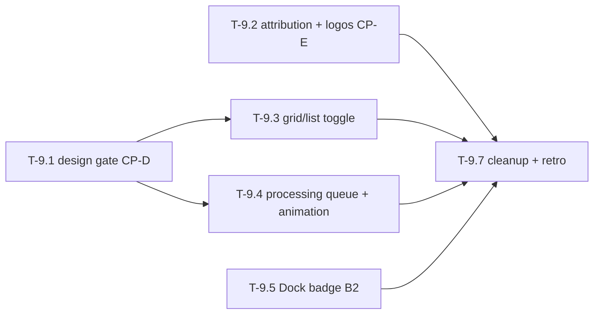

# Phase 9 — Library v2 + processing states

This phase finishes the Library as a **roster of your agent's toolbox** and
makes folder processing **feel alive**: durable model attribution with real
provider logos, a grid/list view toggle, a one-folder-at-a-time processing
queue with a single global animated state (the app stays fully browsable
during a run), and the Dock badge render bug (B2) fixed. The module *cell*
itself already landed in Phase 8 (toolbox-v2, T-8.3b); Phase 9 builds **on
top of it**, it does not re-open it.

Roadmap: [docs/roadmap.md → Phase 9](../roadmap.md). Ground truth for the
cell content: [library-view-prompt.md](../design/feature-report/library-view-prompt.md).
Phase 8 outcomes this phase layers on:
[docs/retros/phase-8.md](../retros/phase-8.md). Design iterations land in
[docs/design/explorations/](../design/explorations/) — toolbox-v2 locked the
Library cell + palette; this phase only needs a new exploration for the
**list view** and the **global processing animation**.

## How to read this document

Written to be executed by an AI agent **with a human ("me") in the loop**.
Each task has the same shape:

- **Task execution (agent prompt):** the literal instruction block.
- **Refining loop:** iterate-until-good cycle.
- **Human-in-the-loop (me):** what I review or provide. The agent **must
  stop at every `[HOLD FOR ME]` gate.**
- **Acceptance:** objective done criteria.

### Working agreement for the agent

1. One task at a time, in order, unless I say otherwise.
2. After any visible change: `swift build`, run the app (`make app` when
   packaging matters), capture a screenshot of the affected surface, paste
   it in your summary.
3. Never proceed past `[HOLD FOR ME]` without my explicit approval.
4. Keep each task PR-sized and reversible.
5. **Schema change is allowed this phase — but only for T-9.2.** The
   model-attribution link is the one sanctioned `Store/Schema.swift` /
   `Store/Models.swift` migration, and it ships behind a forward migration
   **plus** tests that prove old stores open and backfill cleanly. Every
   other task stays out of the schema. `engine/` and `mcp/` server code
   remain **off-limits**.
6. `swift test` stays green after every task.
7. Use the frozen design system (`Design/` tokens + components) and the
   **toolbox-v2** styling constraints: glass material on the floating
   controls layer only (sidebar, toolbars, overlays), solid graphite
   surfaces for content; mono type only for paths/code; accent green only on
   meaningful state. Do not re-tune the palette — toolbox-v2 is locked.

## Decisions locked in (do not relitigate)

- The Library **cell anatomy and toolbox-v2 styling are done** (T-8.3b):
  one trust verdict, prominent name, purpose line, `via <model>` provenance,
  provider-accent corner badge, usage-ranked hero. Phase 9 reuses
  `ModuleCell` as-is; it does **not** redesign the cell.
- **Search is done** (T-8.3b + #163): case-insensitive across name /
  purpose / tags / project, focus-safe. Do not rebuild it.
- **One run at a time.** Processing is a single-folder queue; extra drops
  enqueue. There is exactly one global animated processing state, and the
  app stays fully browsable while it runs.
- **Provenance becomes durable.** A module's creating provider/model is
  store-backed (a module→run link or a denormalized field), not only
  recomputed from traces at view time.
- **No fabricated usage numbers.** Usage telemetry still does not exist; the
  `heroRank` fallback comparator stays until real data lands.
- **Module detail stays interim.** The full module page is Phase 10
  ([module-run-v1](../design/explorations/module-run-v1.md)); Phase 9 does
  not build or pre-build it.
- The **dependencies + versions panel moved to Phase 10** (it became the
  "requirements readout"). It is not a Phase 9 task.
- The **module relationship graph view has moved out of Phase 9** to
  [Phase 13](phase-13-walkthrough-onboarding.md) as a carried-over,
  looks-good-only stretch. It is no longer a Phase 9 task.

## Hard data facts (verified — do not fight these)

1. **The cell already ships.** `Views/ModuleCell.swift` renders the trust
   verdict, name, purpose, tags, hero spanning, and the provider corner
   badge; `BrowseView.swift` lays out the grouped grid + usage-ranked hero;
   `BrowseModel.heroRank` is the documented fallback comparator. Reuse, do
   not rebuild.
2. **Provenance is derived at view time today.** `BrowseModel.provenance(for:)`
   reads `provenanceByGunkId` / `provenanceBySourceId`, both populated from
   the most recent `RunTrace` in `indexTraces`. It renders as the
   `via <model>` line + the **provider-accent color** badge
   (`ProviderBadge` + `BrandColors.providerAccent`). What is missing: (a) a
   **durable store link** so a module knows its run even if traces are
   pruned, and (b) a **real provider logo** mark (today it is a colored
   badge, not a logo). There are **no provider logo assets** in
   `Resources/Assets.xcassets` yet.
3. **`gunks` carries no provider/model.** Per
   [library-view-prompt.md](../design/feature-report/library-view-prompt.md)
   and the closing audit finding **D9**, modules are not linked to runs —
   "the wiring is a small store change, not a fantasy feature." T-9.2 makes
   that change.
4. **`ProcessingModel` allows concurrency today.** It tracks
   `activeSourceIds` as a `Set<Int64>` and only goes idle when *all* sources
   finish (`ProcessingModel.swift`). The one-at-a-time rule is a **queue at
   the orchestration layer** (`Decompose/SourceProcessingRunner.swift` and
   the drop intake in `Views/DropZoneView.swift`), not a `ProcessingModel`
   rewrite.
5. **Usage telemetry does not exist.** No "uses this week" column or table,
   and you may not invent one. The hero ranking stays on its fallback
   comparator with the existing `// FUTURE: rank by uses/week` seam.

## Checkpoint map

| Gate | What I review | Blocks |
| --- | --- | --- |
| CP-D | Approved exploration for the list view + the global processing animation | T-9.3, T-9.4 visual work |
| CP-E | The module→run attribution **data-model migration** (schema + backfill) | T-9.2 Part B, phase exit |

---

## T-9.1 — Design gate: list view + global processing animation (CP-D)

**Owner:** me (Claude Design) + agent (documentation)
**Checkpoint:** CP-D

### Goal
Get an approved visual target for the only two net-new looks this phase
introduces — the **list (vs. grid) view** of the Library and the **global
animated processing state** — before that visual work ships. (Phase 8's
lesson: an approved exploration needs an explicit implementation task, or
structural work builds on the wrong look.)

### Files
- `docs/design/explorations/` (new exploration doc + screenshots)

### Task execution (agent prompt)

> 1. Write the revision instruction for the exploration: a **list view** of
>    the same Library data (one row per module — verdict, name, purpose,
>    `via <model>`, provider mark, tags — reusing the cell's data, denser
>    than the grid) and a **single global processing state** that animates
>    while a folder is decomposing and reads as "alive" without stealing the
>    window (it must coexist with the persistent MCP chip and the
>    transient processing element from T-8.7 — reconcile, don't duplicate).
> 2. Hand the instruction to me; I run the iteration in Claude Design and
>    return screenshots.
> 3. When I return an approved iteration, save the image(s) into
>    `docs/design/explorations/` and write the exploration doc in the
>    toolbox-v2 format: verdict line, what is locked, what changed, and any
>    new constraints for implementation. Cross-link it from the roadmap
>    Phase 9 item.

### Human-in-the-loop (me)
- `[HOLD FOR ME]` I produce and approve the list-view + processing-animation
  exploration. No visual work in T-9.3/T-9.4 starts before this clears.

### Acceptance
- An approved exploration doc exists with embedded screenshots and an
  "approved" verdict, covering both the list view and the global processing
  animation, cross-linked from the roadmap.

---

## T-9.2 — Durable model attribution: store link + provider logos (CP-E)

**Owner:** agent
**Checkpoint:** CP-E (Part A)

### Goal
Each module durably states which model created it, with the provider's
**logo** — provenance that survives trace pruning and does not depend on a
view-time trace lookup. Closes audit finding **D9**.

### Representation decision (CP-E) — agent write-up

**Chosen: a denormalized `provider` / `model` pair on `gunks`** (two nullable
`TEXT` columns), not a `runId` foreign key.

Why denormalized:
- **Survives trace pruning with no join.** The whole point of D9 is that a
  module knows its model even when traces/runs are gone. A `runId` FK would
  re-introduce a dependency on a row that can be pruned (`llm_runs.source_id`
  is even `ON DELETE SET NULL`); the denormalized pair is self-contained.
- **`llm_runs` is not a reliable per-module source.** `recordLLMRun` is
  unused in production today — the engine writes gunks directly and provenance
  lives in the `RunTrace` JSON files, which is what `BrowseModel` already reads.
  So a FK to `llm_runs` would point at mostly-absent rows. Storing the strings
  is the faithful move.
- **Matches the view contract.** `provenance(for:)` returns a
  `provider · model` pair; storing exactly that means the stored path and the
  trace fallback produce identical values.

Migration shape (the one sanctioned schema change this phase):
- **App-only Schema v5**: `ALTER TABLE gunks ADD COLUMN provider TEXT; ADD
  COLUMN model TEXT;` (nullable, additive, non-destructive). Old stores open
  unchanged; rows that predate the column read `NULL`.
- **mcp divergence (flag for CP-E):** earlier migrations are mirrored
  byte-for-byte from `mcp/src/schema/vN.sql`, but `mcp/` is off-limits this
  phase, so **v5 has no mcp counterpart**. Verified safe: the MCP migrator
  early-returns when `from >= LATEST_VERSION` (4) so it never trips on a v5
  store, and every MCP read uses an explicit column list, so the extra columns
  are invisible to it. The byte-for-byte test still only asserts v0–v4.
- **Backfill** reads the same `RunTrace` resolution `BrowseModel.indexTraces`
  uses (gunk-id first, then the source's most recent trace) and runs once on
  open; unresolvable modules stay `NULL` (neutral mark).
- **Extraction-time write** happens app-side in `SourceProcessingRunner` after
  the engine reports its `gunkIds` (it already spawns with `llm.provider` /
  `llm.model`), so `engine/` is untouched.

### Files
- `app/Sources/GunkApp/Store/Schema.swift` (migration — **the one sanctioned
  schema change this phase**)
- `app/Sources/GunkApp/Store/Models.swift` (`Gunk` gains provider/model or a
  run id)
- `app/Sources/GunkApp/Store/Store.swift` (read/write + backfill)
- `app/Sources/GunkApp/Models/BrowseModel.swift` (`provenance(for:)` prefers
  the stored value, falls back to the trace lookup)
- `app/Sources/GunkApp/Design/Components/ProviderBadge.swift` (logo mark)
- `app/Sources/GunkApp/Resources/Assets.xcassets/` (provider logo assets)
- `app/Tests/GunkAppTests/StoreTests.swift`,
  `app/Tests/GunkAppTests/BrowseModelTests.swift`

### Task execution (agent prompt)

> Ship in two landable parts. **Part A (data model) is its own commit and
> must build/test green before Part B.**
>
> **PART A — Durable attribution (`[HOLD FOR ME]` CP-E before merging).**
> 1. Decide the representation and write it up before coding: either a
>    `runId` foreign key on the module or a **denormalized**
>    `provider` / `model` pair written at extraction time. Recommend the
>    denormalized pair (simplest, survives trace pruning, no join) unless you
>    find a reason it breaks — state your choice and why.
> 2. Add the forward migration in `Schema.swift` (new nullable column(s); no
>    destructive change). Old stores must open unchanged.
> 3. **Backfill** existing modules from the most recent `RunTrace` for the
>    gunk (then its source) — the same resolution `BrowseModel.indexTraces`
>    already uses — so today's library isn't blank-attribution after upgrade.
>    Modules with no resolvable trace stay null (render the neutral mark).
> 4. Write the value at extraction time so new modules are attributed without
>    a trace lookup. Do **not** touch `engine/` — write it on the app side
>    where the run's provider/model is already known
>    (`SourceProcessingRunner` spawns with `llm.provider`/`llm.model`).
> 5. `BrowseModel.provenance(for:)` prefers the stored value and falls back
>    to the existing trace-derived lookup, so nothing regresses if a value is
>    null.
> 6. Tests: migration opens an old store; backfill populates from a seeded
>    trace; a new module persists its provider/model; null stays null. No
>    test touches the real store path.
>
> **PART B — Provider logo mark.**
> 7. Add provider logo assets (Anthropic, OpenAI, Google/Gemini, and a
>    neutral fallback) to `Assets.xcassets` as template/SF-symbol-style marks
>    that tint cleanly on the graphite cell. **Verify each mark's usage/brand
>    terms and record the source in your summary** — do not ship a logo we
>    can't use; if a brand mark is restricted, fall back to the existing
>    provider-accent color badge for that provider and flag it.
> 8. Extend `ProviderBadge` to render the logo (keeping the provider-accent
>    color as the tint/background), driven by the stored provider. Keep it
>    **subtle — provenance, not a trust badge** (library-view-prompt §4): it
>    must not compete with the trust verdict.
> 9. `swift build`, `swift test`, screenshot a grid with mixed providers
>    (each logo), the neutral fallback, and a freshly extracted module
>    showing its attribution with no trace present.

### Refining loop
- If a brand's logo terms are too restrictive to bundle, ship the
  provider-accent **color** mark for that provider (the T-8.3b behavior) and
  leave a `// FUTURE: <provider> logo pending brand clearance` seam — never
  ship an unlicensed mark.
- If the migration backfill is slow on a large store, do it lazily/once on
  open rather than blocking launch; flag the approach.

### Human-in-the-loop (me)
- `[HOLD FOR ME]` CP-E: I approve the chosen representation and review the
  migration on a copy of my real store (it must open clean and backfill
  correctly) before Part B builds on it.
- I confirm the logos read as quiet provenance, not a second trust badge.

### Acceptance
- A module's provider/model is store-backed with a forward migration that
  opens old stores and backfills from traces; new modules persist it at
  extraction; `provenance(for:)` prefers the stored value with a safe
  fallback. Provider **logos** render on the cell (or a documented
  color-only fallback for any restricted brand), subtle and non-competing.
  Build + tests green.

---

## T-9.3 — Grid + list view toggle

**Owner:** agent
**Checkpoint:** CP-D (implements the approved list-view look)

### Goal
The Library can be viewed as the briefing-card grid (today) **or** a denser
list, toggled from the appbar, with grouping and search preserved across
both.

### Files
- `app/Sources/GunkApp/Views/BrowseView.swift` (view-mode state, the appbar
  toggle, the list layout)
- `app/Sources/GunkApp/Views/ModuleCell.swift` (a row variant if the list
  reuses it; otherwise a sibling `ModuleRow`)
- `app/Sources/GunkApp/Models/BrowseModel.swift` (only if the toggle needs
  persisted state — read-only otherwise)

### Task execution (agent prompt)

> 1. Add a **grid/list toggle** to the Library appbar (segmented or icon
>    pair), placed per the CP-D exploration. Default to grid. Persist the
>    choice in the same Settings-defaults storage pattern the app already
>    uses (no new store schema).
> 2. Build the **list layout**: one row per module reusing the cell's data
>    (verdict, name, purpose truncated, `via <model>` + provider mark, tags),
>    denser than the grid, on the same solid graphite surface. Sections /
>    `Project | Model` grouping headers and the usage-ranked ordering carry
>    over (the hero distinction may flatten in the list — follow the
>    exploration).
> 3. Search, grouping, the needs-approval scope chip, selection, and the
>    arrival highlight all work identically in both modes — do not fork
>    behavior, only the layout.
> 4. Verify both modes at the **960pt** minimum window next to the 232pt
>    sidebar. `swift build`, `swift test`, screenshot grid and list in both
>    groupings, with search active and a needs-approval row.

### Refining loop
- If the list row competes with the grid cell for code, extract the shared
  presentation (verdict/name/purpose/provenance/tags) once and let grid and
  list arrange it — do not duplicate the trust/provenance logic.

### Human-in-the-loop (me)
- I toggle grid/list with real modules and confirm grouping, search, and the
  needs-approval scope behave the same in both.

### Acceptance
- An appbar toggle switches grid/list; the choice persists; both modes share
  search, grouping, scope, selection, and arrival behavior; both fit at
  960pt. Build + tests green.

---

## T-9.4 — Single-folder processing queue + global animated state

**Owner:** agent
**Checkpoint:** CP-D (implements the approved processing animation)

### Goal
Exactly one folder processes at a time; additional drops enqueue rather than
running concurrently; one global animated state shows the live run; the app
stays fully browsable throughout.

### Files
- `app/Sources/GunkApp/Decompose/SourceProcessingRunner.swift` (the queue)
- `app/Sources/GunkApp/Views/DropZoneView.swift` (intake enqueues)
- `app/Sources/GunkApp/Models/ProcessingModel.swift` (queue-depth signal, if
  needed — keep the existing `isProcessing`/progress contract)
- `app/Sources/GunkApp/Views/AppShellView.swift` (the global animated
  processing element — reconcile with the T-8.7 transient processing chip)

### Task execution (agent prompt)

> 1. Enforce **one active run** in `SourceProcessingRunner`: a serial queue
>    (or actor) so a second dropped folder waits for the first to finish
>    instead of running concurrently. Multiple folders dropped at once
>    enqueue in drop order. Verify the real current behavior first and report
>    whether anything already serialized it.
> 2. Surface a **queue depth** ("processing 1 of 3", or "2 waiting") through
>    `ProcessingModel` without breaking its existing `isProcessing` /
>    `progressBySource` contract that the toast's store-diff summary (T-8.7)
>    relies on.
> 3. Implement the **global animated processing state** per the CP-D
>    exploration. There must be exactly **one** live-run element — reconcile
>    with the T-8.7 transient processing chip (extend it; do not add a second
>    competing indicator). It animates while a run is active and resolves to
>    the existing run-end toast on completion (do not regress the truthful
>    store-diff "N modules added").
> 4. The app stays **fully browsable** during a run: the grid/list, search,
>    grouping, selection, and the run inspector all work; nothing blocks or
>    freezes; no layout shift when the animation appears/disappears (D15).
> 5. `swift build`, `swift test`, screen-record or screenshot: a single run
>    animating, two folders dropped (one running + one queued), and browsing
>    the Library mid-run.

### Refining loop
- If serializing surfaces a latent assumption that two sources could report
  progress at once, fix the queue, not `ProcessingModel`'s multi-source map
  (keep it — it still cleanly handles the active one).
- If the animation competes with the cell scan or the MCP chip, quiet it
  down rather than enlarging it — live state is feedback, not the headline.

### Human-in-the-loop (me)
- I drop two folders in quick succession and confirm they run one at a time,
  the queued one is visibly waiting, and I can browse and search the whole
  time.

### Acceptance
- Processing is strictly one-at-a-time with a visible queue; one global
  animated state (reconciled with T-8.7, resolving to the existing toast);
  the app stays browsable with zero layout shift. Build + tests green.

---

## T-9.5 — Fix the Dock badge render bug (B2)

**Owner:** agent
**Checkpoint:** none (bug fix)

### Goal
The Dock badge renders correctly during the processing/feedback window
(B2, carried from Phase 7 and deferred through Phase 8).

### Files
- `app/Sources/GunkApp/Dock/DockIconController.swift` (`badge(count:)`,
  `dockTile.badgeLabel`, state transitions)
- `app/Sources/GunkApp/Models/ProcessingModel.swift` (badge call sites:
  `begin`/`update`/`moduleFound`/`complete`/`fail`)
- `app/Tests/GunkAppTests/DockIconControllerTests.swift`

### Task execution (agent prompt)

> 1. **Reproduce B2 first** and write down the exact symptom (stale count,
>    badge not clearing on idle, wrong value mid-run, flicker, etc.) before
>    changing anything — the roadmap only labels it "render bug ... in the
>    processing/feedback area." Use the existing `GUNK_DEBUG_*` hooks /
>    `DockIconController` test seams to stage it deterministically.
> 2. Root-cause it against the `ProcessingModel` badge call sites: `begin`
>    badges `modulesFound` (0 at start), `moduleFound`/`update` bump it,
>    `complete`/`fail` reset to gunk count or 0. Identify which transition
>    renders wrong.
> 3. Fix at the controller/transition level; do not change the truthful
>    counts (engine "found" vs. store "added" stays per T-8.7).
> 4. Add a regression test in `DockIconControllerTests` that fails before and
>    passes after.
> 5. `swift build`, `swift test`, screenshot the Dock tile across
>    idle → processing → complete (and the failure path).

### Refining loop
- If B2 turns out to be an AppKit `dockTile` redraw/timing issue rather than
  a count bug, fix the redraw (e.g. force `display()` at the transition)
  and note the real cause — don't paper over it by muting the badge.

### Human-in-the-loop (me)
- I run a real folder and watch the Dock through the whole
  idle→processing→complete cycle and confirm the badge is always correct.

### Acceptance
- The Dock badge renders the correct value through the processing/feedback
  cycle; a regression test covers the fixed transition. Build + tests green.

---

## T-9.7 — Cleanup, regression pass, retro

**Owner:** agent
**Checkpoint:** phase exit

### Task execution (agent prompt)

> 1. Delete any dead code this phase orphaned (e.g. a superseded view-time-
>    only provenance path if T-9.2 replaced it). `rg` for references first.
> 2. Full pass at 960×600 and default window size: Library in both grid and
>    list, mid-run animation and queued state, provider logos, and the Dock
>    badge cycle — no layout shifts, no clipped controls. (The graph-view
>    stretch moved to Phase 13, so it is out of scope for this pass.)
> 3. Confirm the toolbox-v2 styling constraints still hold (no green-tinted
>    surfaces, mono only for paths/code, accent green only on meaningful
>    state, glass on the controls layer only).
> 4. Check off completed Phase 9 items in `docs/roadmap.md`.
> 5. Write `docs/retros/phase-9.md`: what shipped, what slipped, what we
>    learned, what we're cutting.

### Acceptance
- No dead code, roadmap current, retro written, build + tests green.

---

## Task order and dependencies

T-9.2 (store/data model) and T-9.5 (the Dock badge bug) are independent of
the CP-D design gate and can start immediately. T-9.3 and T-9.4 are the only
tasks that wait on CP-D (they implement the approved list-view + processing
animation). The former T-9.6 graph-view stretch has moved to
[Phase 13](phase-13-walkthrough-onboarding.md). T-9.7 closes the phase.
