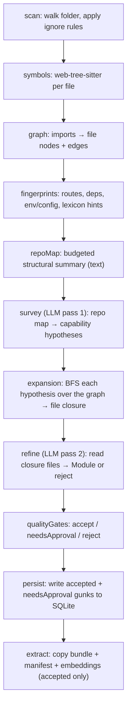

# gunk-engine: how it works (and how to debug the AI)

This document is the map for understanding **exactly** what the engine does on
every run, where each decision is made, and which artifact to open when the AI
output is wrong. It is written for debugging: each stage lists its inputs,
outputs, the failure modes that make capabilities disappear or look wrong, and
the precise trace field to inspect.

If you only read one section, read [Debugging playbook](#debugging-playbook) and
[The two LLM passes](#the-two-llm-passes).

---

## Mental model

The engine is a deterministic, headless batch job:

```
folder ──► [11 stages] ──► SQLite rows (gunks/tags/files) + extracted bundles
                      └──► NDJSON events (stdout)  + trace.json (~/.gunk/runs/<runId>)
```

- **Only two stages call the LLM**: `survey` (pass 1) and `refine` (pass 2).
  Everything else is deterministic static analysis. So if output is wrong, the
  cause is almost always (a) what the deterministic stages fed the LLM, (b) the
  LLM's answer, or (c) the post-processing/quality-gate filters that drop the
  LLM's answer.
- **Durable state** lives in `~/.gunk/store.db`. **Telemetry** is NDJSON on
  stdout. **The full forensic record** (every prompt, every raw response, every
  gate decision) is `~/.gunk/runs/<runId>/trace.json` — only written with
  `--trace`.
- Determinism: `temperature: 0` and stable sorting everywhere, so the same
  inputs should give the same trace. Re-runs are comparable.

---

## Data flow



Progress fractions emitted per stage (useful to see where a run stalls):
`scan 0.10 · symbols 0.20 · graph 0.30 · fingerprints 0.38 · repoMap 0.48 ·
survey 0.58 · expansion 0.66 · refine 0.78 · qualityGates 0.84 · persist 0.92 ·
extract 1.00`.

Source of truth: `src/decompose/pipeline.ts`.

---

## Stage-by-stage reference

### 1. scan — `src/ingest/scanner.ts`
- **In:** source folder path.
- **Does:** recursively walks the folder, applies ignore rules (node_modules,
  `.git`, build dirs, binaries, likely-secret files, `.gunkignore`).
- **Out:** `ScannedFile[]` (`relpath`, `absPath`, `size`).
- **Goes wrong when:** real source is excluded by ignore rules → it never
  reaches the LLM. **Check:** `trace.stages[scan].counts.files` vs how many files
  you expect.

### 2. symbols — `src/analyze/symbolExtractor.ts`
- **In:** each file's contents.
- **Does:** parses with the embedded tree-sitter grammar (JS/TS/TSX, Python,
  Swift, Go) into symbols, imports, exports. Unknown languages or parse failures
  fall back to a regex extractor.
- **Out:** `FileSymbols[]`.
- **Goes wrong when:** a language has no grammar (only the 5 above are real;
  everything else is regex-only) → weak imports/exports → weak graph edges →
  weak closures. **Check:** is the project mostly an unsupported language?

### 3. graph — `src/analyze/codeGraph.ts` + `importResolver.ts`
- **In:** `FileSymbols[]` + file contents.
- **Does:** resolves import specifiers to in-repo files and builds a file-level
  graph: nodes (`kind: "file"`) and edges (`call`, `import`, `implements`,
  `inherit`, `reference`). External (third-party) deps are tracked separately.
- **Out:** `CodeGraph` (`nodes`, `edges`, `externalDependencies`).
- **Goes wrong when:** import resolution misses (path aliases, monorepo layouts,
  re-exports) → edges missing → expansion can't pull collaborators into a
  closure. **Check:** `trace.stages[graph].counts.edges`; low edge count on a big
  repo is a red flag. This is the single most common root cause of "the module
  is missing half its files."

### 4. fingerprints — `src/analyze/capabilityFingerprint.ts`
- **In:** `FileSymbols[]`, dependency manifests, contents.
- **Does:** per file, extracts capability signals: HTTP routes, public exports,
  imported third-party dependencies, env vars, config keys, and lexicon hints
  (known libraries → capability labels, e.g. `stripe` → payments).
- **Out:** `CapabilityFingerprint[]`.
- **Used by:** the repo map (so the LLM sees anchors) and the quality gate's
  "does this module have a real surface?" check.

### 5. repoMap — `src/ingest/contextBuilder.ts` + `repoMap.ts`
- **In:** everything above.
- **Does:** serializes a **text** structural summary into a token budget
  (`--context-budget`, default 20,000 tokens; ~chars/4). Per file it includes:
  cluster id, up to 8 key symbols, sorted exports, resolved imports, routes,
  env/config keys, capability hints, and a few route/manifest snippets. Plus
  graph clusters with cohesion scores and bridge files.
- **Out:** one big string — **this is the only thing pass 1 sees.** It does *not*
  see file bodies.
- **Goes wrong when:** the repo is large and the budget truncates the map →
  capabilities below the cut line are invisible to survey. **Check:**
  `trace.stages[repoMap].counts.chars`; if it's near `budget*4`, you're
  truncating. Raise `--context-budget`.

### 6. survey (LLM pass 1) — `src/decompose/survey.ts`
See [The two LLM passes](#the-two-llm-passes). Produces `CapabilityHypothesis[]`.

### 7. expansion — `src/decompose/expander.ts`
- **In:** hypotheses + the code graph.
- **Does:** for each hypothesis, BFS from its `seedFiles` along graph edges
  (depth ≤ 3, ≤ 25 files) to build a **closure** of related files. Files reached
  by multiple capabilities — or known shared dirs (`config`, `lib`, `shared`,
  `types`, `utils`, `types.*`, `*utils.ts`) with fan-in ≥ 3 — are split out as
  **shared dependencies** rather than owned files. Records edge evidence and
  exclusion reasons.
- **Out:** `CapabilityExpansion[]` (`closureFiles`, `ownedFiles`,
  `sharedDependencyFiles`, `excludedFiles`, `edgeEvidence`).
- **Goes wrong when:** seed files aren't in the graph (survey cited a path that
  doesn't exist or was filtered), or the graph has no edges out of the seed → the
  closure is just the seed file → pass 2 sees almost nothing. **Check:**
  `trace.expansions[i].closureFiles` and `.excludedFiles` (reasons like "seed
  file is not present in the code graph" or "closure file limit reached").

### 8. refine (LLM pass 2) — `src/decompose/refiner.ts`
See [The two LLM passes](#the-two-llm-passes). Produces `Module[]` (or rejects).

### 9. qualityGates — `src/decompose/qualityGate.ts`
See [Quality gates](#quality-gates). Classifies each module as
`accepted` / `needsApproval` / `rejected`.

### 10. persist — `pipeline.ts`
- **Does:** writes `accepted` and `needsApproval` modules to SQLite as gunks
  (with tags and files). **Rejected modules are not persisted.**
- **Check:** `trace.summary` and the `gunks` table.

### 11. extract — `src/extract/extractor.ts` + `src/search/embeddingIndex.ts`
- **Does:** for `accepted` modules only, copies files into a bundle under
  `~/.gunk/modules/<id>`, writes `gunk.yml` + README, redacts secrets, flags
  licenses, then (if an embedding provider is configured) indexes embeddings and
  runs cross-source dedupe. `needsApproval` modules wait for manual approval in
  the app. Embedding/dedupe failures are swallowed (best-effort) and never fail
  the run.

---

## The two LLM passes

This is where AI quality lives. Both run at `temperature: 0` and use strict JSON
schema structured output.

### Pass 1 — survey (`src/decompose/survey.ts`)

**Sees:** the source name, the sorted list of known file paths, and the repo map
text. **Does not see file contents.**

**System prompt (verbatim):**

```
You are Pass 1 of gunk's capability-centric decomposition pipeline.
Propose capability hypotheses from the structural repo map only.

Real-module rubric:
- A real module is a reusable capability or feature slice that spans the files needed to stand alone.
- Prefer user-visible or integration-visible capabilities such as OAuth login, Stripe checkout, upload pipeline, API endpoint group, CLI command, SDK client, or workflow.
- Reject file-level chunks, type-only files, generic utilities, config-only groups, generated files, docs-only groups, and arbitrary folders.
- Each hypothesis needs at least one structural anchor: route, entrypoint, public export, dependency capability hint, env/config key, or strongly connected graph cluster.
- Name the capability by what it does, not by a filename.
```

**Output schema:** `{ hypotheses: [{ name, rationale, anchors[], seedFiles[],
expectedCollaborators[], granularity }] }`.

**Post-processing that silently drops hypotheses** (`parseHypotheses`): a
hypothesis is **discarded** if:
- it has zero `seedFiles`, or any seed file is not in the known-files set, or
- any `expectedCollaborator` is not in the known-files set.

It is kept but marked `priority: "low"` if it has no anchors and cites < 2 known
files. **This is a common "the model proposed it but it vanished" cause** — the
model hallucinated a path or used a slightly different relative path than what
`scan` produced. **Check:** compare `trace.llmCalls[stage=survey].responseJson`
(what the model said) against `trace.hypotheses` (what survived).

### Pass 2 — refine (`src/decompose/refiner.ts`)

Runs **once per expansion**. **Sees:** the candidate name/rationale/anchors, the
closure's owned/shared/excluded file lists, edge evidence, and the **actual file
contents** of the closure (budgeted: ≤ 32,000 chars total, ≤ 8,000 chars/file,
truncated with markers).

**System prompt (verbatim):**

```
You are Pass 2 of gunk's capability-centric decomposition pipeline.
Deep-read one expanded capability closure and return structured JSON only.

Real-module rubric:
- Keep only files needed for the reusable capability.
- Separate owned files from shared dependencies.
- Use only allowed tags and only files present in the closure.
- Return module null with a reject reason if this is not a real module.
```

**Output schema:** `{ module: {name, purpose, tags[], language, ownedFiles[],
sharedDependencies[], entrypoints[{path,symbol}], anchors[], confidence} | null,
qualityGateHints{...}, reject{reason} | null }`.

**Post-processing rules** (`parseModule`):
- A malformed response (missing `module` key, `qualityGateHints` not an object,
  missing `reject`) **throws** and fails the whole run.
- `module: null` → rejected with the model's reason (surfaced into the trace).
- `ownedFiles`/`sharedDependencies` are **filtered to the closure** — paths
  outside the closure are dropped. Shared files are removed from owned. If
  nothing survives, the module becomes `null` (dropped).
- `tags` are **filtered to `allowedTags`** (the taxonomy from the `tags` table).
  ⚠️ **If the store has no tags seeded, every tag is stripped** and the schema's
  `enum` is empty — modules come back tagless and may look broken. Verify the
  taxonomy is seeded.
- `anchors` fall back to the hypothesis anchors if the model returns none.
- `confidence` is clamped to `[0,1]` and drives the quality-gate decision.

**Check:** `trace.refinements[i]` (`accepted`, `rejectReason`, `module`) and the
matching `trace.llmCalls[stage=refine]` entry for the full prompt + raw response.

---

## Quality gates

`src/decompose/qualityGate.ts`. Each module gets one decision. Order matters:
**any** rejection reason → `rejected`; else confidence below threshold →
`needsApproval`; else `accepted`.

| Reason (`trace.gateEvaluations[].reasons`) | Triggered when |
| --- | --- |
| `missingFiles` | module has zero files |
| `missingSurface` | no surface/anchors and no fingerprint signal (routes, exports, deps, env, config, hints) on any file |
| `singleFileWithoutOwnedSurface` | exactly 1 file and that file owns no route/public export/surface |
| `lowCohesion` | > 1 file and internal/total edge ratio < `0.35` |
| `generatedOnly` / `typeOnly` / `utilityOnly` / `configOnly` | all files classify as that trivial kind |
| `typeOnly`+`utilityOnly`, `configOnly`+`typeOnly` | files are only those trivial kinds combined |
| `duplicateOverlap` | ≥ `0.85` file overlap with another kept module (lower-confidence/smaller/later-named one loses) |
| `belowConfidenceThreshold` | no rejection reasons, but `confidence` < `--confidence` (default `0.7`) → `needsApproval` |

- **Cohesion** = internal edges / (internal + external) edges over the module's
  files (single-file modules score 1.0).
- **File classification** (`classify`) keys off path components and contents:
  `generated` (markers like `@generated`, `do not edit`), `config`, `utility`,
  `typeOnly` (`types.*`, `.d.ts`, or only import/type/interface/enum lines), else
  `source`.

**Goes wrong when:** good modules get rejected because (a) the graph was too
sparse → `lowCohesion`, (b) fingerprints missed the surface → `missingSurface`,
or (c) file classification is too aggressive → `typeOnly`/`utilityOnly`. The
`trace.gateEvaluations[].fileKinds` map shows exactly how each file was
classified.

---

## Observability

### NDJSON events (stdout, with `--json`) — `src/contract/events.ts`

One JSON object per line. Used by host UIs to drive progress.

| `type` | Fields |
| --- | --- |
| `stage` | `stage`, `phase` ("started"/"finished"), `durationMs?`, `counts?` |
| `progress` | `stage`, `fraction` (0–1), `modulesFound?` |
| `result` | `runId`, `gunkIds[]`, `accepted`, `needsApproval`, `rejected`, `tracePath?` |
| `error` | `message`, `stage?` |

### Run trace (`~/.gunk/runs/<runId>/trace.json`, with `--trace`) — `src/trace/trace.ts`

This is the debugging gold mine. Top-level fields:

| Field | What's in it |
| --- | --- |
| `runId`, `sourceName`, `provider`, `model`, `status`, `error` | run identity + outcome |
| `startedAtMs` / `finishedAtMs` | wall-clock timing |
| `stages[]` | per stage: `durationMs`, `counts`, `status`, `error` |
| `llmCalls[]` | **per LLM call: full `requestMessages` (the exact prompt), full `responseJson` (the raw model output), tokens, `durationMs`, tagged by `stage`** |
| `hypotheses[]` | the survey hypotheses that **survived** filtering |
| `expansions[]` | per hypothesis: `closureFiles`, `ownedFiles`, `sharedDependencyFiles`, `excludedFiles` (+reasons), `edgeEvidence` |
| `refinements[]` | per candidate: `accepted`, `rejectReason`, resulting `module` |
| `gateEvaluations[]` | per module: `decision`, `reasons`, `cohesionScore` |
| `summary` | `accepted`, `needsApproval`, `rejected`, `gunkIds` |

Because `llmCalls` carries the verbatim prompt **and** the raw response, you can
always answer "what did we ask, and what did it actually say?" without re-running.

The Swift app's **Runs** tab reads these files; you can also open them directly.

---

## Debugging playbook

Start from the symptom, jump to the stage, open the trace field.

| Symptom | Likely stage | Open in trace | Typical fix |
| --- | --- | --- | --- |
| Run fails immediately at survey | LLM/auth | `error`, last `llmCalls` | bad/missing API key, wrong model, provider down (HTTP status in message) |
| Way fewer files scanned than expected | scan | `stages[scan].counts.files` | ignore rules / `.gunkignore` too broad |
| Modules missing collaborator files | graph / expansion | `stages[graph].counts.edges`, `expansions[].closureFiles`/`excludedFiles` | import resolution gaps (aliases/monorepo); raise `maxDepth`/`maxFiles` |
| Model proposed a capability but it's gone | survey post-filter | `llmCalls[survey].responseJson` vs `hypotheses` | hallucinated/mismatched paths; tighten repo map paths |
| Capabilities never proposed at all | repoMap budget | `stages[repoMap].counts.chars` | truncation; raise `--context-budget` |
| Modules come back with no tags | refine | `gateEvaluations[].module.tags`, `tags` table | seed the tag taxonomy |
| Good module rejected as low cohesion | graph / gates | `gateEvaluations[].cohesionScore`, edges | sparse graph; check importResolver |
| Good module rejected as trivial | gates | `gateEvaluations[].fileKinds` | over-aggressive `classify`; inspect paths |
| Everything is `needsApproval` | refine confidence | `refinements[].module.confidence` | model under-confident; lower `--confidence` or improve context |
| Output not reproducible | provider | `llmCalls[].responseJson` across runs | ensure `temperature: 0` honored; some providers are non-deterministic |

### Reproduce a single run with full forensics

```bash
cd engine
GUNK_API_KEY=sk-... bun run src/index.ts /path/to/project \
  --provider openai --model gpt-4.1-mini \
  --db /tmp/debug.db --gunk-home /tmp/gunk-home \
  --json --trace
# then inspect:
cat /tmp/gunk-home/runs/*/trace.json | jq '.stages, .summary'
cat /tmp/gunk-home/runs/*/trace.json | jq '.hypotheses'
cat /tmp/gunk-home/runs/*/trace.json | jq '.llmCalls[] | select(.stage=="survey") | .responseJson'
cat /tmp/gunk-home/runs/*/trace.json | jq '.gateEvaluations[] | {name: .module.name, decision, reasons}'
```

`--json` (stdout) is the live progress; `--trace` is the post-mortem. stderr
carries human-readable `[decompose]` log lines.

---

## Tuning knobs

| Knob | Where | Default | Effect |
| --- | --- | --- | --- |
| `--context-budget` | survey input | 20,000 tokens | bigger repo map (fixes truncation) at higher cost |
| `--confidence` | quality gate | 0.7 | accept/needsApproval cutoff |
| expansion `maxDepth` | `expander.ts` | 3 | how far closures reach |
| expansion `maxFilesPerCapability` | `expander.ts` | 25 | closure size cap |
| `sharedFanInThreshold` | `expander.ts` | 3 | when a file becomes a shared dep |
| `cohesionThreshold` | `qualityGate.ts` | 0.35 | low-cohesion rejection line |
| `duplicateOverlapThreshold` | `qualityGate.ts` | 0.85 | dedupe sensitivity |
| refiner `maxContextCharacters` / `maxFileCharacters` | `refiner.ts` | 32k / 8k | how much code pass 2 reads |

The eval gate (`test/evalGate.test.ts`) runs the whole pipeline against fixtures
with canned LLM responses and asserts the scorecard stays at/above baseline —
run it after any change to these knobs or prompts.
